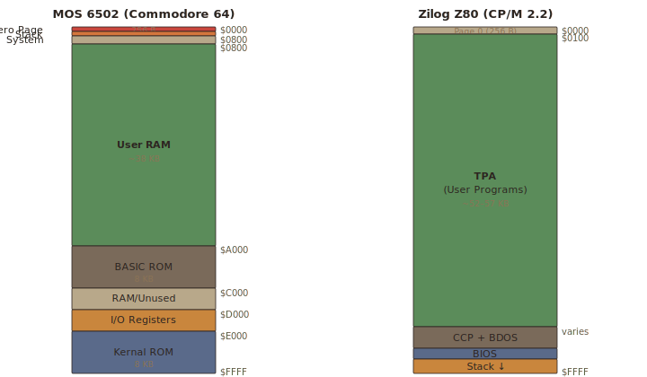
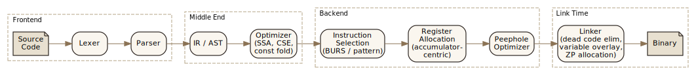
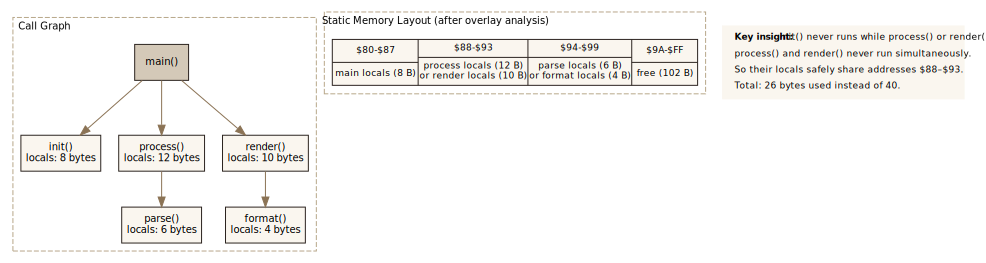

## Introduction

Writing a compiler for an 8-bit CPU is an exercise in negotiating with hostile hardware. The Z80 offers an asymmetric register file where arithmetic funnels through a single accumulator. The 6502 provides three registers, a 256-byte hardware stack, and an instruction set that one designer described as "terrible for arithmetic." Neither CPU has multiply, divide, or barrel shift instructions. Both address 64 KB of memory — total, for code, data, stack, and I/O.

And yet, from the late 1970s through today, compiler writers have produced toolchains that generate surprisingly competent code for these machines. The techniques they developed — accumulator-centric register allocation, peephole optimization, static variable overlay, zero-page management, software stack elimination — represent a distinct tradition of compiler engineering, one that modern projects like LLVM-MOS are now revisiting with contemporary infrastructure.

This article surveys the architectural constraints that make 8-bit compilation difficult, the historical toolchains that first solved the problem, and the optimization approaches that proved most effective.

## Abstract

8-bit CPUs such as the Zilog Z80 and MOS 6502 present severe challenges for compiler design: asymmetric and minimal register files, non-orthogonal instruction sets, no hardware multiply or divide, limited addressing modes, and constrained memory models. Despite these limitations, a rich ecosystem of compilers and high-level languages emerged from the late 1970s onward, spanning native-code compilers (BDS C, Hi-Tech C, Action!), bytecode interpreters (UCSD Pascal, Forth), subset languages (Small-C, PL/M), and structured environments (Turbo Pascal, BBC BASIC). Successful optimization techniques include peephole rewriting, accumulator-centric code generation, zero-page register allocation, whole-program variable overlay, and software stack elimination. Modern projects — LLVM-MOS, KickC, Cowgol, Oscar64, vbcc — apply SSA-based optimization, BURS instruction selection, and interprocedural analysis to close the gap with hand-written assembly. The 6809 stands as a counterpoint, demonstrating how small ISA design choices in register width, orthogonality, and addressing modes cascade into measurable compiler efficiency.

## The Hardware: What Makes 8-Bit Compilation Hard

### Register Starvation

The 6502 provides three 8-bit registers: the accumulator (A), and index registers X and Y. All arithmetic flows through A — to add two values, one must be in A and the result lands in A. The vanilla 6502 cannot even push X or Y directly to the stack; saving them requires routing through A first. A compiler targeting the 6502 has, in effect, one general-purpose register and two limited-use index registers.

The Z80 is richer but deceptive. It has seven 8-bit registers (A, B, C, D, E, H, L) that pair into 16-bit combinations (BC, DE, HL), plus index registers IX and IY. But arithmetic still funnels through A: there is no `ADD B, C` instruction — only `ADD A, C`. The register file is asymmetric in other ways too. Only HL can serve as a general-purpose memory pointer with single-byte instructions. BC and DE support `LD A, (BC)` and `LD A, (DE)` but nothing else indirect. IX and IY support `(IX+d)` displacement addressing, but every IX/IY instruction requires a prefix byte (DD or FD), costing an extra byte of code and 4+ extra clock cycles per access.

The result: a Z80 compiler must constantly shuttle values through A, choosing between the fast-but-inflexible HL register pair and the flexible-but-slow IX/IY index registers. Graph coloring register allocation, the standard technique for modern architectures, breaks down on these irregular register files.

### Addressing Mode Constraints

The 6502's addressing modes look versatile on paper — zero-page, absolute, indexed, indirect indexed `(zp),Y`, indexed indirect `(zp,X)` — but each has sharp restrictions. Indirect indexed addressing requires the pointer to reside in zero page and uses only Y as the index. Indexed indirect uses only X. Neither supports arbitrary base+offset addressing. Accessing a structure field through a pointer requires: computing the effective 16-bit address, storing it in a zero-page pair, then using indirect indexed mode. A single `ptr->field` access compiles to 10+ bytes and dozens of cycles.

The Z80's `(HL)` is the workhorse addressing mode — one byte, fast. But the moment code needs two pointers simultaneously, one must go into IX or IY, paying the prefix penalty, or the compiler must generate explicit address arithmetic through HL. Structure access, array indexing, and pointer chasing all become multi-instruction sequences.

### The 64 KB Ceiling

Both CPUs address 64 KB. Code, data, stack, I/O ports, and ROM share this space. On a typical Z80 CP/M system, the OS claims the bottom page and the top 6 KB, leaving roughly 57 KB for everything. On a 6502 system like the Commodore 64, BASIC ROM, the kernel, I/O registers, and screen memory carve out large regions, leaving perhaps 38 KB of contiguous RAM.

Bank switching extends addressable memory but adds complexity: the compiler must track which bank is active and insert switching code at bank boundaries. Few 8-bit compilers handle this automatically.

### The 6502's 256-Byte Stack

The 6502's hardware stack occupies page 1 ($0100–$01FF) — a fixed 256-byte region. The stack pointer is 8 bits wide. There is no frame pointer register and no way to index into the stack. A C-style calling convention with stack-allocated locals and arguments is nearly impossible to implement efficiently on this hardware. Most 6502 compilers resort to a software stack in main RAM, adding overhead to every function call, or abandon stack-based calling conventions entirely.

### Missing Instructions

Neither CPU provides hardware multiply, divide, or barrel shift. The 6502 has only single-bit shifts (ASL, LSR, ROL, ROR). Multiplying two 8-bit values requires a shift-and-add loop of 20+ bytes and hundreds of cycles. Division is worse. The Z80 adds `SRL`, `SRA`, and `SLL` but only on A or `(HL)` — not on arbitrary registers. Expression evaluation involving multiplication, division, or multi-bit shifts compiles to subroutine calls, bloating code and destroying performance.

### Comparing the Architectures

The table below summarizes the key differences that affect compiler design across four major 8-bit CPUs:

| Feature | MOS 6502 | Intel 8080 | Zilog Z80 | Motorola 6809 |
|---|---|---|---|---|
| **Year** | 1975 | 1974 | 1976 | 1978 |
| **GP Registers** | 3 (A, X, Y) | 7 (A, B, C, D, E, H, L) | 7 + IX, IY, shadow set | 2 accum (A, B) + X, Y, U, S |
| **Accumulator** | A only (8-bit) | A only (8-bit) | A only (8-bit) | A or D (A+B, 16-bit) |
| **Register Pairs** | none | BC, DE, HL | BC, DE, HL, IX, IY | D (16-bit), X, Y, U, S (16-bit) |
| **Index Registers** | X, Y (8-bit) | HL (16-bit) | HL, IX, IY (16-bit) | X, Y (16-bit) |
| **Stack** | 256 bytes (page 1) | 64 KB (SP) | 64 KB (SP) | 64 KB (S), user stack (U) |
| **Frame Pointer** | none | manual (HL) | IX or IY (with prefix cost) | U or S (native support) |
| **Hardware Multiply** | no | no | no | yes (MUL: 8x8→16) |
| **Barrel Shift** | no (1-bit only) | no (1-bit only) | no (1-bit only) | no (1-bit only) |
| **Zero/Direct Page** | fixed ($00–$FF) | none | none | relocatable (DP register) |
| **Indirect Addressing** | (zp),Y and (zp,X) only | (HL) only | (HL), (IX+d), (IY+d) | [,X], [,Y], [n,S], etc. |
| **Position-Independent** | no | no | JR (relative branch) | full PIC (LEA, PC-relative) |
| **Orthogonality** | low | moderate | moderate | high |
| **Compiler Friendliness** | poor | fair | fair | good |

### The 6809: Proof by Counterexample

Motorola's 6809 (1978) demonstrates what happens when an 8-bit ISA is designed with compilers in mind. It provides 16-bit index registers (X, Y), a relocatable direct page register (the zero-page concept moved anywhere in memory), hardware multiply (`MUL`), position-independent code support via `LEA` instructions, and a substantially more orthogonal instruction set. The 6809 C compilers produced code competitive with 16-bit systems. The gap between 6502/Z80 and 6809 compiler output illustrates how small ISA design choices — register width, orthogonality, addressing flexibility — cascade into large differences in compiled code quality.

## Historical Toolchains

| Year | Toolchain | Target | Approach | Key Innovation |
|---|---|---|---|---|
| 1973 | PL/M | 8080 | Native code | First HLL for microprocessors; systems language |
| 1977 | UCSD Pascal | 6502, Z80, PDP-11 | p-code bytecode | Portable VM; same binary on different hardware |
| 1978 | Forth (FIG-Forth) | 6502, Z80 | Threaded interpreter | Minimal overhead; interactive development |
| 1979 | BDS C | 8080/Z80 | Native, single-pass | First C on CP/M; 30 KB RAM; 75K copies sold |
| 1979 | Integer BASIC | 6502 | Interpreter | Hand-coded by Wozniak; integer-only for speed |
| 1980 | Small-C | 8080 | Native code | Subset C; spawned dozens of derivatives |
| 1981 | BBC BASIC | 6502, Z80 | Interpreter | Structured BASIC with inline assembler |
| 1982 | ACK | Multi-target | EM bytecode + native | Retargetable; multiple source languages |
| 1983 | Turbo Pascal | Z80 | Native, single-pass | Compiler in RAM; interactive speed |
| 1983 | Action! | 6502 | Native code | Static locals, no recursion; 126x faster than BASIC |
| 1983 | Aztec C | 6502, Z80 | Native + cross | Cross-compilation; floating-point on Z80 |
| ~1984 | Hi-Tech C | Z80 | Native, ANSI C | 18 years development; only ANSI C native on CP/M |
| 1986 | Turbo Modula-2 | Z80 | M-code interpreter | Borland's Modula-2; became TopSpeed on DOS |
| ~1987 | Hochstrasser Modula-2 | Z80 | Native code | Native Z80 codegen; freely distributed 2002 |

### The C Compiler Wave (1979–1985)

**BDS C** (1979), written by 20-year-old Leor Zolman, was the first C compiler for CP/M on 8080/Z80. It compiled in a single pass without intermediate disk files, requiring only 30 KB of RAM — a design constraint that became a competitive advantage. Around 75,000 copies sold. BDS C proved that C was viable on 8-bit hardware if the compiler was lean enough.

**Small-C** appeared in *Dr. Dobb's Journal* in May 1980, targeting the 8080. Ron Cain deliberately designed it as a subset implementation: no `struct`, no `float`, limited types. The compiler was small enough to understand, modify, and port. James Hendrix extended it with `for` loops, `do-while`, and `switch` statements. Small-C's influence was enormous — it became the starting point for dozens of ports and derivatives, including the compiler that eventually became cc65.

**Aztec C** from Manx Software represented the cross-compiler approach, offering both native Z80/8080 compilers for CP/M and cross-compilers targeting 6502 systems (Apple II, Commodore 64). Its floating-point support was a competitive differentiator for scientific applications.

**Hi-Tech C** for Z80 evolved through 18 years of continuous development, eventually producing version 3.09 — reportedly the only ANSI C compiler that runs natively on CP/M. Microchip acquired Hi-Tech Software in 2009. The compiler was released as freeware around 2000 and remains maintained by the open-source community.

### Pascal and the Single-Pass Revolution

**UCSD Pascal** (1977) took the portability route: compile to p-code, a bytecode executed by a virtual machine. Richard Gleaves and Mark Allen completed the 6502 p-machine interpreter in 1978, forming the basis for Apple Pascal. The p-machine approach traded execution speed for code portability across wildly different hardware — the same p-code binary ran on Z80, 6502, and PDP-11 systems with only a new interpreter.

**Turbo Pascal** for CP/M (November 1983) demonstrated that a single-pass compiler could be both fast and practical. Written entirely in Z80 assembly by Anders Hejlsberg, it compiled Pascal to native Z80 code fast enough to feel interactive. The key: the compiler, source, and output all fit in RAM simultaneously, eliminating disk I/O. Turbo Pascal made the case that on memory-constrained systems, a fast simple compiler beats a slow optimizing one.

### Modula-2: Wirth's Next Step

Modula-2, Wirth's successor to Pascal, added modules, coroutines, and low-level system access — features that made it a plausible systems language. Two Z80/CP/M implementations illustrate different trade-offs.

**Turbo Modula-2** (Borland, December 1986) initially used an M-code interpreter — essentially the same p-code approach as UCSD Pascal, trading execution speed for portability. Borland briefly marketed it at $69.95 before dropping CP/M support. The unreleased MS-DOS version became TopSpeed Modula-2, which eventually evolved into Clarion.

**Hochstrasser Modula-2** (Hochstrasser Computing AG, Switzerland) took the native-code route, generating Z80 machine code directly rather than intermediate bytecode. Library source code was included; compiler source was not. After the company's liquidation in 1997, Peter Hochstrasser released the compiler freely in 2002.

ACK also supported Modula-2 as a source language, compiling through its EM intermediate representation. Between these implementations, Modula-2 on Z80 covered the full spectrum: interpreted bytecode (Turbo), retargetable IR (ACK), and native code generation (Hochstrasser).

### Systems Languages

**PL/M** (Programming Language for Microcomputers), conceived by Gary Kildall in 1973 for Intel's 8080, was designed explicitly as a systems language. It exposed direct memory access, I/O ports, and interrupt control without high-level overhead. PL/M-80 became the standard language for CP/M kernel development and embedded systems. Its philosophy — controlled hardware access without abstraction penalties — influenced embedded C dialects for decades.

**Action!** (1983) by Clinton Parker, distributed on cartridge for Atari 8-bit computers, solved the stack frame problem through fixed-address local variables. Rather than building stack frames, the compiler assigned locals to static memory locations, eliminating stack manipulation overhead at the cost of recursion. BYTE magazine's 1985 Sieve benchmark timed Action! at 18 seconds versus Atari BASIC's 38 *minutes* — a 126x speedup.

### BASIC: The Universal Runtime

**Microsoft BASIC** dominated through market penetration. Gates and Weiland completed the 6502 port in 1976; Commodore licensed it for a flat $25,000 fee, embedding it in every PET, VIC-20, and C64. On Z80 systems, MBASIC (later BASIC-80) served the same role under CP/M. BASIC was interpreted, not compiled, but its ubiquity made it the first language most users encountered.

**BBC BASIC** (1981), designed by Sophie Wilson for the BBC Micro, stood apart by offering structured programming constructs (named procedures, local variables, `REPEAT...UNTIL`) and an inline assembler. Developers could embed 6502 assembly directly in BASIC programs using `[` and `]` brackets — a pragmatic hybrid that acknowledged the need for low-level access while providing high-level structure.

**Wozniak's Integer BASIC**, hand-coded in 6502 assembly, executed integer-only arithmetic with no floating-point overhead. Applesoft BASIC (Microsoft-licensed, with floating-point) eventually replaced it after the Apple II Plus (1979), trading execution speed for mathematical generality.

### Forth and Threaded Interpretation

Forth implementations on 6502 used threaded interpretation, representing code as sequences of references to "words" (subroutines). FIG-Forth (1980) used indirect threading; later systems employed direct threading for speed. The 6502's X register indexed the parameter stack in zero page, while the hardware stack held return addresses. Forth's inner interpreter — the `NEXT` routine — was typically just 5–7 6502 instructions, making word dispatch remarkably fast for an interpreted language.

### The Amsterdam Compiler Kit

**ACK** (Amsterdam Compiler Kit), created by Andrew Tanenbaum and Ceriel Jacobs in the early 1980s, was the most architecturally ambitious project. It supported multiple source languages (C, Pascal, Modula-2, BASIC, Occam) targeting multiple architectures through an intermediate representation called EM (a stack-based bytecode). ACK served as Minix's native toolchain and demonstrated that retargetable compilation was practical even for 8-bit targets. Released open-source under BSD in 2003.

### BCPL

BCPL, Martin Richards' systems language, ran on various 8-bit and small systems. Its typeless design (everything is a machine word) simplified compilation but limited type safety. BCPL's influence was indirect — it begat B, which begat C — but some direct BCPL implementations existed for Z80 and similar platforms.

## Optimization Techniques That Work

The diagram below shows a typical 8-bit compiler pipeline, highlighting where the key optimization techniques apply. Not all compilers implement every stage — cc65 skips the middle-end optimizer entirely, relying on peephole passes alone, while LLVM-MOS runs 100+ optimization passes before instruction selection.

### Peephole Optimization: The Workhorse

Peephole optimization is the dominant technique in 8-bit compilers, used by cc65, z88dk/sccz80, and most Small-C derivatives. The compiler first generates naive code — often comically redundant — then scans the output for known inefficient patterns and rewrites them.

Davidson and Fraser's work on automatic peephole optimization ("Code Selection Through Object Code Optimization," TOPLAS 1984) formalized this approach and showed that simple rule-directed rewriting can produce code competitive with more sophisticated code generation strategies. Their insight: on architectures where instruction selection is the dominant cost (as opposed to scheduling or register allocation), pattern-driven post-pass optimization is surprisingly effective.

Typical 6502 peephole rules:

- **Dead load elimination**: `LDA #0; CMP #0` becomes `LDA #0` (the comparison is redundant since LDA sets the zero flag)
- **Store-load elimination**: `STA temp; LDA temp` eliminates the reload
- **Branch threading**: `BEQ L1; ... L1: JMP L2` redirects to `BEQ L2`

Z80 peephole patterns include replacing `JP` (3-byte absolute jump) with `JR` (2-byte relative jump) when the target is within range, and recognizing that `LD A, (HL); INC HL` can be replaced with table-lookup patterns in some contexts.

### Register Allocation on Irregular Architectures

Classical graph coloring fails on 8-bit register files. The Z80's registers are not interchangeable — A is the only arithmetic register, HL is the only efficient pointer, and IX/IY carry prefix penalties. The 6502 has effectively one register.

Practical approaches:

**Accumulator-centric allocation** treats A as the primary computational register and generates explicit loads/stores around every operation. This is what Small-C and cc65 do. It's simple and correct but produces bloated code.

**Dedicated-register allocation** assigns fixed roles: X for loop counters, Y for array indexing, HL for pointers, DE for secondary data. The compiler's instruction selector knows which registers each instruction can use and emits the minimal transfer sequence. SDCC uses this approach with a refinement: it allocates storage *bytewise*, so each byte of a variable can independently live in a register or memory.

**Pattern-matching allocation** (used by Cowgol) combines instruction selection and register allocation in a single bottom-up pass. The code generator matches AST patterns against rules that specify both the instruction sequence and register usage. When no register is available, the allocator spills — but often to another register rather than memory, since it can see what's free across the entire expression.

### Zero-Page Management on 6502

The 6502's zero page ($0000–$00FF) provides faster addressing (one-byte addresses instead of two) and is the only location that supports indirect addressing modes. Compilers treat it as an extended register file.

**Static allocation** (cc65, Action!): zero-page locations are assigned at compile time to frequently-used variables and compiler temporaries. cc65 reserves approximately 26 bytes of zero page for its runtime, including pseudo-registers used for pointer operations. The programmer can direct additional variables to zero page with pragmas.

**Whole-program analysis** (Cowgol, LLVM-MOS): the compiler analyzes the complete call graph to determine which functions can be active simultaneously, then overlays non-conflicting variables in the same zero-page locations. Cowgol's linker reduces zero-page usage to 146 bytes for the compiler itself — tight enough to self-host on actual 6502 hardware.

**LLVM-MOS** takes this further, modeling 16 virtual two-byte registers in zero page and running LLVM's full register allocation infrastructure against them. The result is aggressive zero-page utilization driven by live-range analysis rather than static heuristics.

### Software Stack Elimination

The 6502's 256-byte hardware stack makes C-style stack frames impractical. CC65 implements a software stack in main RAM (growing downward), but every parameter access requires a helper subroutine call — a substantial overhead.

The radical solution: eliminate the stack entirely. Cowgol forbids recursion, allowing the linker to prove that certain functions are never simultaneously active. Their local variables can share memory addresses. This transforms stack allocation into a static graph-coloring problem solved at link time. The performance gain is significant: a zero-page variable access is 3 cycles on 6502, while a software stack access through cc65's runtime can cost 20–30 cycles.

Action! took the same approach in 1983 — fixed-address locals, no recursion — demonstrating that this trade-off was well-understood even in the 8-bit era.

### Instruction Selection via Tree Matching

Modern compilers use Bottom-Up Rewrite Systems (BURS) for instruction selection, matching subtrees of the intermediate representation against a grammar of machine instruction patterns with associated costs. The compiler selects the minimum-cost covering of the expression tree.

For 8-bit targets, BURS rules must encode:
- Accumulator routing requirements (all arithmetic through A)
- Addressing mode constraints (zero-page indirect needs pointer in specific locations)
- Register pairing rules (Z80's BC/DE/HL pairs)
- Prefix byte costs (IX/IY penalty on Z80)

Aho, Ganapathi, and Tjiang's "Code Generation Using Tree Matching and Dynamic Programming" (TOPLAS 1989) formalized this approach. Cowgol's `newgen` tool reads backend definition files specifying these rules and generates the pattern-matching code automatically.

### Whole-Program and Link-Time Optimization

On machines with 64 KB total, dead code elimination is not optional — it's survival. Several approaches:

**Linker-level dead code elimination**: Cowgol's linker traces reachability from entry points and strips unreferenced functions. cc65's linker manages code in segments, allowing fine-grained placement and selective inclusion.

**Variable overlay**: Cowgol's linker computes the call graph, identifies non-overlapping function lifetimes, and assigns their static variables to shared memory addresses. This is effectively register allocation at link time, applied to the entire memory space rather than just registers.

**Cross-module inlining**: Oscar64 includes library implementations as pragma-annotated headers, allowing the optimizer to inline and optimize across module boundaries.

### Code Density Techniques

**RST instructions** on Z80: the eight RST opcodes ($00, $08, ..., $38) are single-byte calls to fixed addresses. Placing frequently-called utility routines at these addresses saves 2 bytes per call site (RST is 1 byte vs. CALL's 3 bytes). Z80 compilers and operating systems use RST for system calls, print routines, and runtime helpers.

**Computed gotos and dispatch tables**: replacing `switch` statements with indexed jumps into a table. On 6502, this uses the `JMP (indirect)` instruction with a precomputed table. On Z80, `JP (HL)` serves the same purpose.

**Self-modifying code**: storing variables inside instruction operands, eliminating separate load instructions. The 6502 instruction `LDA #$00` can have its operand byte modified at runtime to effectively create a one-byte variable embedded in the code stream. Used in hand-optimized code and some aggressive compilers, though it breaks on systems with ROM-resident code or instruction caches.

## The Modern Renaissance

| Compiler | Target | Language | Optimization Strategy | Self-Hosting | Relative Performance |
|---|---|---|---|---|---|
| cc65 | 6502 | C (ANSI) | Peephole | no | baseline |
| z88dk (sccz80) | Z80 | C (~C90) | Peephole (COPT) | no | — |
| z88dk (zsdcc) | Z80 | C (C99+) | Graph-based regalloc | no | — |
| SDCC | Z80, 8080, 6502 | C (C99+) | Bytewise graph regalloc | no | varies |
| LLVM-MOS | 6502 | C/C++ (C17+) | SSA, 100+ passes, GlobalISel | no | 10–15% smaller than cc65 |
| KickC | 6502 | C (C99) | SSA-based | no | better than cc65 |
| Oscar64 | 6502 (C64) | C99, partial C++ | Pragma-based inlining | no | better than cc65 |
| vbcc | 6502, Z80 | C (ANSI) | Graph coloring, CSE | no | ~3x cc65 (Dhrystone) |
| Cowgol | 6502, Z80, 8080 | Cowgol (Ada-inspired) | Pattern match + variable overlay | **yes** | ~3x GCC density claim |
| Millfork | 6502, Z80 | Millfork (middle-level) | Multi-pass whole-program | no | better than cc65 |
| Prog8 | 6502 | Prog8 (structured) | Const-fold, AST opt | no | better than cc65 |
| kz80_c | Z80 | C (subset) | Direct codegen | **yes** | — |

### CC65 and z88dk: Maintaining the Legacy

**cc65** remains the standard C compiler for 6502 systems, providing ANSI C with platform-specific libraries for Commodore, Apple, Atari, and NES targets. Its optimization is primarily peephole-based, and careful hand-tuning can bring output within 20–40% of hand-written assembly. It remains the most portable and best-documented option.

**z88dk** covers 100+ Z80 platform targets, offering two compiler frontends: sccz80 (Small-C derived, near C90 compliance) and zsdcc (SDCC integration). Both use COPT, a regex-based peephole optimizer, for post-processing. The project includes 15,000+ lines of hand-optimized assembly libraries — an acknowledgment that library code quality matters as much as compiler output.

### SDCC: Graph-Based Allocation

**SDCC** (Small Device C Compiler) targets Z80, 8080, 6502, and various microcontrollers. Its key innovation is polynomial-time graph-based register allocation with bytewise granularity: each byte of every variable can independently live in a register or memory. The `--max-allocs-per-node` flag controls the trade-off between compilation time and optimization effort. SDCC's FOSDEM 2025 presentation reported continued improvements in Z80 code generation quality.

### LLVM-MOS: The SSA Approach

**LLVM-MOS** brings the full weight of LLVM's optimization infrastructure to the 6502. It uses GlobalISel with 100+ optimization passes, models 16 virtual two-byte registers in zero page, and applies loop strength reduction, addressing-mode selection, and aggressive inlining. In benchmarks, LLVM-MOS generates 10–15% smaller code than cc65 for equivalent C source. Arguments pass in registers rather than on a software stack, eliminating cc65's most significant overhead.

The project demonstrates that SSA-based compilation can work on an architecture with one accumulator — the key was modeling zero-page locations as virtual registers within LLVM's existing register allocation framework.

### KickC and Oscar64: SSA for Commodore

**KickC** implements C99 with SSA-based optimization specifically tuned for 6502. **Oscar64** targets the Commodore 64 with C99 and partial C++ support (variadic templates, lambdas), using pragma-based library inlining for cross-module optimization. Oscar64 outperforms cc65 on most benchmarks.

### vbcc: Classical Techniques Scale Down

**vbcc**, a portable retargetable C compiler, brings proven optimization techniques from its 68K and PowerPC backends to 6502. The results are striking: approximately 3x the throughput of cc65 on Dhrystone benchmarks (234 vs. 75 Dhrystones/s on C64). This demonstrates that classical compiler optimization — graph coloring, strength reduction, common subexpression elimination — remains effective even on extremely constrained architectures.

### Language-Level Solutions

**Cowgol** (David Given) takes the most radical approach: design the language around the hardware's constraints. No recursion enables static variable overlay. Strong typing with explicit width casts prevents implicit promotion bugs. The compiler self-hosts on Z80, 6502, and 8080, proving that a sophisticated toolchain can run on the target hardware itself.

**Millfork** targets both 6502 and Z80 with a "middle-level" language that exposes hardware details (register variables, explicit memory regions) while providing high-level control flow. Its multi-pass whole-program optimizer applies platform-specific transformations at multiple optimization levels.

**Prog8**, written in Kotlin, compiles a structured language to 6502 for Commodore and Commander X16 targets. It uses ANTLR4 for parsing and applies const-folding and optimization before lowering to intermediate code. Output typically outperforms cc65.

### Hobbyist Self-Hosting: the kz80 Project

The kz80 project (tinycomputers.io) demonstrates that self-hosting compilers remain viable on extreme hardware. Running on a RetroShield Z80 with 8 KB ROM and 6 KB RAM, the project includes a self-hosting C compiler (`kz80_c`) and a self-hosting Lisp compiler (`kz80_lisp`), alongside Smalltalk, Lua, Fortran, and Pascal interpreters — all targeting the same minimal Z80 platform. The C compiler, written in the subset of C it compiles, accepts source on stdin and emits Z80 binary on stdout. At 66 KB, the compiler source exceeds the 8 KB input buffer, illustrating the fundamental tension between compiler complexity and target constraints. The project's evolution — from hand-written Z80 assembly to SDCC cross-compilation to a Rust-hosted development workbench — recapitulates the history of 8-bit toolchain development in miniature.

## Conclusion

The history of 8-bit compiler design is a story of creative constraint. The Z80 and 6502 were not designed for compilers — their register files are too small, too asymmetric, and too specialized. The instruction sets lack operations that compilers need and include operations that compilers rarely use. The memory model provides no room for the stack-heavy calling conventions that high-level languages assume.

The solutions that worked share a pattern: they meet the hardware halfway. Peephole optimization compensates for poor initial code generation. Zero-page allocation turns a 256-byte memory region into an extended register file. Static variable overlay eliminates stack frames by exploiting whole-program knowledge. Languages like Cowgol and Action! forbid recursion because the hardware can't support it efficiently. LLVM-MOS proves that modern SSA-based optimization works on these targets — but only after reimagining zero page as a virtual register file.

The most successful approach is not any single technique but the combination: language-level constraints that simplify the compiler's job, pattern-driven code generation that handles irregular instruction sets, and whole-program analysis that squeezes maximum value from every byte. The 6809's superior compiler support — achieved simply by adding register width, orthogonality, and flexible addressing — confirms that the real lesson is in ISA design. But for the Z80 and 6502, the compilers that exist today represent decades of accumulated craft, turning hostile hardware into viable compilation targets.
