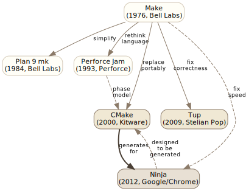
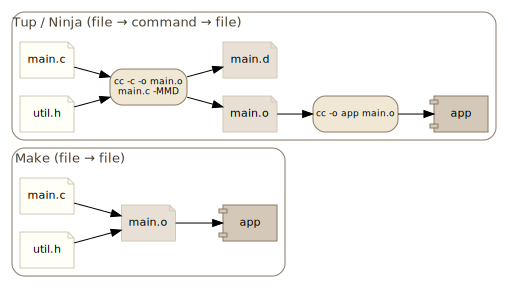
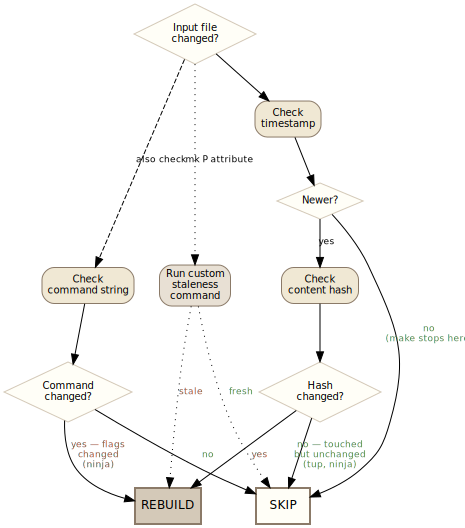
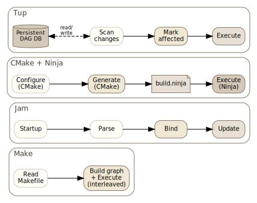

## Introduction

Build systems are foundational infrastructure for software development, yet their design space is surprisingly varied. From make's 1976 origins through modern systems like Ninja and tup, each generation has addressed different tradeoffs in correctness, performance, and expressiveness. This research surveys six influential build systems to understand how they approach dependency graph construction, staleness detection, parallelism, build description languages, and cross-platform support.

## Abstract

A comparative analysis of build system design — make, tup, Plan 9 mk, Perforce Jam, Ninja, and CMake.

## Findings

### Dependency Graph Construction

All six systems model builds as directed acyclic graphs, but they differ fundamentally in when and how the graph is constructed.

Make builds its graph incrementally during execution — it discovers targets as it processes rules, and recursive make invocations create isolated subgraphs with no visibility into each other. This is both slow and incorrect: changing a header in one subdirectory doesn't reliably rebuild dependents in another. Plan 9 mk corrected this by building the full dependency graph before any execution begins. Jam took the same approach with an explicit four-phase model (startup → parsing → binding → updating), separating graph construction cleanly from execution. Ninja inherits its complete graph from a generator and performs no graph construction logic of its own.

Tup stores its DAG persistently in a database across builds. Rather than reconstructing the graph each run, it scans only for changes and marks affected nodes — giving it O(changed) update cost rather than O(total). At 100k files, make takes ~30 minutes to determine what to rebuild; tup does it in ~0.1 seconds.

CMake operates at a different level entirely. As a meta-build system, it constructs a dependency graph during its configure phase, then translates that graph into native build files (Makefiles, Ninja files, VS projects). The actual build tool then re-derives its own graph from those files. CMake's dependency model is target-centric: targets declare dependencies with `PRIVATE`, `INTERFACE`, and `PUBLIC` visibility, and usage requirements (include paths, compile flags, link libraries) propagate transitively through `INTERFACE_*` properties.

Both tup and mk prohibit cycles in the graph. Make allows them. Ninja, Jam, and CMake all require acyclic graphs.

Tup and mk both use file-level granularity for DAG nodes (files and commands as distinct node types), which prevents unnecessary rebuilds compared to make's coarser task-level approach. Ninja and Jam share this file-and-command node model.

### Staleness Detection

Make uses timestamps exclusively — a target is out-of-date if any prerequisite has a newer modification time. This is fast but imprecise: touching a file without changing its content triggers unnecessary rebuilds, and clock skew can cause missed rebuilds.

Tup uses content-based change detection, comparing file hashes rather than timestamps. Its `^o` flag extends this to outputs: if a command reruns but produces identical output, dependents are not rebuilt.

Plan 9 mk offers the most flexible approach with its P attribute, which runs an arbitrary command to decide if a target is out-of-date — fully programmable staleness. Its D attribute auto-deletes partial targets on recipe failure, preventing stale outputs from persisting.

Ninja implicitly tracks command strings — changing compiler flags triggers a rebuild even if no source files changed, with no extra mechanism required. It also stores compiler-generated depfile results in a compact binary log (`.ninja_deps`) to avoid reparsing `.d` files each run.

Jam uses timestamps like make but augments them with its header scanning system: `$(HDRSCAN)` regex patterns combined with `$(HDRRULE)` callbacks dynamically discover header dependencies, erring toward over-inclusion rather than risking missed rebuilds.

CMake itself uses file timestamps to detect when `CMakeLists.txt` or included `.cmake` files have changed, triggering reconfiguration. The actual build staleness detection is delegated entirely to whatever native tool CMake generated files for.

### Header and Implicit Dependency Discovery

This is one of the sharpest dividing lines between systems.

Make has no built-in mechanism for header dependency tracking. Users must manually maintain dependency lists or bolt on external tools like `mkdep`. Recursive make compounds the problem — a header change in one directory simply won't be seen by another directory's sub-make.

Tup solves this radically: runtime file-access monitoring intercepts all reads and writes during command execution, automatically discovering dependencies. Undeclared reads from generated files and undeclared writes both trigger errors. This provides a correctness guarantee no other surveyed system matches — N iterations of updates always produce the same result as a clean build.

Ninja delegates to the compiler via depfiles (`gcc -MMD`, MSVC `/showIncludes`). Two modes handle the two major compiler families: `deps = gcc` processes depfiles after compilation, `deps = msvc` parses compiler stdout. Dynamic dependencies (dyndep, added in v1.10) extend this to cases where dependencies are only discoverable by analyzing source files during the build.

Jam uses regex-based header scanning at the build system level — `$(HDRSCAN)` patterns match `#include` lines and `$(HDRRULE)` callbacks register the discovered dependencies. This is dynamic but not exact: it can miss conditional includes, computed includes, and generated headers.

Plan 9 mk relies entirely on manual dependency declarations in mkfiles. Its prototype mkfile system and metarules provide patterns for common cases, but there is no automatic header discovery.

CMake generates depfile rules (for Ninja) or `-MD` flags (for Make) in its output, so the native build tool handles header tracking. CMake itself does not scan headers.

### Build Description Languages

Each system takes a distinct approach to how builds are described, ranging from minimal DSLs to full programming languages.

Make uses a declarative format with tab-delimited recipes, implicit rules, and variable expansion. Its syntax is notoriously sensitive to whitespace — tabs vs. spaces carry semantic meaning. Variable assignment offers five operators (`=`, `:=`, `+=`, `?=`, `!=`) with different expansion timing.

Plan 9 mk simplifies make's syntax: three-part rule headers (`targets:attributes:prerequisites`), recipes passed verbatim to the shell without interpretation, and a cleaner variable system where environment and mk variables are unified. Metarules use `%` and `&` patterns with matched text available as `$stem`. There are no built-in rules at all — all build knowledge comes from included prototype mkfiles.

Tup uses a compact pipeline syntax (`: inputs |> command |> outputs`) with `%`-substitution flags. `!-macros` provide reusable command templates. The format is purpose-built and minimal — there is no general-purpose programming capability in Tupfiles.

Jam has its own procedural language where the only data type is a list of strings. Rules (procedures) and actions (shell commands) are separate concepts. Variable expansion is a cartesian product: `t$(X)` where X is "a b c" produces "ta tb tc". Variable modifiers (`:D`, `:B`, `:S`) extract path components. Jambase provides all default build rules — Jam itself has no built-in build knowledge, just a language interpreter.

Ninja is deliberately minimal — designed as a "build assembler" meant to be generated, not hand-written. Variables are immutable bindings that can only be shadowed. There is no conditional logic, no loops, and no functions. Its core insight: "build systems get slow when they need to make decisions."

CMake is a full Turing-complete scripting language with variables, functions, macros, control flow, and feature-detection capabilities like `try_compile`. All values are strings; lists are a semicolon-delimited convention. The language has three argument forms with different evaluation rules (bracket, quoted, unquoted), a four-level variable scoping hierarchy, and case-insensitive command names but case-sensitive variable names — historical artifacts from its late-1990s origins at Kitware. A policy system (`cmake_policy`) toggles between old and new behavior for specific changes, allowing decades-old `CMakeLists.txt` to work with new CMake versions.

A recurring theme is the "everything is a string" philosophy. Jam, CMake, and mk all treat values as strings or lists of strings with no other types. Tup and Ninja avoid the question by offering almost no language at all.

### Parallel Execution

All six systems support parallel builds, but the mechanisms differ.

Make requires explicit `-j N` and gives no output isolation — parallel command outputs can interleave unpredictably. Recursive make adds further problems: each sub-make is an independent process with its own job pool unless GNU jobserver integration is used.

Plan 9 mk controls parallelism through `$NPROC` and gives each recipe a unique processor ID via `$nproc` for temp file naming. It serializes operations that require it — archive updates run serially in one recipe to avoid corruption from concurrent `ar` invocations.

Jam supports `-j N` and offers `-g` to reorder execution by source recency. Its `$(JAMSHELL)` mechanism gives fine-grained control over how actions are dispatched, with `!` expanding to a process slot number.

Tup parallelizes naturally from its DAG — independent nodes run concurrently with no explicit configuration needed.

Ninja is parallel by default, scaled to CPU count. Pools limit concurrency for specific rules (e.g., a `console` pool at depth=1 for interactive commands). Output is buffered per-job so parallel outputs never interleave; on failure, the full command and output are shown together. Ninja also integrates with GNU's jobserver protocol, respecting `MAKEFLAGS` when invoked as part of a larger make-driven build.

CMake does no parallel execution itself. Parallelism is entirely the native build tool's responsibility — CMake's contribution is generating a dependency graph correct enough for the downstream tool to safely parallelize.

Common to Ninja, tup, and mk: on failure, in-flight jobs are allowed to finish but no new jobs start. Make's `-k` flag offers a weaker version (continue building unrelated targets after an error).

### Cross-Platform and Cross-Compilation

Make is inherently Unix-centric. Its Makefile syntax, shell-dependent recipes, and reliance on Unix tools make portable builds difficult without external help (autoconf, automake).

Plan 9 mk was designed for Plan 9's heterogeneous architecture — prototype mkfiles per `$objtype` replace make's built-in rules, providing a clean model for multi-architecture builds within Plan 9, but mk itself is not widely portable.

Jam was designed for cross-platform builds from the start. Platform abstraction uses conditional variables (`SUFEXE`, `SUFLIB`, `SUFOBJ`) and platform flags (`UNIX`, `NT`, `MAC`). The SubDir rule enables tree-wide builds from any directory with per-directory grist for disambiguation.

Ninja runs on Linux, macOS, and Windows but has no built-in cross-compilation support — it relies on its generator (typically CMake or Meson) to set up the correct toolchain.

CMake's generator architecture is its primary cross-platform mechanism. It generates native build files for Unix Makefiles, Ninja, Visual Studio, Xcode, and others. For cross-compilation, toolchain files are loaded before any compiler detection, setting `CMAKE_SYSTEM_NAME`, `CMAKE_<LANG>_COMPILER`, and `CMAKE_SYSROOT`. Search path policies (`CMAKE_FIND_ROOT_PATH_MODE_*`) cleanly separate host tools from target-platform artifacts.

Tup runs on Linux and macOS (with limited Windows support). Its FUSE/inotify-based file monitoring is Linux-specific, making it the least portable of the six.

### Persistent State

The systems vary widely in how much state they maintain between builds.

Make is stateless — every invocation rescans the full project from scratch.

Plan 9 mk is similarly stateless, rebuilding its graph from mkfiles each run.

Jam maintains no persistent state beyond what the filesystem provides.

Ninja stores depfile results in `.ninja_deps` and build logs in `.ninja_log`, providing compact persistent state for header dependencies and build timing.

Tup maintains the most state: a full persistent DAG in a database, plus change detection state. This allows sub-millisecond no-op updates on Linux (via inotify monitor mode) by skipping filesystem scanning entirely.

CMake maintains a persistent cache (`CMakeCache.txt`) storing user options, detected compiler paths, and package locations. This cache survives across configure runs and provides incremental reconfiguration. The generated build files themselves are also a form of persistent state — the native build tool detects when CMake inputs change and triggers reconfiguration.

### Package and Dependency Management

Make has no concept of packages or external dependencies.

Plan 9 mk has no package system — dependencies are managed externally by the Plan 9 package infrastructure.

Jam's binding phase (`$(SEARCH)` for existing sources, `$(LOCATE)` for output locations) and grist system (`<src!util>filename`) provide explicit path management for multi-directory projects, but there is no external package discovery.

Ninja has no package management — it relies entirely on its generator.

CMake provides the most sophisticated dependency management of the six. `find_package` has two modes: Module mode (heuristic `Find<Pkg>.cmake` scripts) and Config mode (authoritative `<Pkg>Config.cmake` files installed by the package). Modern CMake uses imported targets (`Foo::Foo`) that encapsulate all usage requirements, replacing the old variable-based approach (`FOO_INCLUDE_DIRS`, `FOO_LIBRARIES`). `FetchContent` downloads and configures dependencies at configure time; `ExternalProject` defers to build time.

### Summary Comparison

| | Make | Plan 9 mk | Tup | Jam | Ninja | CMake |
|---|---|---|---|---|---|---|
| **Type** | Build system | Build system | Build system | Build system | Build executor | Meta-build system |
| **Staleness** | Timestamps | Timestamps + P attribute | Content hash + stat | Timestamps + header scan | Timestamps + command hash + depfiles | Delegates to native tool |
| **Header deps** | Manual | Manual | Runtime monitoring | Regex scanning | Compiler depfiles | Generates depfile rules |
| **Parallelism** | `-j N` (opt-in) | `$NPROC` | Automatic from DAG | `-j N` | Automatic (CPU count) | Delegates to native tool |
| **Persistent state** | None | None | Full DAG database | None | `.ninja_deps` + `.ninja_log` | `CMakeCache.txt` |
| **Language** | Declarative DSL | Declarative DSL | Minimal pipeline syntax | Procedural (strings only) | Minimal (generated) | Turing-complete scripting |
| **Cross-platform** | Unix only | Plan 9 / Unix | Linux-first | Unix, Windows, Mac | Portable | All major platforms + IDEs |
| **Graph construction** | Incremental / interleaved | Full before execution | Persistent + incremental | Full before execution | Inherited from generator | Configure-time, then delegates |
| **Cycles allowed** | Yes | No | No | No | No | No |

### Design Philosophy Comparison

The six systems represent distinct philosophies about what a build system should be:

**Make** is the original: a minimal dependency-driven command runner. It provides rules, timestamps, and variable expansion, then gets out of the way. Its simplicity is both its strength (universally available, easy to understand in small doses) and its weakness (no scalable mechanism for header deps, multi-directory builds, or cross-platform portability). Make assumes a single Unix platform and a single developer who understands the full dependency structure.

**Plan 9 mk** is make redesigned with the benefit of hindsight. It removes make's accumulated warts (built-in rules, tab sensitivity, incremental graph building) and replaces them with cleaner abstractions (attributes, three-part rule headers, full graph before execution). Its P attribute for programmable staleness and its prototype mkfile system for architecture-specific builds show a preference for composable, orthogonal mechanisms over special cases. It remains a Unix tool, but a more principled one.

**Tup** prioritizes correctness above all else. Its runtime file-access monitoring, persistent DAG, and content-based staleness checking ensure that builds are always correct — not just fast. The cost is platform portability (FUSE/inotify dependency) and a 5–30% overhead on initial builds. Tup is designed for developers who have been burned by incorrect incremental builds and are willing to accept constraints in exchange for guarantees.

**Perforce Jam** prioritizes expressiveness and cross-platform abstraction. Its procedural language, rule/action separation, and platform variable system were designed to handle large cross-platform C/C++ projects. The Jambase standard library encapsulates all default build knowledge, keeping the core engine language-agnostic. Jam's cartesian product variable expansion and target-specific dynamic scoping show a willingness to invest in language power at the cost of learning curve.

**Ninja** is the anti-build-system. It deliberately has almost no features, pushing all decisions to the generator that produces its input files. Variables are immutable, there is no control flow, and the file format is designed for machine generation rather than human editing. Ninja's philosophy: the build system should be a fast, correct executor — nothing more. CMake+Ninja is the canonical realization of this two-layer architecture (policy generation, then fast execution).

**CMake** is a meta-build system — a build system generator that delegates actual execution to native tools. Its Turing-complete scripting language, persistent cache, target-centric dependency model with transitive propagation, and multi-generator architecture make it the most featureful of the six. The cost is complexity: three argument evaluation modes, a four-level scoping hierarchy, a policy system for backward compatibility, and the configure-time vs. build-time semantic wall that necessitates generator expressions. CMake prioritizes ecosystem reach and portability over simplicity.

### Technology and Implementation

The implementation strategies reflect each system's priorities:

- **Make**: C implementation, stateless, shell-dependent recipes. Numerous variants exist (GNU make, BSD make, POSIX make) with incompatible extensions.
- **Plan 9 mk**: C implementation for Plan 9, later ported. Delegates to rc shell. No persistent state.
- **Tup**: C implementation with SQLite database for persistent DAG. FUSE filesystem and inotify for file monitoring. Linux-first.
- **Jam**: C implementation with built-in interpreter for Jam's procedural language. Stateless. Portable across Unix, Windows, and Mac.
- **Ninja**: C++ implementation. Minimal persistent state (`.ninja_deps`, `.ninja_log`). Designed to be generated. Portable.
- **CMake**: C++ implementation with its own scripting language interpreter. Persistent cache. Generator plugins for each target platform/IDE.

### Use Cases

- **Make**: Small to medium Unix projects, projects with simple dependency structures, environments where universality matters more than correctness guarantees.
- **Plan 9 mk**: Plan 9 systems, projects that value clean design and are willing to manage dependencies manually.
- **Tup**: Projects where build correctness is critical and the development environment is Linux-based. Good for large codebases where incorrect incremental builds waste significant developer time.
- **Jam**: Legacy cross-platform C/C++ projects, particularly those with Perforce/Boost heritage (Boost.Build/b2 descends from Jam).
- **Ninja**: Any project using a higher-level build system (CMake, Meson, GN) that generates Ninja files. Not intended for direct use.
- **CMake**: The de facto standard for cross-platform C/C++ projects. Dominant in open-source libraries, game engines, scientific computing, and any project that must build on Linux, macOS, and Windows with IDE support.

## Conclusion

The evolution from make to modern systems reveals a clear trajectory: toward persistent state (tup's database, ninja's deps log, CMake's cache), content-aware staleness (beyond timestamps alone), automatic dependency discovery (depfiles, runtime monitoring), and separation of build description from build execution (ninja as assembler, jam's phase model, CMake's generator architecture). Each system makes different tradeoffs — tup prioritizes correctness at the cost of platform portability; ninja prioritizes speed by eliminating decisions; mk prioritizes composable simplicity through orthogonal mechanisms; jam prioritizes expressiveness with its procedural language and cross-platform abstractions; CMake prioritizes ecosystem reach by generating native build files for every major platform and IDE, at the cost of a complex scripting language. No single system dominates across all dimensions, and the design space remains active — the emergence of the two-layer architecture (CMake+Ninja, Meson+Ninja) suggests that separating build policy from build execution may be the most durable pattern to emerge from four decades of build system design.
