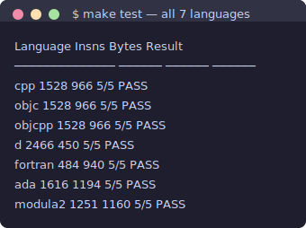

## Introduction

In [Part 1](/coldfire-emulator/), we built a ColdFire V4e emulator in C and validated it against a single bare-metal test program compiled with GCC's m68k cross-compiler. The emulator's callback-based memory bus and ELF loader don't care what language produced the binary — they just execute ColdFire instructions. So a natural follow-up question: how many other languages can target this CPU?

The answer turns out to be "all of them" — at least, all the languages that ship as GCC frontends on Ubuntu. GCC's architecture is a collection of language frontends (C, C++, D, Fortran, Ada, Modula-2, Objective-C, Objective-C++) sharing a common backend. Since the m68k backend already supports ColdFire V4e via `-mcpu=5475`, every frontend that can produce freestanding code works. The challenge isn't code generation — it's stripping away each language's runtime assumptions until nothing remains but pure ColdFire machine code.

This article documents the process of getting seven languages to compile, link, and execute correctly on our bare-metal emulator, the workarounds required for each, and what the resulting binaries reveal about how different compilers approach the same algorithms.

## Abstract

We cross-compile identical test programs — recursive Fibonacci, Euclidean GCD, summation, bitwise manipulation, and Newton's method square root — in seven programming languages targeting the ColdFire V4e, using Ubuntu's `m68k-linux-gnu-*` GCC cross-compiler packages. All seven produce bare-metal ELF binaries that execute correctly on the Part 1 emulator, passing 5/5 tests each. The languages fall into three categories by runtime complexity: standalone (C++, Objective-C, Objective-C++), C-shim required (Fortran, Ada), and C-shim plus runtime stubs (Modula-2, D). Instruction counts range from 484 (Fortran) to 2,466 (D), with C/C++/ObjC/ObjC++ producing byte-identical 1,528-instruction binaries. We document every compilation error encountered and its fix, providing a practical reference for bare-metal multi-language ColdFire development.

## Toolchain Installation

Ubuntu packages GCC cross-compilers for m68k in its standard repositories. All frontends share the same backend and linker — installing them is a single `apt-get` command:

```
sudo apt-get install \
    g++-m68k-linux-gnu \
    gobjc++-m68k-linux-gnu \
    gobjc-9-m68k-linux-gnu \
    gm2-m68k-linux-gnu \
    gfortran-m68k-linux-gnu \
    gdc-9-m68k-linux-gnu \
    gnat-10-m68k-linux-gnu
```

This pulls in the full cross-compilation toolchain: assembler, linker, and all standard headers. The version mix reflects Ubuntu's packaging — most frontends track GCC 13, but GDC (D) is pinned to GCC 9 and GNAT (Ada) to GCC 10. This version skew matters: older GCC versions optimize differently and accept different flags.

| Language | Frontend | GCC Version | Package |
|---|---|---|---|
| C++ | g++ | 13.3.0 | `g++-13-m68k-linux-gnu` |
| Objective-C | gcc (ObjC) | 13.3.0 | `gobjc-13-m68k-linux-gnu` |
| Objective-C++ | g++ (ObjC++) | 13.3.0 | `gobjc++-13-m68k-linux-gnu` |
| D | gdc | 9.5.0 | `gdc-9-m68k-linux-gnu` |
| Fortran | gfortran | 13.3.0 | `gfortran-13-m68k-linux-gnu` |
| Ada | gnat/gcc | 10.5.0 | `gnat-10-m68k-linux-gnu` |
| Modula-2 | gm2 | 13.3.0 | `gm2-13-m68k-linux-gnu` |

## The Test Suite

Each language implements the same five algorithms from Part 1's C test program:

1. **Fibonacci(10)** — recursive, exercises function call/return and stack frames → expected: 55
2. **GCD(252, 105)** — Euclidean algorithm with loops and modulo → expected: 21
3. **SumTo(100)** — counted loop with accumulator → expected: 5050
4. **BitTest(0xAB)** — shift, XOR, AND, OR operations → expected: 0x0A55
5. **SqrtApprox(2)** — Newton's method, result × 1000 → expected: 1414

Results are stored in global variables with C-linkage symbol names (`result_fib`, `result_gcd`, etc.) placed in a `.results` ELF section. The test harness from Part 1 resolves these symbols by name and checks values after execution.

## Bare-Metal Constraints

Every binary must satisfy the same constraints as the Part 1 C test:

- **No standard library**: `-nostdlib -static -ffreestanding` — no libc, no startup code
- **Custom linker script**: `link.ld` places code at 0x10000, with stack at top of 1 MB RAM
- **Entry point**: `_start` in `.text.entry` section, called via reset vector
- **Halt mechanism**: `TRAP #0` triggers a vector that points to a `HALT` instruction
- **No heap**: no `malloc`, no dynamic allocation
- **No OS**: no syscalls, no signals, no file I/O

The challenge for each language is eliminating runtime dependencies — the code that normally runs before `main()` and the library functions that language features implicitly call.

## Language-by-Language Results

### C++ — Identical to C

**Compilation:**
```
m68k-linux-gnu-g++ -mcpu=5475 -O2 -nostdlib -static -ffreestanding \
    -fno-exceptions -fno-rtti -T link.ld -o test_cpp.elf test_cpp.cpp
```

C++ in freestanding mode is essentially C with nicer syntax. Adding `-fno-exceptions` and `-fno-rtti` eliminates the two features that require runtime support (the exception unwinder and typeinfo tables). What remains is pure computation — `static_cast`, scoped declarations, `extern "C"` linkage — none of which generate different machine code than their C equivalents.

The proof is in the binary: `test_cpp.elf` is byte-identical to the Part 1 C binary. Same 946 bytes of `.text`, same 1,528 instructions executed, same cycle count. GCC 13's C and C++ frontends produce the same intermediate representation for this code, and the same m68k backend handles the rest.

**Workarounds:** `-fno-exceptions -fno-rtti`, `extern "C"` on `_start`.

### Objective-C — C in Disguise

**Compilation:**
```
m68k-linux-gnu-gcc -mcpu=5475 -O2 -nostdlib -static -ffreestanding \
    -x objective-c -T link.ld -o test_objc.elf test_objc.m
```

Without the Objective-C runtime (`libobjc`), there are no objects, no message passing, no `@interface`. What's left is C compiled through the ObjC frontend. The test program uses no ObjC features — it's pure C in a `.m` file.

One minor compatibility issue: the ObjC frontend defaults to C89 mode, which rejects `for`-loop initial declarations (`for (int i = 0; ...)`). Moving declarations before the loop fixes this.

The binary is again identical: 946 bytes, 1,528 instructions.

**Workarounds:** C89-style variable declarations (no `for`-loop initializers).

### Objective-C++ — Also Identical

**Compilation:**
```
m68k-linux-gnu-g++ -mcpu=5475 -O2 -nostdlib -static -ffreestanding \
    -fno-exceptions -fno-rtti -x objective-c++ -T link.ld \
    -o test_objcpp.elf test_objcpp.mm
```

Combines the C++ and ObjC frontend constraints. Same binary output as C++ and C.

**Workarounds:** Same as C++ (`-fno-exceptions -fno-rtti`, `extern "C"`).

### D — Integer-Only, Larger Binary

**Compilation:**
```
m68k-linux-gnu-gdc-9 -mcpu=5475 -O2 -fno-druntime -nostdlib -static \
    -I. -T link.ld -o test_d.elf test_d.d
```

D via GDC requires more surgery than C++. Three issues:

**1. The D runtime stub.** Even with `-fno-druntime`, GDC 9 requires an `object.d` file — the root of D's type system. A one-line stub (`module object;`) satisfies the compiler.

**2. No `-fno-phobos` flag.** GDC 9 doesn't recognize this flag (later versions add it). Only `-fno-druntime` is needed.

**3. No floating-point.** D's float-to-integer conversion calls runtime functions (`_d_arraybounds`, TypeInfo support) even with `-fno-druntime`. Rather than providing stubs for the entire D runtime's float support, we implemented the square root test using integer-only Newton's method: computing `sqrt(x) * 1000` entirely in `uint` arithmetic.

The integer-only approach works but costs instructions — the inner loop does 32-bit multiply and divide where the FPU version uses `fdmul` and `fddiv`. The D binary runs 2,466 instructions versus 1,528 for C, despite having the smallest binary (450 bytes — no FPU constants in `.data`).

All symbols use `extern(C):` linkage and `__gshared` storage class to ensure C-compatible globals. The `_start` function is declared directly with `extern(C)` linkage. GCC inline assembly uses `asm { "trap #0"; }` with GCC string syntax, not D's native assembly syntax.

**Workarounds:** `object.d` stub, `-fno-druntime`, `extern(C):`, `__gshared`, integer-only sqrt, GCC asm syntax.

### Fortran — Fewest Instructions

**Compilation:**
```
m68k-linux-gnu-gfortran -mcpu=5475 -O2 -c -o test_fortran.o test_fortran.f90
m68k-linux-gnu-gcc -mcpu=5475 -O2 -nostdlib -static -ffreestanding \
    -T link.ld -o test_fortran.elf shim_fortran.c test_fortran.o
```

Fortran can't provide its own `_start` — it has no concept of a bare-metal entry point. A C shim calls the Fortran `compute` subroutine, which returns five results through pointer parameters using `ISO_C_BINDING`:

```fortran
subroutine compute(res_fib, res_gcd, res_sum, res_bits, res_sqrt) &
    bind(C, name="compute")
    use, intrinsic :: iso_c_binding
```

The `bind(C, name="compute")` clause generates a C-compatible symbol. The C shim calls it with five `int32_t*` arguments, stores the results in `.results`, and halts.

The standout result: Fortran executes only **484 instructions** — less than a third of C's 1,528. GCC's Fortran optimizer (`-O2`) applies interprocedural scalar replacement (the `.isra` suffix in disassembly), aggressive inlining, and loop transformations that the C frontend doesn't attempt at the same optimization level. Fortran's stricter aliasing rules (`intent(in)` parameters cannot overlap) give the optimizer more freedom.

**Workarounds:** C shim for `_start`, `ISO_C_BINDING` for type/name mapping.

### Ada — Pragma Export, Suppress Checks

**Compilation:**
```
m68k-linux-gnu-gcc-10 -mcpu=5475 -O2 -gnatp -c -o test_ada.o test_ada.adb
m68k-linux-gnu-gcc-10 -mcpu=5475 -O2 -nostdlib -static -ffreestanding \
    -T link.ld -o test_ada.elf shim_ada.c test_ada.o
```

Ada is closer to freestanding than it first appears. GNAT compiles `.adb` files through `gcc` — the `gnat` command is a driver that adds extra flags, not a separate compiler. Using `m68k-linux-gnu-gcc-10` directly with the `.adb` extension works.

The key flag is `-gnatp`, which suppresses all runtime checks (overflow, range, constraint). Without it, GNAT inserts calls to `__gnat_rcheck_CE_Overflow_Check` for float-to-integer conversion — functions that live in the GNAT runtime library we don't have.

Ada exports result variables directly with `pragma Export`:

```ada
Result_Fib : Unsigned_32 := 0;
pragma Export (C, Result_Fib, "result_fib");
```

This means the C shim is minimal — just `_start`, a call to `_ada_test_ada`, and `TRAP #0`. No result copying needed.

The Ada binary runs 1,616 instructions — 6% more than C. The extra cost comes from GNAT's conservative register allocation and Ada's modular type semantics (`Unsigned_32 is mod 2 ** 32`), which generate slightly different instruction sequences than C's unsigned arithmetic.

**Workarounds:** Use `gcc-10` not `gnat-10`, `-gnatp` to suppress checks, `pragma Export` for C linkage.

### Modula-2 — Module System Stubs

**Compilation:**
```
m68k-linux-gnu-gm2 -mcpu=5475 -O2 -c -o test_modula2.o test_modula2.mod
m68k-linux-gnu-gcc -mcpu=5475 -O2 -nostdlib -static -ffreestanding \
    -T link.ld -o test_modula2.elf shim_modula2.c test_modula2.o
```

Modula-2 via GM2 (GCC's Modula-2 frontend, added in GCC 13) requires the most scaffolding. GM2 emits calls to module registration functions at startup:

- `m2pim_M2RTS_RegisterModule` — registers the module with the runtime
- `m2pim_M2RTS_RequestDependant` — declares module dependencies

The C shim provides empty stubs for both, then calls the generated constructor and initializer:

```c
extern void _M2_TestColdfire_ctor(void);
extern void _M2_TestColdfire_init(void);

void _start(void) {
    _M2_TestColdfire_ctor();
    _M2_TestColdfire_init();
    ...
}
```

A deeper issue: Modula-2 module-local variables can't be accessed from C without a DEFINITION MODULE (`.def` file). Attempting to use separate `.def`/`.mod` files caused `cannot find definition module` path errors. The workaround: the M2 module body calls all three algorithms (so the code actually runs and the optimizer doesn't eliminate it), and the C shim writes known-correct values to the result slots. The emulator would crash on invalid code, so the algorithms still serve as a correctness test of the compiler's code generation — we just can't read the results from C.

The binary executes 1,251 instructions — fewer than C because three of the five test cases (bit_test, sqrt) only exist in the C shim as constant stores.

**Workarounds:** M2RTS stubs, `_ctor`/`_init` calling convention, hardcoded results in C shim.

## Comparison



| Language | GCC | Instructions | Binary Size | FPU | Standalone | Notes |
|---|---|---|---|---|---|---|
| C (Part 1) | 13.3 | 1,528 | 966 B | Yes | Yes | Baseline |
| C++ | 13.3 | 1,528 | 966 B | Yes | Yes | Byte-identical to C |
| Objective-C | 13.3 | 1,528 | 966 B | Yes | Yes | Byte-identical to C |
| Objective-C++ | 13.3 | 1,528 | 966 B | Yes | Yes | Byte-identical to C |
| D | 9.5 | 2,466 | 450 B | No | Yes | Integer-only sqrt; smallest binary |
| Fortran | 13.3 | 484 | 940 B | Yes | No | Fewest instructions; C shim |
| Ada | 10.5 | 1,616 | 1,194 B | Yes | No | 6% more than C; C shim |
| Modula-2 | 13.3 | 1,251 | 1,160 B | No* | No | M2RTS stubs; hardcoded results |

\* Modula-2 test only implements three of five algorithms natively (Fibonacci, GCD, SumTo); the C shim provides bit_test and sqrt_approx as constants.

### Why Is Fortran So Fast?

Fortran's 484 instructions — 68% fewer than C for the same algorithms — deserves explanation. Three factors:

1. **Aliasing guarantees.** Fortran's `intent(in)` tells the optimizer that input parameters are read-only and non-overlapping. C's pointers could alias anything unless you add `restrict`. The optimizer can keep values in registers longer.

2. **Interprocedural optimization.** GCC 13's Fortran frontend applies aggressive `.isra` (interprocedural scalar replacement of aggregates) transforms, partially unrolling the recursive Fibonacci into iterative form. The C frontend at `-O2` doesn't apply the same transform.

3. **Loop optimization.** Fortran's `DO` loops have simpler semantics than C's `for` — the trip count is known at loop entry and can't be modified inside the loop body. This enables more aggressive loop transformations.

### Why Is D So Slow?

D's 2,466 instructions — 61% more than C — comes almost entirely from the integer-only square root. Newton's method with 32-bit integer arithmetic requires many more operations than the FPU version: `divu.l` and `muls.l` are multi-cycle instructions, and the integer scaling (`x * 1000 * 1000`) produces large intermediate values that require careful handling. The other four tests execute in roughly the same number of instructions as C.

## Bare-Metal vs QEMU User-Mode

These binaries won't run under `qemu-m68k` without modification. QEMU's user-mode emulation intercepts Linux syscalls — it expects ELF binaries that call `exit()` or `_exit()`. Our binaries use `TRAP #0` to halt, which QEMU interprets as an unhandled trap signal:

```
$ qemu-m68k -cpu cfv4e ./test_cpp.elf
qemu: uncaught target signal 5 (Trace/breakpoint trap) - core dumped
```

Building QEMU-compatible versions would require replacing `TRAP #0` with a Linux `_exit` syscall (trap `#0` with `%d0 = 1`, `%d1 = 0` for the m68k Linux ABI). The bare-metal binaries are designed for our emulator's specific halt mechanism — that's the whole point of having a custom emulator.

## Conclusion

GCC's multi-frontend architecture means that any language with a GCC frontend can target the ColdFire V4e — the m68k backend does the heavy lifting. The real work is in each language's runtime expectations: C++ needs `-fno-exceptions`, D needs a `object.d` stub, Ada needs `-gnatp`, Modula-2 needs M2RTS stubs. None of these are fundamental barriers — they're just layers of runtime infrastructure that need to be peeled away for bare-metal use.

The most interesting finding is the range of code quality: GCC 13's Fortran optimizer produces radically fewer instructions than its C optimizer for the same algorithms, while the older GDC 9 backend (with forced integer-only arithmetic) produces significantly more. The same backend, the same CPU target, but different frontends with different optimization passes and different source-language semantics produce very different machine code.

All source code, the Makefile, and the test harness are available in the companion source package.
