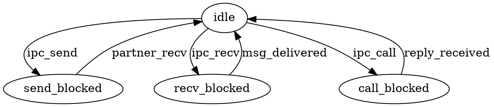

## Introduction

An operating system kernel is the smallest piece of software that runs at the highest privilege level. It is the code that every other program on the machine must trust absolutely — because it controls the hardware, enforces isolation between programs, and mediates every interaction between software and the physical world. The question that has defined OS research for four decades is: *how small can that piece of software be?*

The answer matters because size determines trustworthiness. A kernel of thirty million lines (Linux) cannot be audited, cannot be formally verified, and statistically contains thousands of bugs. A kernel of twenty-three thousand lines (QNX) can be safety-certified for automotive braking systems and nuclear plant control. A kernel of eighty-seven hundred lines (seL4) can be *mathematically proven correct* — every possible execution path verified against a formal specification, with zero bugs relative to that spec.

But size is not the only axis. A kernel must also be *useful*. The smallest possible kernel — one that does nothing — is trivially correct and trivially useless. The engineering challenge is finding the minimum set of abstractions that enables a complete, practical system to be built on top. That search has produced dozens of distinct kernel architectures over four decades, from picokernels that fit in two kilobytes to exokernels that export raw hardware to applications.

This article surveys that landscape. It compares microkernels (QNX, L4, Fuchsia, Horizon), real-time kernels (FreeRTOS, ThreadX, VxWorks, uITRON), educational kernels (xv6, XINU), exokernels (MIT Aegis), and hybrid kernels (XNU). It distills what the successful ones share into a practical blueprint for building a working kernel on RISC-V — and adds a twist that no existing educational kernel offers: *runtime verification*, where the kernel checks its own correctness as it runs, catching bugs that testing misses.

## The Kernel Spectrum

Every OS kernel must answer the same question: how much belongs inside the privileged core, and how much can be pushed to user-space programs? The answers form a spectrum.

At one extreme sits the **monolithic kernel**. Linux is the canonical example — thirty million lines of code, all running in a single address space at the highest privilege level. Device drivers, file systems, networking stacks, and the scheduler all share memory and call each other's functions directly. This is fast but fragile: a bug in any driver can corrupt anything in the system.

At the other extreme sits the **exokernel**, developed at MIT by Dawson Engler in the mid-1990s. An exokernel multiplexes raw hardware among applications and enforces protection, but provides *no abstractions*. No virtual memory, no file system, no processes. Applications link against "library operating systems" that implement whatever abstractions they need. The Aegis exokernel dispatched exceptions in eighteen instructions. Its web server ran eight times faster than the competition. But the programming model was demanding.

Between these extremes lie three architectures that have proven most practically significant:

**Microkernels** provide a small number of fundamental abstractions — typically threads, address spaces, and inter-process communication (IPC) — and implement everything else as isolated user-space servers. QNX, the oldest continuously deployed microkernel (1982), proved this architecture could pass the highest safety certifications and run in hundreds of millions of vehicles. L4 (1993) proved it could be fast. seL4 (2009) proved it could be mathematically correct. The key insight: if the kernel is small enough to audit, it can be *trusted* — and everything built on top runs with the minimum privilege it needs.

**Embedded real-time kernels** prioritize deterministic scheduling and minimal footprint over isolation. FreeRTOS, ThreadX, VxWorks, and uITRON run all tasks in a single address space with no memory protection, but they fit in two to ten kilobytes and provide guaranteed worst-case response times. These properties matter more than isolation when the kernel runs on a microcontroller with eight kilobytes of RAM controlling a pacemaker — or navigating a rover on Mars.

**Hybrid kernels** collapse the microkernel boundary for performance. Apple's XNU combines a Mach microkernel with FreeBSD in a single address space to avoid IPC overhead. Windows NT has a microkernel-influenced architecture but puts drivers in kernel space. These systems inherit the *conceptual* modularity of microkernels without paying the performance cost — or gaining the isolation benefits.

The following table surveys kernels across this spectrum, including both production systems and educational designs:

| Kernel | Type | Year | Origin | Kernel Size | IPC Model | Deployed Units |
|--------|------|------|--------|------------|-----------|----------------|
| QNX Neutrino | Microkernel | 1982 | Quantum Software | 23K SLOC | Synchronous msg passing | 275M+ vehicles |
| Mach | Microkernel | 1985 | CMU | ~100K LOC | Port-based messages | Legacy (XNU) |
| uITRON (TRON) | RTOS spec | 1987 | Univ. of Tokyo | 2.4 KB min | Mailboxes, event flags | Billions |
| VxWorks | RTOS | 1987 | Wind River | Configurable | Queues, semaphores | Mars rovers, Boeing 787 |
| L4 (original) | Microkernel | 1993 | GMD, Germany | 12 KB binary | Synchronous, register-based | Research |
| eCos | RTOS | 1997 | Cygnus/Red Hat | Configurable | Mutexes, event flags | Networking, automotive |
| ThreadX | Picokernel | 1997 | Express Logic | 2-20 KB ROM | Queues, semaphores | 12B+ devices |
| FreeRTOS | RTOS | 2003 | Richard Barry | 4-9 KB binary | Queues, notifications | Billions |
| HelenOS | Microkernel | 2004 | Charles University | Moderate | Async, connection-oriented | Research |
| MINIX 3 | Microkernel | 2005 | Vrije Universiteit | 6K LOC | Synchronous msg passing | Billions (Intel ME) |
| NuttX | RTOS | 2007 | Gregory Nutt | 32 KB flash min | POSIX msg queues, pipes | PX4 drones, Sony |
| seL4 | Microkernel | 2009 | NICTA/Data61 | 8,700 LOC C | Capability-based | 3B+ (via OKL4) |
| Horizon | Microkernel | ~2011 | Nintendo | ~10-30K LOC est. | Sessions + CMIF | 100M+ consoles |
| Zircon (Fuchsia) | Microkernel | 2016 | Google | ~250K LOC | Channels + FIDL | Millions (Nest) |
| Zephyr | Modular RTOS | 2016 | Linux Foundation | 8 KB flash min | Queues, mailboxes | Growing |
| Redox OS | Microkernel | 2015 | Jeremy Soller | ~30K LOC Rust | Scheme-based (URL) | Development |
| XNU | Hybrid | 1996 | Apple (via NeXT) | Large | Mach ports + BSD IPC | Billions (Apple) |
| xv6 | Educational | 2006 | MIT CSAIL | ~6-10K LOC | Pipes | Universities worldwide |
| XINU | Educational | 1981 | Purdue (Comer) | Few K LOC | Messages, semaphores | Universities |

The numbers tell a story. The kernels that have achieved the widest deployment — ThreadX at twelve billion, uITRON at billions, FreeRTOS at billions — are the simplest. They provide tasks, scheduling, and basic synchronization. They fit in single-digit kilobytes. They run on hardware too constrained for isolation. The kernels that provide strong isolation — seL4, QNX, Zircon — are larger, but still orders of magnitude smaller than Linux. The sweet spot for a *practical, modular, extensible* kernel lies in the microkernel column: enough abstraction to be useful, little enough to be trustworthy.

Note that hypervisors (Xen, ESXi, PHYP) fall outside this survey's scope — they serve a specialized purpose of running multiple operating systems rather than providing general-purpose kernel services.

## Beyond the Microkernel: Nanokernels, Cache Kernels, and Capability Systems

The microkernel/monolithic/RTOS taxonomy captures the mainstream, but several architectures explored radically different points in the design space. Some of these influenced modern systems more than their obscurity suggests.

### What Is a Nanokernel?

The term "nanokernel" emerged in the mid-1990s to describe kernels even smaller than microkernels. The meaningful distinction, where one exists: a microkernel provides *abstractions* (threads, address spaces, IPC) while a nanokernel provides only the *mechanism* to multiplex hardware — interrupt dispatching and CPU context switching — pushing everything else, including scheduling and memory management, into upper layers. In practice the line is blurry. L4 is called a microkernel but is smaller than some things called nanokernels. The term largely fell out of academic use by the 2010s, replaced by simply describing what the kernel does and does not contain.

### Symbian EKA2: The Billion-Phone Nanokernel

The most commercially successful nanokernel shipped in over a billion Nokia phones. Symbian's EKA2 (2004) used a deliberate two-layer design: a **nanokernel** (~10,000 lines of C++ and assembly) handled interrupt dispatch, preemptive thread scheduling, synchronization, and MMU configuration. On top sat the full Symbian OS kernel layer (~50,000 lines) providing processes, device drivers, file systems, and IPC.

EKA2's critical innovation was making the nanokernel fully preemptive with real-time guarantees — any thread, including kernel-mode threads, could be preempted at almost any point. This allowed the GSM/3G telephony stack (with hard real-time protocol deadlines) to run on the same processor as the application OS, without a separate baseband RTOS. The nanokernel was personality-agnostic: in theory, a different OS could replace the Symbian layer on top. EKA2 died with Symbian itself when Nokia transitioned to Windows Phone and then Android, but its layered architecture was remarkably sophisticated for mobile hardware of its era.

### Adeos: The Interrupt Pipeline

Adeos (2001) is perhaps the purest nanokernel ever built — a thin interrupt-virtualization layer (~5,000–8,000 lines, implemented as a Linux patch) that dispatches hardware interrupts through a priority-ordered chain of "domains." A small hard real-time executive (Xenomai or RTAI) sits in the highest-priority domain and gets first crack at every interrupt. Linux runs in a lower-priority domain and only sees interrupts the real-time domain did not handle. Linux never actually disables hardware interrupts — Adeos virtualizes the `cli`/`sti` instructions, deferring delivery instead. This gave Linux sub-10-microsecond worst-case latency without replacing it. The I-pipe concept has been largely superseded by Xenomai's Dovetail mechanism and mainline Linux's PREEMPT_RT improvements, but it remains the clearest demonstration of the nanokernel idea: a tiny layer that does nothing but route interrupts, enabling radical OS composition.

### KeyKOS and EROS: The Capability Lineage

**KeyKOS** (1983, Key Logic) is the grandfather of capability-based operating systems. Every object — memory pages, threads, device access, files — was accessed exclusively through unforgeable tokens called "keys." No access control lists, no superuser, no ambient authority. The kernel managed keys, nodes (containers of key slots), pages, and "meters" (CPU allocation tokens) — nothing else. KeyKOS also introduced persistent checkpointing: the entire system state was periodically saved to disk, and on crash or power failure the system resumed from the last checkpoint with all processes intact. Key Logic went out of business in the early 1990s, but Norm Hardy's work produced the concept of "confused deputy" attacks — now foundational in computer security — and directly inspired every capability-based system that followed.

**EROS** (1991–2005, Jonathan Shapiro at the University of Pennsylvania) was KeyKOS's intellectual successor. Shapiro rebuilt the capability model on a rigorous formal foundation, producing the first OS with a formal *confinement proof*: mathematical certainty that an untrusted program given data through the capability system cannot exfiltrate that data. EROS demonstrated that capability systems could achieve IPC performance within a factor of two of L4. The seL4 team explicitly cited EROS's capability design as influential. CapROS, a maintained fork, continues as an active project.

### The Stanford Cache Kernel

The Cache Kernel (1994, Cheriton and Duda at Stanford) inverted the usual design question. Instead of asking "what abstractions should the kernel provide?", it asked: what if the kernel is just a *cache* for OS objects? The kernel held no persistent state. It cached threads, address spaces, and page mappings on behalf of user-space "application kernels." When the cache was full, objects were evicted back to the owning application kernel, just like a hardware cache evicting lines. Different application kernels could implement entirely different OS personalities simultaneously. Crash recovery was simple — reboot the kernel and repopulate from application kernels. The design (~15,000 lines of C, validated on MIPS R4000) never became a product, but it influenced exokernel designs, OS virtualization, and the idea that the kernel need not be the source of truth for system state.

### LSE/OS: Nanokernel for Weapons Systems

LSE/OS (late 1990s, Lockheed Martin) was an embedded nanokernel of approximately one to three thousand lines, designed for military avionics and weapon systems. It provided only partition scheduling (static time-division multiplexing), inter-partition communication, and hardware abstraction — following ARINC 653 partitioning concepts. Each partition ran its own RTOS or bare-metal code in temporal and spatial isolation. LSE/OS achieved DO-178B/C and Common Criteria assurance in a footprint small enough for resource-constrained embedded processors. It flew in actual aircraft and military systems, making it one of the few nanokernels that was not an academic exercise.

### Composite: Scheduling as a User-Space Component

Composite (2010–present, Gabriel Parmer at George Washington University) pushes microkernel minimality to its logical conclusion. The kernel (~5,000–8,000 lines of C) provides only four things: capability-mediated invocation (synchronous IPC), thread dispatch, interrupt routing, and memory mapping. Everything else — including the *scheduler* — is a replaceable, isolated user-space component. Parent scheduler components can delegate scheduling authority to child schedulers, each implementing different policies (EDF for real-time tasks, CFS-like for batch) with formal isolation between them. "Temporal capabilities" grant bounded CPU time quanta, making resource accounting as fine-grained as memory access control. IPC costs are competitive with L4 (sub-microsecond on x86). Composite demonstrates that if scheduling is policy, it need not be in the kernel — and removing it does not cost unacceptable overhead.

## A Brief History

### The Pioneers (1980–1985)

The idea of a minimal message-passing kernel emerged independently in multiple places during the early 1980s.

In 1980, two University of Waterloo students, Dan Dodge and Gordon Bell, took a course in real-time operating systems that required building a basic real-time microkernel. Convinced there was a commercial need, they founded Quantum Software Systems and by 1982 shipped **QNX** — a Unix-like RTOS where the kernel contained only scheduling, message passing, and interrupt handling, with everything else running as user-space servers. QNX fit on a 1.44 MB floppy disk — a complete POSIX OS with GUI, TCP/IP, web browser, and text editor. It was not the first microkernel, but it was the first to prove the architecture commercially viable, and it remains in production four decades later.

In 1981, Douglas Comer at Purdue published **XINU** ("Xinu Is Not Unix"), a clean-room educational kernel designed to be read in a semester. At the same time, Ken Sakamura at the University of Tokyo began designing the **TRON** architecture, which would become the specification behind billions of embedded devices in Japan. IBM shipped the **VRM** (Virtual Resource Manager) on its RT PC in 1986, an early microkernel that ran AIX as a user-mode guest — a concept ahead of its time.

### Mach and the First Crisis (1985–1993)

In 1985, Richard Rashid and Avie Tevanian at Carnegie Mellon University began building **Mach** as a next-generation kernel for multiprocessor workstations. The design was elegant: five abstractions (tasks, threads, ports, messages, memory objects) mediated everything. Unix compatibility was maintained by running a BSD server on top of the microkernel. DEC, IBM, and HP formed the Open Software Foundation and adopted Mach. NeXT used Mach 2.5 for NeXTSTEP.

But when CMU shipped Mach 3.0 — the version that actually moved BSD *out* of the kernel into user space — the performance numbers were devastating. Benchmarks showed fifty to sixty-seven percent overhead compared to monolithic Unix. The IPC round-trip cost about one hundred microseconds — five times slower than a Unix pipe on the same hardware.

Chen and Bershad's 1993 analysis identified the root cause: cache pollution. Each context switch flushed the processor's caches, and Mach's hundred-thousand-line kernel competed with application code for cache space. The "microkernel" was too big to be a microkernel. This result damaged the reputation of the entire architectural approach.

### Meanwhile, in the Embedded World (1987–2000)

While the academic community debated Mach's failure, embedded systems were quietly building practical small kernels without worrying about the theory.

**VxWorks** (1987, Wind River) became the dominant commercial RTOS, eventually running on the Mars Pathfinder — where it famously demonstrated a priority inversion bug that was debugged remotely from Earth. VxWorks ran on Spirit, Opportunity, Curiosity, Perseverance, the Ingenuity helicopter, and Boeing 787 avionics.

**uITRON** (1987, TRON Forum) took a different approach entirely: rather than shipping a kernel, it shipped a *specification*. The "weak standardization" philosophy defined APIs but let each vendor optimize the implementation for their hardware. This enabled deployments from eight-bit microcontrollers to thirty-two-bit SoCs, achieving over sixty percent market share in Japan's embedded RTOS market — a position held for twenty-six consecutive years.

**pSOS** (1982, Software Components Group) dominated telecom equipment at Lucent, Nortel, and Ericsson through the 1990s before Wind River acquired and end-of-lifed it.

These kernels shared a philosophy: deterministic scheduling, minimal footprint, single address space, no pretense of Unix compatibility. They were not microkernels in the academic sense — they provided no isolation — but they proved that a kernel measured in kilobytes could run safety-critical systems.

### L4 and the IPC Revolution (1993–2009)

Jochen Liedtke at GMD in Germany had been building kernels since the 1980s (Eumel, L3) and had observed the same IPC costs as Mach. But where others concluded microkernels were fundamentally flawed, Liedtke concluded Mach was over-engineered.

His **L4** kernel, written in i386 assembly, attacked the problem directly: three abstractions (threads, address spaces, IPC), seven system calls, twelve kilobytes of code. IPC messages traveled in CPU registers — no copying, no buffering. The kernel performed a *direct process switch* from sender to receiver, skipping the scheduler. Result: IPC round-trip of ten microseconds, twenty times faster than Mach.

L4's contribution was not the microkernel concept — QNX had shipped a production microkernel a decade earlier. L4's contribution was demonstrating that the performance gap between microkernels and monolithic kernels was an *implementation* problem, not an *architectural* one. Mach was slow because it did too much work per IPC, not because message passing is inherently expensive.

Liedtke continued L4 development at the University of Karlsruhe until his death in 2001. His students and collaborators carried the work forward. The UNSW/NICTA group in Sydney forked L4 into **OKL4** and shipped it on every Qualcomm modem chipset — over three billion devices. TU Dresden's **Fiasco** variant added real-time guarantees.

### Formal Verification and the Modern Landscape (2009–Present)

In 2009, Gerwin Klein and colleagues at NICTA published **seL4**, a formally verified L4 variant. The verification proved that seL4's 8,700 lines of C *correctly implement* its mathematical specification — zero bugs relative to the spec. The proof covers functional correctness, integrity, confidentiality, and worst-case execution time bounds. It required approximately twenty person-years and hundreds of thousands of lines of Isabelle/HOL proof scripts.

This was only possible because the kernel was small enough. Formal verification cost scales roughly with the cube of code size. Eight thousand lines is tractable. A hundred thousand is not.

The modern landscape shows the microkernel concept thriving across diverse domains:

- **QNX** (1982–present): 275+ million vehicles, safety-certified to ISO 26262 ASIL D and IEC 62304 Class C.
- **Nintendo's Horizon** (~2011–present): True microkernel in every 3DS and Switch, all drivers in user space including the GPU driver.
- **Google's Zircon** (2016–present): Capability-based microkernel powering Nest Hub smart displays.
- **MINIX 3** (2005): Found inside every Intel CPU since ~2015, running in the Management Engine.
- **Redox OS** (2015–present): A Rust microkernel aiming to prove memory-safe kernels are viable.
- **Xous** (2020): A Rust microkernel for the Precursor open-hardware security platform.

Apple's **XNU** (1996–present) is the most commercially successful Mach descendant — but it achieved this by abandoning the microkernel's isolation, running Mach and BSD in a single address space as a hybrid kernel. XNU inherits Mach's abstractions (tasks, threads, ports) while avoiding the IPC overhead that sank Mach 3.0.

At the teaching level, MIT's **xv6** (2006) — a clean reimplementation of Unix v6 in modern C, now targeting RISC-V — has become the standard educational kernel at dozens of universities worldwide.

## The Three Pillars

Strip away the historical detail and every microkernel reduces to three fundamental abstractions. These three are necessary and, for the kernel itself, sufficient. Everything else can be — and in a well-designed microkernel, *is* — implemented in user space.

### Threads: The Unit of Execution

A thread is the kernel's representation of a running computation. At minimum, a thread consists of a program counter, a stack pointer, saved registers, a priority, and a state (running, ready, blocked, or dormant).

The scheduler selects the highest-priority ready thread and dispatches it to the CPU. When a thread blocks on IPC or a page fault, the scheduler picks the next one. When a higher-priority thread becomes ready, it preempts the current one immediately.

Implementations differ in ways that reveal each kernel's priorities:

**QNX** implements POSIX scheduling policies — FIFO, round-robin, and sporadic — with 256 priority levels and *adaptive partitioning* that guarantees minimum CPU budgets to groups of threads, preventing starvation under overload.

**L4/seL4** model hardware interrupts as IPC messages delivered to handler threads. This unifies interrupt handling with the message-passing mechanism, keeping the kernel simpler. The handler runs in user mode with the same memory protection as any other process.

**ThreadX** introduced *preemption-threshold*, where a thread specifies a ceiling: only threads above the ceiling can preempt it. This reduces context switches among cooperating threads — a practical optimization on twelve billion devices.

**Horizon** (Nintendo Switch) uses hard core affinity: three of four CPU cores dedicated to the game, one reserved for system services. Microkernel scheduling optimized for gaming latency.

**VxWorks** uses the Wind microkernel with 256 priorities and a fully preemptible kernel. Its most famous scheduling incident: the Mars Pathfinder priority inversion bug (1997), debugged remotely from Earth by enabling priority inheritance in the mutex subsystem.

Embedded RTOSes (FreeRTOS, uITRON, Zephyr) use similar priority-based preemptive schedulers but run all threads in a single address space, eliminating address-space switching overhead at the cost of zero isolation.

### Address Spaces: The Unit of Isolation

An address space ensures one program cannot read or modify another's memory. The kernel manages the MMU's page tables so each process sees its own virtual address space. This is the fundamental difference between a microkernel and an embedded RTOS — and it is the feature that makes microkernels suitable for systems where untrusted code must be contained.

The approaches differ dramatically:

**No isolation**: FreeRTOS, uITRON, ThreadX, VxWorks (in flat mode), and RIOT run all tasks in a single address space. No MMU, no page tables. A bug anywhere corrupts everything. This is appropriate when all code is compiled and linked together by a single team for a single-purpose device.

**Recursive address spaces (L4)**: The kernel creates one primordial address space (sigma0) mapping all physical memory. User-space programs construct new address spaces using three operations: **map** (share pages), **grant** (transfer ownership), **unmap** (revoke access). Page faults are delivered as IPC messages to a designated *pager* — a user-space server. The entire virtual memory policy is in user space; the kernel provides only the mechanism.

**Capability-controlled memory objects (Fuchsia)**: Zircon's Virtual Memory Objects (VMOs) are kernel objects that can be mapped, shared, COW-cloned, and pager-backed. Access requires holding a handle with appropriate rights. Richer than L4's model, but less minimal.

**Full POSIX virtual memory (QNX)**: Per-process address spaces with lazy physical allocation, guard pages, ASLR, and POSIX shared memory. The memory manager runs partly in user space (process manager) and partly in the kernel.

**Signed capability intersection (Horizon)**: Each process has cryptographically signed capability descriptors (ACID) specifying maximum permissions, and requested capabilities (ACI0). The process gets ACI0 ∩ ACID — it can never exceed what was authorized at signing time.

### IPC: The Critical Path

In a microkernel, every operation that would be a function call in a monolithic kernel becomes an IPC round-trip. If IPC is slow, everything is slow. This is why Mach's hundred-microsecond IPC killed it, and why L4's ten-microsecond IPC revived the architecture.

**Synchronous message passing (QNX)**: MsgSend/MsgReceive/MsgReply. The sender blocks until the receiver processes the message and replies. The kernel copies data directly between address spaces with no intermediate buffer. Built-in blocking provides automatic flow control. This is the foundation of QNX's *resource manager* pattern: every system service — file systems, drivers, networking — is a user-space process that receives standard POSIX I/O messages via IPC.

**Register-based message passing (L4)**: Short messages travel in CPU registers. The kernel performs a direct process switch from sender to receiver, skipping the scheduler. No copying, no buffering. This approaches the hardware minimum for a protected transfer between address spaces.

**Port-based messages (Mach)**: Every kernel object has a port. Messages can contain port rights, inline data, and out-of-line data via COW mapping. The generality was Mach's undoing — every message paid the cost of the most complex case.

**Channels + FIDL (Fuchsia)**: Bidirectional, asynchronous channels that transfer both data and handles (capabilities). FIDL provides type-safe protocol definitions with code generation. The most ergonomic design, at the cost of being the least minimal.

**Session-based with domains (Horizon)**: The CMIF protocol multiplexes multiple logical sessions through a single kernel session handle. Services are registered by name with a central service manager.

**Zero-copy mailboxes (uITRON)**: Only the address of the message is sent — the receiver reads data directly from the sender's memory. Fastest possible, but requires a shared address space (no isolation).

| Kernel | IPC Round-Trip | Mechanism | Notes |
|--------|---------------|-----------|-------|
| L4 (original) | ~10 μs | Register transfer, direct switch | 486DX-50, ~1993 |
| seL4 | Sub-microsecond | Capability-validated registers | Modern ARM/x86 |
| Mach | ~100-230 μs | Port messages, kernel copy | Same-era hardware |
| QNX | Low μs | Direct copy between addr spaces | POSIX-compatible |
| Unix pipe | ~20 μs | Kernel buffer copy | Same-era baseline |
| ThreadX semaphore | ~0.2 μs | Direct (same addr space) | 200 MHz Cortex-M |

L4Linux demonstrated the practical ceiling empirically: Linux running as a user-space server on L4 suffered only five to six percent overhead on macro-benchmarks. The microkernel "tax" is real but small — and it buys isolation, modularity, and the ability to restart crashed drivers without rebooting.

## Security Models

The security model is where kernel philosophy becomes most visible:

**No protection**: FreeRTOS, uITRON, ThreadX trust all code absolutely. Every task can access every memory location. Appropriate for single-purpose embedded devices where all code is from the same team.

**POSIX permissions**: QNX implements Unix-style discretionary access control. Familiar and sufficient for many applications, but does not prevent privilege escalation by design.

**Capability-based access control**: seL4, Fuchsia, and Horizon enforce access through unforgeable tokens. In seL4, every system call requires an explicit capability. In Fuchsia, there is no global namespace, no superuser, no ambient authority. In Horizon, capabilities are cryptographically signed and intersected with requests.

**Formal verification**: seL4's proofs establish that the C code does exactly what its mathematical specification says. The integrity proof: no process can access data without the right capability. The confidentiality proof: information cannot flow between processes unless a capability permits it. These are mathematical theorems, valid for all possible inputs and execution paths.

**Runtime verification** occupies a middle ground between testing and formal proof: the kernel monitors its own behavior against formal specifications *as it runs*, catching violations that testing misses and formal verification cannot cover (because formal proofs assume correct hardware and specific configurations). This is the approach we will build into our tutorial kernel.

## Building Your Own: A Self-Verifying Microkernel on RISC-V

The survey above distills into a concrete blueprint. What follows is a step-by-step guide to building a minimal but practical microkernel — with a twist. This kernel will *verify its own correctness at runtime*, using lightweight deterministic automata to check that its IPC protocol, scheduler, and capability system behave as specified.

The target platform is **RISC-V on QEMU** (the `virt` machine), with a path to physical hardware on the **Raspberry Pi Pico 2** (RP2350 in RISC-V mode) or the **Olimex RP2350-PC**.

### Why RISC-V

RISC-V is a natural fit for kernel development education:

- **Clean privilege model**: Three levels — Machine (M), Supervisor (S), User (U) — with explicit CSRs for trap handling, interrupt control, and page table configuration. No legacy cruft.
- **Simple context switch**: Fourteen stores and fourteen loads for a voluntary switch (callee-saved registers only). About seventy instructions for a full preemptive switch from a trap handler.
- **Straightforward page tables**: Sv39 gives 39-bit virtual addresses with three-level 4 KiB page tables. A single identity-mapped gigapage gets you started with one page table entry.
- **System calls via `ecall`**: The instruction traps to the next privilege level. Arguments in `a0`-`a5`, syscall number in `a7`, return in `a0`. Clean and uniform.
- **Real hardware exists**: The RP2350's Hazard3 cores run RV32IMC at 150 MHz. The Olimex RP2350-PC adds 8 MiB PSRAM, HDMI output, and an SD card slot — enough to build a system with a real display and storage.

QEMU's `virt` machine provides M+S+U modes with Sv39, a PLIC (Platform-Level Interrupt Controller) for device interrupts, a CLINT for timer interrupts, and VirtIO devices. This is sufficient for a complete microkernel with virtual memory and user-space isolation.

The RP2350's Hazard3 cores run M-mode only (no MMU, no S/U modes), which makes them suitable for an RTOS-style kernel without isolation — a useful stepping stone before tackling full virtual memory on QEMU.

### Step 1: Boot on RISC-V

The kernel starts in M-mode (or S-mode if OpenSBI handles M-mode setup). The boot sequence:

1. Set the stack pointer for each hart (hardware thread)
2. Set the trap vector (`mtvec` or `stvec`) to point to the kernel's trap handler
3. Zero the BSS section
4. Park secondary harts (only hart 0 continues)
5. Jump to C

```
qemu-system-riscv64 -machine virt -bios none -kernel kernel.elf -nographic
```

With `-bios none`, QEMU starts your kernel directly in M-mode at the reset vector. With `-bios default`, OpenSBI handles M-mode initialization and drops your kernel into S-mode at 0x80200000, passing the hart ID in `a0` and a device tree pointer in `a1`.

For the RP2350, the Pico SDK's startup code handles initialization. Build with `cmake -DPICO_PLATFORM=rp2350-riscv ..` to target the Hazard3 cores.

### Step 2: Threads and Scheduling

Implement a Thread Control Block (TCB) containing saved registers, stack pointer, priority, state, and — for runtime verification — a small automaton state field.

The context switch on RISC-V saves and restores callee-saved registers: `ra`, `sp`, `s0`-`s11`. For a voluntary switch, this is twenty-eight instructions (fourteen stores, fourteen loads, then `ret`). For a preemptive switch from a trap, save all thirty-one general-purpose registers plus `sepc` and `sstatus`.

The scheduler is a bitmap of priority levels, each with a linked list of ready threads. Finding the highest-priority ready thread is a single "find first set" operation on the bitmap. Set up the CLINT timer to fire periodic interrupts for time-slicing.

### Step 3: Synchronous IPC

This is the heart of the kernel. Implement synchronous message passing:

1. The sender specifies a destination and loads message words into registers (`a0`-`a5`).
2. The kernel validates the destination and checks whether the receiver is blocked waiting for a message.
3. If the receiver is ready: direct process switch. Save the sender's context, transfer the message registers, resume the receiver. The scheduler is *not* invoked.
4. If the receiver is not ready: the sender blocks on a send queue.

For the common call-reply pattern, a combined `ipc_call` sends a message and immediately blocks for a reply. The server uses `ipc_reply_wait` to reply and block for the next message. Two kernel entries per round-trip.

### Step 4: Address Spaces and Memory Management

On QEMU's `virt` machine (RV64 with Sv39), set up three-level page tables. Implement three system calls:

- **Map**: Create page table entries in a destination address space pointing to the same physical frames as a source. The source retains access.
- **Grant**: Like map, but remove the mapping from the source.
- **Unmap**: Revoke previously mapped pages from a destination (and all transitive mappings).

Implement page fault delivery: when a thread faults, the kernel sends an IPC message to its designated pager containing the faulting address and access type. The pager maps a page into the faulting thread's address space and the thread resumes.

On the RP2350 (M-mode only, no MMU), this step is skipped — all threads share a flat physical address space, like FreeRTOS.

### Step 5: The System Call Interface

You need approximately ten system calls:

| System Call | Purpose |
|-------------|---------|
| `ipc_call` | Send message and block for reply |
| `ipc_reply_wait` | Reply to caller and wait for next message |
| `ipc_send` | Send (blocking or non-blocking) |
| `map` | Map pages between address spaces |
| `grant` | Transfer page ownership |
| `unmap` | Revoke page mappings |
| `thread_create` | Create a new thread |
| `thread_yield` | Donate remainder of time slice |
| `thread_control` | Set scheduling parameters |
| `irq_register` | Bind a hardware interrupt to a thread |

System calls enter the kernel via the `ecall` instruction. The trap handler reads `scause` (value 8 for a U-mode ecall), dispatches on the syscall number in `a7`, and advances `sepc` by four bytes to skip past the `ecall` on return.

### Step 6: Interrupts as IPC

When a hardware interrupt fires (delivered via the PLIC on QEMU, or the RP2350's interrupt controller), the kernel looks up the registered handler thread and delivers the interrupt as an IPC message. The handler thread processes the interrupt in user space, accesses the device through mapped I/O memory, and acknowledges it. This unifies interrupt handling with the IPC path.

On QEMU `virt`, the PLIC sits at 0x0C000000. Each interrupt source has a priority register, and each hart/privilege-level context has enable bits and a claim/complete protocol. The CLINT at 0x02000000 provides per-hart timer interrupts via `mtimecmp`.

### Step 7: Runtime Verification — The Self-Checking Kernel

This is what makes this kernel different from xv6, XINU, or any other educational kernel.

The Linux kernel gained a runtime verification (RV) subsystem in version 5.17 (2022), developed by Daniel Bristot de Oliveira. The approach: specify expected kernel behavior as **deterministic automata** (finite state machines), then monitor actual execution traces against those automata, flagging violations. The overhead is less than one percent — each check is a single array lookup.

For a microkernel with ten system calls, this approach is even more natural than it is for Linux. The kernel's API surface is small enough that a handful of automata can cover every critical invariant.

#### Defining Monitors as State Machines

Each monitor is specified as a Graphviz `.dot` file, compiled to a C transition table at build time:



This compiles to a constant array:

```c
enum rv_state { IDLE, SEND_BLOCKED, RECV_BLOCKED, CALL_BLOCKED, NR_STATES };
enum rv_event { EV_SEND, EV_RECV, EV_CALL, EV_PARTNER_RECV,
                EV_MSG_DELIVERED, EV_REPLY_RECEIVED, NR_EVENTS };

static const int8_t ipc_table[NR_STATES][NR_EVENTS] = {
    [IDLE][EV_SEND] = SEND_BLOCKED,
    [IDLE][EV_RECV] = RECV_BLOCKED,
    [IDLE][EV_CALL] = CALL_BLOCKED,
    [SEND_BLOCKED][EV_PARTNER_RECV] = IDLE,
    [RECV_BLOCKED][EV_MSG_DELIVERED] = IDLE,
    [CALL_BLOCKED][EV_REPLY_RECEIVED] = IDLE,
    /* all other entries default to -1 (violation) */
};
```

#### Instrumenting the Kernel

Each system call path includes a single check:

```c
static inline void rv_check(struct thread *t, int monitor, int event) {
    int8_t next = monitors[monitor].table[t->rv_state[monitor]][event];
    if (next < 0) {
        rv_violation(t, monitor, event); /* log, panic, or recover */
        return;
    }
    t->rv_state[monitor] = next;
}
```

Per-thread overhead: one byte per monitor. For a hundred threads and three monitors, that is three hundred bytes. Each transition table is typically under sixty-four bytes (fits in a cache line). The check itself is a single array index plus a branch — two to three cycles.

#### What to Verify

Four monitors cover the critical invariants of a microkernel:

1. **IPC protocol**: Per-thread automaton tracking message flow. Catches: sending while already blocked, replying without a pending call, receiving when not in a valid state.

2. **Scheduler correctness**: After every context switch, verify that the running thread has the highest priority among all ready threads. This is the most common scheduler bug in student kernels and the hardest to diagnose without a monitor.

3. **Thread lifecycle**: Track state transitions (created → ready → running → blocked → ready → ... → exited). Catch invalid transitions like running a dormant thread or blocking an already-blocked thread.

4. **Capability lifecycle** (if implemented): Track capability states (empty → valid → revoked). Catch: invoking a revoked capability, double-free, granting from an empty slot.

#### Why This Matters

Runtime verification occupies a unique position between testing and formal proof:

- **Testing** checks specific inputs. It misses bugs on paths the test suite never exercises.
- **Formal verification** (seL4-style) checks all possible inputs. It costs person-years and requires PhD-level expertise.
- **Runtime verification** checks *every actual execution* against a formal specification. It costs days to implement, catches bugs testing misses, and runs with negligible overhead.

A student's kernel with RV monitors catches its own bugs — not after the fact in a debugger, but *at the moment of violation*, with a diagnostic that says exactly which invariant was broken, in which subsystem, for which thread, and from which state. The monitors also serve as executable documentation: each automaton is a precise, testable statement of a kernel invariant that cannot go stale.

No existing educational kernel — not xv6, not XINU, not any of the hundreds of hobby OS projects — includes built-in runtime verification. A self-verifying microkernel would be genuinely novel.

### Step 8: From Kernel to System

With the steps above, you have a kernel that runs isolated processes, lets them communicate via IPC, manages virtual memory, handles interrupts, and verifies its own correctness at runtime. Everything else is user space:

**A device driver** is a user-space process that receives mapped I/O memory, registers as an interrupt handler, and exposes a service interface via IPC.

**A file system** is a user-space process that receives storage access via IPC to the disk driver and serves file operations to clients.

**A network stack** is a user-space process that communicates with the NIC driver via IPC and serves socket operations.

This is the QNX resource manager pattern: every system service registers an IPC endpoint, receives requests, and replies. The kernel knows nothing about files, networks, or devices. It only knows about threads, address spaces, and messages.

### Hardware Path: From QEMU to Physical Silicon

The tutorial has two natural progression points for physical hardware:

**Raspberry Pi Pico 2** (RP2350, Hazard3 RV32IMC cores at 150 MHz): M-mode only, no MMU. Run the RTOS-style variant of the kernel (threads, IPC, scheduling — but no address space isolation). The 520 KiB SRAM is enough for a meaningful system with several tasks. Build with the Pico SDK targeting `rp2350-riscv`.

**Olimex RP2350-PC**: Same RP2350 chip, but with 16 MiB flash, 8 MiB QSPI PSRAM, HDMI output (via HSTX), a microSD card slot, and audio. This transforms the microcontroller into a platform where a kernel can drive a real display, access real storage, and produce real sound — while still being simple enough that a single student can understand every line of code running on it.

Note that the Hazard3 cores lack the A (atomic) extension — there are no `lr`/`sc` or AMO instructions. Mutual exclusion requires the RP2350's thirty-two hardware spinlocks in the SIO block, or disabling interrupts.

## Conclusion

The minimal kernel is not a theoretical construct. It is the architecture behind the modem in your phone (OKL4, three billion devices), the brakes in your car (QNX, 275 million vehicles), the console under your television (Horizon, hundreds of millions), and the smart display on your kitchen counter (Zircon). It runs the rovers on Mars (VxWorks) and the Management Engine in your CPU (MINIX 3). It runs on billions of devices because the engineering argument is straightforward: a kernel small enough to audit is a kernel you can trust.

The blueprint presented here — threads, address spaces, IPC, nothing more — is not new. It is what QNX shipped in 1982, what L4 optimized in 1993, what seL4 proved correct in 2009. What the survey reveals is convergence: across sixteen kernels spanning four decades, the answers are remarkably consistent. Priority-based preemptive scheduling. Synchronous message passing. User-space drivers and file systems.

What *is* new in this blueprint is the runtime verification layer — a kernel that checks its own invariants as it runs, catching the bugs that testing misses without the multi-year investment of formal proof. The automata are small (under sixty-four bytes each), the overhead is negligible (under one percent), and the educational value is high: each monitor is an executable specification that documents precisely what the kernel promises about its own behavior.

For a student looking to build a working kernel: start on QEMU's RISC-V `virt` machine. Get IPC working first — everything else depends on it. Write your first runtime monitor before your first user-space process. Then add address spaces, deliver interrupts as IPC, and build your first driver as a user-space server. You will have a kernel smaller than many individual Linux device drivers, and it will be capable of something no production kernel offers: proving, at every moment, that it is behaving correctly.
