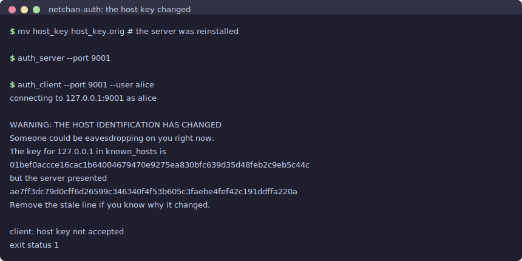
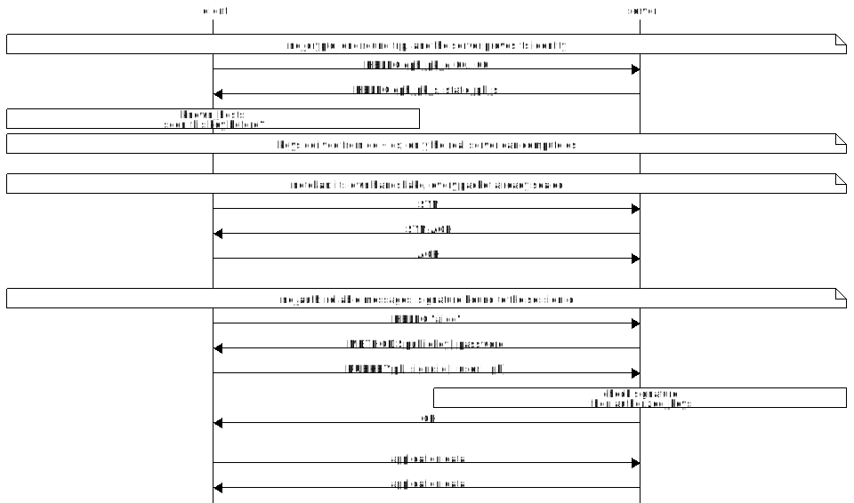
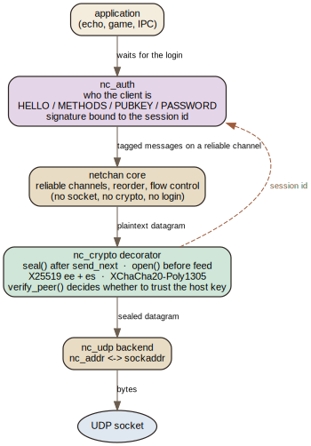
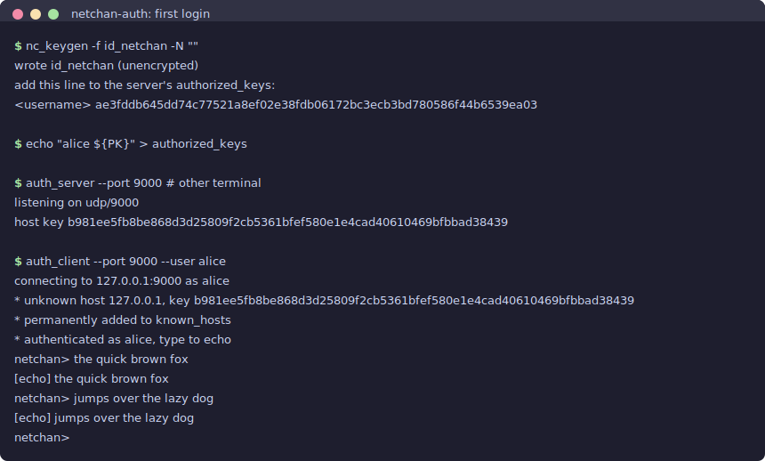

## Introduction

[Part three](/netchan-crypto/) added encryption and then spent most of its
length admitting what encryption alone does not do. The default handshake was
ephemeral on both sides, which is Noise's `NN` pattern, and `NN` gives
confidentiality, integrity, and forward secrecy against someone who is only
listening. Against someone in the path it gives nothing. An active attacker
can run a separate handshake with each side and sit in the middle reading
everything, because neither end has any durable identity for the other to
check.

That article named two ways to close the gap and implemented the easier one, a
pre-shared key. The harder one, a long-term identity key that a client
remembers between connections, was described as a natural extension and left
unbuilt. This part builds it, and then keeps going, because a server that can
prove who it is immediately raises the question of who the client is.

The model throughout is ssh, whose trust model fits the same programs netchan
fits: you own both ends, or you know the operator, and there is no certificate
authority anywhere in the picture. More rigorous designs exist. None of them
fit as well.

## Abstract

Two additions, at two different layers.

`nc_crypto` gains an optional long-term X25519 identity key. When a side has
one, its public half travels in the `HELLO` and a second Diffie-Hellman is
folded into the key derivation. Authentication then falls out with no
signature on the wire and no extra round trip: only the holder of the matching
secret can derive the same keys, so the first packet that opens is proof of
possession. The decision of whether to *trust* a given key is pushed out to a
`verify_peer` callback, and the demo answers it the way ssh does, by recording
the key on first contact and refusing loudly if it ever changes.

Above that sits `nc_auth`, a small conversation modelled on ssh's userauth:
the client claims a name, the server says which methods it will accept, and
the client offers an Ed25519 public key first and a password only as a
fallback. The signature is over a digest that includes the `nc_crypto` session
id, which is what stops a signature captured by a malicious server from being
replayed at a real one.

The two layers know nothing about each other. `nc_crypto` has never heard of a
username; `nc_auth` has never heard of a socket, which is why both halves of
the login can be tested in one process with no transport at all.

## What Part Three Left Open

The gap was narrow and specific. Encryption without authentication is not
worthless, it defeats passive collection entirely, but it fails the moment the
attacker can write to the wire and not merely read it. And the failure is
silent. Both endpoints see a perfectly healthy encrypted session.

There are three ways out, and they differ mainly in where the trust comes from.

**A certificate authority.** Some third party you already trust signs a
statement binding a name to a key. This is what TLS, and therefore QUIC and
DTLS, do. It scales to strangers, which is the entire reason the web works,
and it costs a certificate to obtain, renew, and validate against a name.

**Keys exchanged out of band.** Each side is configured with the other's
public key before the first packet. This is WireGuard. It is simple and it has
no first-contact window at all, but somebody has to move those keys around, and
that somebody is a human with a text editor.

**Trust on first use.** Accept whatever key appears the first time, remember
it, and compare forever after. This is ssh, and it is what the user of a
lightweight protocol will actually do, because it requires no infrastructure
and no key distribution ceremony.

The third option is the right one here, and the reason is more specific than
convenience.

## Trust on First Use, and Why It Is Enough Here

The honest description of trust on first use is that it converts a permanent
vulnerability into a single-connection one. With `NN`, every session is
open to a man in the middle. With a remembered host key, only the very first
session is, and every session after it is protected. If an attacker is not
present at that one moment, they have permanently lost their opportunity.

That is a large improvement bought for almost nothing, and it is also
genuinely weaker than a certificate. An attacker present at first contact gets
its own key pinned, and every connection after it looks immaculate with no
alarm anywhere. ssh has lived with this since 1995.

Two things make the exposure smaller in practice than it sounds. The first is
that being in the path at an arbitrary moment is much easier than being in the
path at a specific one, and an attacker does not get to choose when a user
first connects. The second is that ssh gives you an out-of-band channel when
you want one: read the fingerprint off the server's console, or publish it in
DNS as an `SSHFP` record (RFC 4255). Neither is a certificate authority.
Both close the window if you care enough to use them.

The other cost is operational, and it is the one people actually complain
about. Key continuity means a legitimately reinstalled server produces the
alarming warning, and each client has to be told the change was real. That is
irritating for a fleet and trivial for a game server or a pair of processes on
one machine, which is exactly the population netchan is aimed at.



Note what the client does *not* do there. It refuses before it sends a
username, let alone a password. A design that prompted for credentials and
then checked the host key would hand them to whoever answered.

## Adding an Identity Key to the Handshake

The protocol change is smaller than the discussion around it. The `HELLO`
grows a field:

```
HELLO: [0x01][ephemeral pk : 32][static pk : 32]        (65 bytes)
DATA : [0x02][counter : 8 BE][mac : 16][ciphertext ...] (+25 bytes)
```

The static field is all zeros when the sender has no identity key, and it is
always present rather than optional. Both `HELLO`s are then the same size,
which matters for a socket exposed to the internet: a responder that answered
33 bytes with 65 would be a small amplifier for anyone willing to spoof a
source address.

The key derivation absorbs a second Diffie-Hellman:

```c
if (c->role == 0) {                       /* we are the initiator */
    if (c->peer_has_static)
        crypto_x25519(dh_is, c->eph_sk, c->peer_static_pk);
    if (c->have_static)
        crypto_x25519(dh_si, c->static_sk, peer_eph);
} else {                                  /* we are the responder */
    if (c->have_static)
        crypto_x25519(dh_is, c->static_sk, peer_eph);
    if (c->peer_has_static)
        crypto_x25519(dh_si, c->eph_sk, c->peer_static_pk);
}
```

`dh_is` is the interesting one. The initiator computes it from its own
ephemeral secret and the responder's identity public key; the responder
computes the identical value from its identity secret and the initiator's
ephemeral public key. Only the true holder of the identity secret can arrive
at that number, so an impostor derives different session keys and every packet
it seals fails to open. That is the whole authentication mechanism. There is
no signature on the wire, no certificate to parse, and, crucially, **no extra
round trip**. The handshake costs exactly what it cost before.

Both results go into the same BLAKE2b transcript as everything else, along
with the sorted ephemeral public keys, the identity keys in role order, and
the optional pre-shared key. Three outputs come out under three labels: one
session id and the two directional keys.

**Forward secrecy survives.** The ephemeral-ephemeral secret is still in the
transcript, so an attacker who steals the server's identity key next year
cannot decrypt the traffic they recorded this year. What they gain is the
ability to impersonate that server from then on, which is the same bargain
WireGuard and ssh make.

In Noise's naming this message flow is `NX`: the responder's identity is
transmitted during the handshake rather than known in advance. A client that
has connected before, and compares the key against what it recorded, is
applying `NK`'s verification to `NX`'s message flow, which is trust on first
use stated in Noise's vocabulary.



## Keeping the Policy Out of the Protocol

`nc_crypto` can prove that a peer holds a particular secret. It has no
business deciding whether that particular peer is welcome. Those are different
questions, and the second one is pure policy: pin one key, look it up in a
file, warn on change, accept anything in a test harness.

So the file exposes a callback and stops:

```c
/* Return 0 to accept the peer's static key, non-zero to abort the session.
 * peer_static_pk is NULL if the peer presented none. */
typedef int (*nc_crypto_verify_cb)(void *ctx, const uint8_t *peer_static_pk);
```

It is called once, after the peer's `HELLO` is parsed and before any key
material is derived from it. Refusing kills the session permanently rather
than downgrading it to something weaker.

This is a small interface with a large payoff in what does not end up in the
protocol file. `nc_crypto` performs no file I/O, has no notion of a hostname,
prints nothing, and prompts nobody. The demo's entire known-hosts policy is
one function in the client, and the loopback test replaces it with a
three-line pin. Neither required touching the transport.

There is one negative case worth being firm about. A client that wants a
recognisable server should set `require_peer_static`, so a peer presenting no
identity key is refused outright rather than silently falling back to the
unauthenticated handshake. A security property that quietly disappears when
the other side omits a field is not a security property.

## Authenticating the Client Is a Different Problem

Everything above authenticates the *server*. The server still has no idea who
just connected, and the right answer to that is a different layer, for a
specific reason.

Client authentication is a conversation. It has several messages, it can fail
and retry with a different method, and it needs those messages to arrive
in order and not get lost. netchan already provides exactly that, one layer
above the transport decorator. Pushing the login down into `nc_crypto` would
mean reimplementing reliable delivery underneath the thing that already
has it.

So `nc_auth` sits above netchan and carries ssh's flow, minus the parts a game
does not need:

```
client -> HELLO    "I claim to be alice"
server -> METHODS  "for that name I will accept publickey, password"
client -> PUBKEY   a public key and a signature over the session
server -> OK, or FAIL carrying the methods still worth trying
client -> PASSWORD only if publickey was refused or unavailable
server -> OK or FAIL
```

The `FAIL` message carries the methods that remain, which is why the client
never guesses and never retries something already ruled out. Six failed
attempts end the conversation and the server drops the session.

One detail in the server's `METHODS` reply is deliberate and easy to get
wrong. It offers the same methods for a name that exists as for one that does
not:

```c
static unsigned
srv_methods(void *ctx, const char *user)
{
    (void)ctx;
    (void)user;
    return NC_AUTH_M_PUBKEY | NC_AUTH_M_PASSWORD;
}
```

Tailoring that answer to whether the account exists would turn a single
message into an account enumerator. The same care is needed on the timing
side: the demo's password check runs its Argon2 work even when the account
does not exist, so a stopwatch cannot answer the question the message refuses
to.

`nc_auth` is ignorant of the transport as well. It is handed a send callback
and fed whole messages, which is why both halves of the login can be driven in
one process with a message queue between them and no sockets at all. Being
able to test it that way is the evidence that the seam is real.



The dashed arrow in that diagram is the only coupling between the two new
layers, and it is the most important line in the design.

## Binding the Signature to the Session

A naive challenge-response works like this: the server sends a random nonce,
the client signs it, the server checks the signature against a known public
key. It looks fine. It is broken.

Suppose a client connects to a malicious server, or an attacker gets itself
pinned during that one first-contact window. The client offers its public key
and a signature over the server's nonce. The attacker now opens its own
connection to the *real* server, receives a challenge, and it cannot reuse the
signature because the nonce differs. So it does the obvious thing: it relays.
It takes the real server's nonce, hands it to the client as its own challenge,
and forwards the client's signature onward. The real server sees a valid
signature over its own fresh nonce and logs the attacker in as the client.
Nothing was replayed in the naive sense, and the freshness of the nonce
bought nothing at all.

The fix is to sign something that could only have been produced in *this*
session, between *these* two parties. `nc_crypto` already computes a value
with exactly that property, since its transcript commits to both ephemeral
keys, both identity keys, and the pre-shared key. It is exported under its own
label, so publishing it says nothing about either directional key:

```c
/* BLAKE2b-256("netchan-auth-v1" || sid || ulen || user || pk) */
void nc_auth_signed_digest(uint8_t out[32], const uint8_t sid[32],
                           const char *user, const uint8_t pk[32]);
```

Because the session id includes the server's identity key, a signature made
for a session with the attacker commits to the attacker's key. Relaying it to
the real server produces a digest over a different session id, and the
signature does not check out. ssh does the same thing, signing a blob that
begins with its session identifier (RFC 4252), and for the same reason.

This is the one property in the design with a test of its own. It captures a
`PUBKEY` message from a genuine successful login and feeds it to a second
server whose session id differs by nothing but the session:

```
ok: captured a signature to replay
ok: replayed signature is rejected
```

There is a second benefit that comes free. The username and the public key
travel inside the encrypted channel, after the crypto handshake has completed,
so a passive observer never learns who logged in. That property is why the
login has to sit above the encryption rather than beside it.

## Public Keys, Passwords, and the Token That Is Not Needed

Public-key authentication is what makes a login instant. The secret sits on
disk, sealed with XChaCha20-Poly1305 under a key stretched from a local
passphrase by Argon2id. Unlocking it costs a moment of CPU on the client and
nothing whatsoever on the network: no extra round trip, no server-side state,
no lookup beyond a line in a file. The password path exists only for a client
that has not enrolled a key yet, which is precisely ssh's arrangement.

It is tempting, having got that far, to reach for a token with an expiry
time, on the theory that this is what "log in without typing a password"
means. Two things get conflated there, and they separate cleanly.

A key pair is an identity. It never expires, it is never transmitted, and
possession is proved by signature. Revoking it means deleting a line from
`authorized_keys`, which takes effect on the next login.

A token is a bearer credential. It is transmitted, so anyone who obtains a
copy can use it, which is why it needs an expiry. In exchange it gives the
server a way to cut a client off on a deadline without editing any file, and
it can carry claims the key itself does not. That is a Kerberos ticket, not
an ssh key.

For the goal of instant password-free login, the key pair already does the
job and the token adds a transmitted secret and a clock to keep in sync.
Tokens earn their place when you need central revocation with a deadline, or
when a fleet of servers must accept a credential issued somewhere else.
Neither describes a game server or two processes on one machine, so this
design does not have them, and the demo says so rather than building one for
appearances.

## What It Costs, Compared

| Design | Server identity comes from | First contact | Revocation | Client identity |
|---|---|---|---|---|
| **TLS / QUIC** | a CA chain to a trusted root | safe, if the CA is honest | CRL, OCSP, short-lived certs | optional client certificates |
| **DTLS 1.3** | the same X.509 chain | safe, if the CA is honest | the same machinery | optional client certificates |
| **WireGuard** | a static key configured out of band | no window; keys precede traffic | edit the peer list, per server | the same static key |
| **ssh** | a key recorded on first use | one connection of exposure | edit `known_hosts` on every client | `authorized_keys` or a password |
| **nc_crypto + nc_auth** | a key recorded on first use | one connection of exposure | edit `known_hosts` on every client | `authorized_keys` or a password |

The bottom two rows are the same row, which is the point. What this design
adds over ssh is that same trust model on a datagram transport a game can use,
in a few hundred lines whose only cryptographic dependency is one vendored
source file.

The table covers first contact and revocation. The costs it does not show:

- **Four round trips before the first application byte.** One each for the
  crypto handshake, netchan's connect, `HELLO` and `METHODS`, and the
  credential and its answer. Part three spent two and called that the visible
  cost of a clean seam; authentication doubles it, where QUIC spends one.
  Folding the login into netchan's connect would win one back and weld
  together two layers that are currently independent. For a session that
  opens once and then lasts minutes, that is a bad trade.
- **The identity key is in the clear.** The server's public key travels in
  the `HELLO`, so an observer learns which server this is. Given that they
  already have the IP address, this leaks close to nothing. The client's
  identity is not exposed, because it goes inside the encrypted channel.
- **32 extra bytes per handshake, none per packet.** The `HELLO` grows
  from 33 bytes to 65. Data packets are untouched at 25 bytes of overhead.
- **Argon2 is a denial-of-service surface.** A password attempt costs the
  server real memory and CPU by design. That is the correct trade against
  offline guessing and the wrong one against a flood, so an exposed server
  wants a connection rate limit, which the demo does not have.

Against that, the things that do not appear anywhere: no certificate, no
authority, no chain validation, no name matching, no expiry, no revocation
protocol, no clock. For software where the operator and the users already know
each other, none of that machinery was doing any work.

## The Demo

The demo is an encrypted echo service with a real login. A server holds a
`host_key` it generates on first run; a client records that key in
`known_hosts` and logs in with an Ed25519 key pair or a password. The socket,
the retransmit timer, the keyboard, the password prompt, and `Ctrl-C` all
arrive through one `poll()`, and nothing blocks.

Getting the password prompt into that list is the reason `nc_auth` has no
client callbacks. A callback that returns a password has to sit and wait for a
human, and a program driven by an event loop cannot sit anywhere: while it
waits, retransmissions stop, keepalives stop, and it cannot even notice that
the peer has gone. So the conversation suspends instead. It sets
`nc_auth_needs()` and returns, having sent nothing; the client draws a prompt,
registers a watcher on stdin, and reads the answer a byte at a time as the
loop turns; `nc_auth_supply_password()` resumes the exchange whenever the
answer is complete. Taking thirty-five seconds to type is now indistinguishable
from taking one.

The same mechanism covers the passphrase that unlocks a key file, which had
the identical problem. What is left is a state machine that never calls out
into application code at all.



Three tests cover it, 36 checks in all: both halves of the login driven in one
process with no transport, including the replayed-signature case; the five
on-disk formats, including a wrong passphrase reported as a passphrase error
rather than as corruption, which is what the AEAD tag buys; and a client and
server on one event loop over real loopback sockets, run again with a
mismatched host key and again against a peer that never answers. The suite is
clean under AddressSanitizer and UndefinedBehaviorSanitizer, including the
`Ctrl-C` shutdown path.

Writing it turned up two bugs, neither of which has anything to do with
cryptography, and one of them was hiding in plain sight since Part three.

The demo schedules a periodic tick to fire netchan's retransmissions, and each
tick reschedules the next one, guarded by a check that the loop has not been
stopped. That guard was wrong. `iox_loop_stopped()` reports true whenever the
loop is not running, which includes the moment *before* `iox_loop_run()` is
first called, and that is exactly when the session kicks its first tick. The
guard retired the timer at birth, so every session ran with no clock at all,
advancing only when a datagram happened to arrive. A session on a quiet
loopback still looks perfect, which is how it survived. What it cost was
everything that depends on time passing rather than on the peer talking:
nothing retransmitted after a lost packet, the client stopped repeating its
`HELLO`, and a peer that vanished went unnoticed. Part three stated that
launch order did not matter because the client repeats its `HELLO`, and with
the timer dead a client started before its server hung forever instead.

The earlier parts were unaffected, for a structural reason. They drive the
protocol from a plain main loop, where `netchan_service` is an unconditional
statement that runs every time around and nothing can suppress it. A one-shot
timer that must re-arm itself has a failure mode a loop body does not: it can
decline, once, and the program carries on looking healthy. That re-arm
condition deserves the same suspicion as a loop's exit condition, and it is
easier to get wrong because it is written only once. Testing the paths where
*nothing* is supposed to happen is what exposed it.

The other bug was smaller. The password prompt originally used `fgets`, and
stdio happily buffered the lines *after* the password into a buffer that the event
loop's later `read()` on the same descriptor could never see. Piped input
authenticated correctly and then silently lost every line the user had typed.
Mixing buffered and unbuffered reads on one descriptor is an old trap, and it
does not announce itself.

## Conclusion

Part three ended by naming authentication as the honest boundary of a
two-hundred-line encryption layer. This part moves that boundary rather than
removing it. A server can now prove which server it is, at the cost of one
field in a handshake packet and one extra Diffie-Hellman, with no additional
round trip and with forward secrecy intact. A client can prove which client it
is, over the channel that encryption already established, with a signature
that is worthless anywhere but the session it was made in.

What has not changed is where the trust comes from. There is still no
certificate authority, and there is still one unauthenticated connection at
the beginning of every relationship. That is ssh's bargain, taken deliberately,
because the programs netchan serves are ones where the operator and the users
already know each other and nobody wants to run a PKI to prove it.

The seam held, which is the quiet result. `nc_crypto` gained an identity key
without the netchan core noticing, and `nc_auth` gained a whole login
conversation without knowing what carries its messages. Two files, neither
aware of the other, joined only by a 32-byte session id.

- **Demo source:** [`demo/`](demo/) holds the server, the client, the keygen
  tool, and the three tests. See [`demo/README.md`](demo/README.html) for the
  full build and run steps, including how to make the host-key warning appear.
