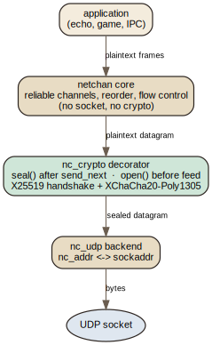
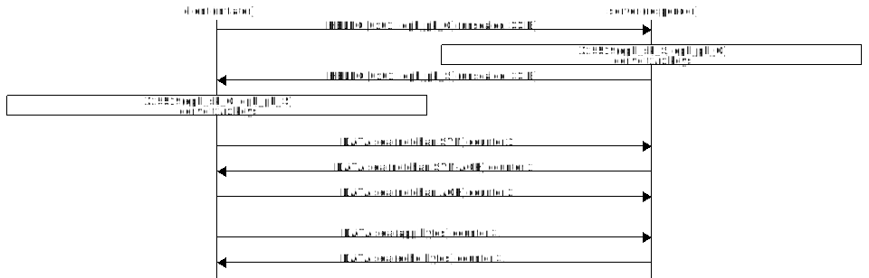
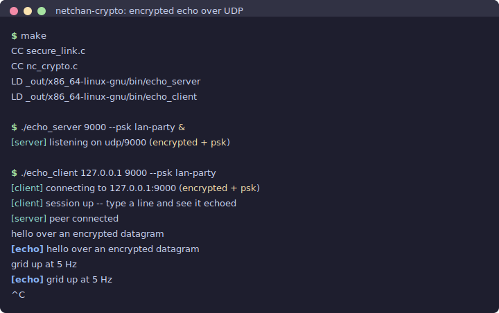

## Introduction

[Part two](/netchan-v2/) cut a seam through the protocol so that a new transport
became a new file instead of a rewrite. It ended with a promise: the next
backend, "whatever it is, is another file." An encrypted transport was named as
the first thing that seam unlocked, and this part delivers it.

The code is small, about two hundred lines, and its shape is not original. It
copies WireGuard and the Noise framework almost gesture for gesture: one
ephemeral handshake, no certificates, a fixed cipher, per-packet authenticated
encryption, a sliding replay window. The implementation is easy to follow; the
argument for it is the part worth writing down.
The internet already has IPsec, QUIC, and DTLS. Each is the product of many
years and many people, and each is more capable than two hundred lines can be.
So the honest question for this part is not "how do I encrypt a datagram," which
is answered, but "what exactly did I give up by not reaching for one of those,
and when is that trade a good one?"

netchan is for lightweight programs and games. It is not trying to be a VPN or a
web transport. That narrow target is what makes the trade defensible.

## Abstract

`nc_crypto` is a transport decorator that sits between the netchan core and the
UDP socket. `netchan_send_next` produces a plaintext datagram, `nc_crypto_seal`
wraps it, and the socket sends the wrapped bytes; inbound datagrams pass through
`nc_crypto_open` before `netchan_feed`. The core never learns it is encrypted,
exactly as it never learns whether its socket is UDP or a browser data channel.

The design is deliberately the WireGuard/Noise shape and deliberately not QUIC:
one X25519 ephemeral handshake per connection, directional keys derived through
BLAKE2b so each side's packet counter starts at one with no risk of nonce reuse,
XChaCha20-Poly1305 per packet with a 64-bit counter nonce, an RFC 6479 sliding
replay window, 25 bytes of per-packet overhead, and an optional pre-shared key
for closed games. It has no certificates, no cipher negotiation, no mid-session
rekey, and no 0-RTT resumption. Every one of those absences is a decision,
weighed in turn against IPsec, QUIC, DTLS 1.3, WireGuard, and the Noise
framework it borrows from.

To show the decorator is real and not a toy, two things exercise it. The *lumi*
terminal workspace adopted it as an encrypted IPC transport between its
processes, which stress-tests the handshake sequencing and connection roaming in
production. And a small demo here runs an encrypted echo over a real UDP socket,
driven by an event loop that owns the socket, a retransmit timer, and the
process signals, so the two nested handshakes advance without a single blocking
call.

## The Shape of the Problem

It is tempting to say "just add TLS" and stop. That instinct is wrong for
datagrams, and seeing why sharpens what `nc_crypto` has to provide.

TLS assumes an in-order, reliable byte stream. Record N cannot be processed
until record N-1 has arrived, because the cipher state chains forward. Put that
on top of UDP, where packets arrive out of order or not at all, and every loss
stalls the stream until a retransmission fills the hole. That is head-of-line
blocking, and it is exactly the property a game does not want: a dropped
position update should be skipped, not waited for.

So a datagram cipher has to treat each packet as independently decryptable. It
needs, and needs only, these properties:

- **Confidentiality and integrity together.** An attacker must not read the
  payload, and must not be able to flip a bit undetected. This is what an AEAD
  gives you in one operation: XChaCha20-Poly1305 here, AES-GCM elsewhere.
- **Replay protection.** A captured packet replayed later must be rejected, or
  an attacker can resend last second's "fire weapon" packet forever.
- **Forward secrecy.** Recording today's ciphertext and stealing a key tomorrow
  must not decrypt it. An ephemeral Diffie-Hellman handshake provides this: the
  session key exists only for the connection and is never written down.
- **Some resistance to spoofed-source floods**, because the socket is open to
  the whole internet.

Notice what is *not* on that list. Ordering, reliability, retransmission, and
flow control are all absent, because netchan already does them one layer up. A
datagram security layer that also re-implements reliability, which is what
running TLS over a reliability shim amounts to, is doing the same job twice. The
whole point of the decorator is that it does the one job the core cannot: it
makes each datagram secret and unforgeable, and nothing else.

## What nc_crypto Actually Does



The decorator is a wire format with a one-byte type tag and two packet kinds:

```
HELLO: [0x01][ephemeral public key : 32]                 (33 bytes)
DATA : [0x02][counter : 8 BE][mac : 16][ciphertext ...]  (+25 bytes)
```

**The handshake is one ephemeral X25519 exchange.** Each side generates a fresh
key pair per connection and sends its public half in a `HELLO`. When a side has
both public keys it computes the shared secret and derives two directional keys
from it:

```c
/* One directional key = BLAKE2b(shared || pk_lo || pk_hi || psk || label).
 * Sorting the two public keys makes both peers hash the same transcript. */
static void
derive_key(uint8_t out[32], const uint8_t shared[32],
           const uint8_t pk_lo[32], const uint8_t pk_hi[32],
           const uint8_t psk[32], uint8_t label)
{
    crypto_blake2b_ctx ctx;
    crypto_blake2b_init(&ctx, 32);
    crypto_blake2b_update(&ctx, shared, 32);
    crypto_blake2b_update(&ctx, pk_lo, 32);
    crypto_blake2b_update(&ctx, pk_hi, 32);
    crypto_blake2b_update(&ctx, psk, 32);
    crypto_blake2b_update(&ctx, &label, 1);
    crypto_blake2b_final(&ctx, out);
}
```

Sorting the two public keys before hashing means both peers feed BLAKE2b the
identical transcript regardless of who is the initiator, so they derive the same
pair of keys and simply pick tx and rx by role. Two keys, one per direction, is
the detail that removes an entire class of bug: because the initiator seals with
a key the responder only ever opens with, and vice versa, both counters can
start at one without any chance that the same key ever sees the same nonce
twice.



**Each data packet is one AEAD operation.** The nonce is the packet counter, a
64-bit value that also travels in the clear so the receiver can reconstruct it:

```c
uint64_t counter = ++c->tx_counter;   /* 1-based, never reused */
uint8_t nonce[24];
memset(nonce, 0, sizeof(nonce));
wr64be(nonce, counter);
out[0] = NC_CRYPTO_DATA;
wr64be(out + 1, counter);
/* out+9: 16-byte mac, out+25: ciphertext */
crypto_aead_lock(out + NC_CRYPTO_OVERHEAD, out + 9, c->tx_key, nonce,
                 NULL, 0, plain, len);
```

The receiver runs the AEAD in reverse and, only if the tag verifies, checks the
counter against a sliding window. The window is the RFC 6479 trick: a 64-bit
mask tracking which of the last 64 counters below the high-water mark have been
seen, so a replayed or too-old packet is dropped without a large data structure.

**The interesting decisions are the absences.** The header comments are candid
that this is a single-session object: there is no mid-session rekey, a `HELLO`
that arrives after keys are established is ignored on purpose, the same
ephemeral secret must never be reused, and the sealer refuses to wrap the nonce
counter at its 64-bit ceiling rather than roll it over. Each of these is a line
of defense bought by *not* having a feature. No rekey means no rekey state
machine to attack. Ignoring late `HELLO`s means an attacker cannot reset a live
session to a key of their choosing. Refusing to wrap the counter means the one
catastrophic failure of a counter-nonce AEAD, nonce reuse, simply cannot happen;
the connection dies first.

## Five Ways to Encrypt a Datagram

Here is the same job, done by five other designs and by `nc_crypto`. The first
table is about how a session starts and who it trusts.

| Design | Layer | Handshake to first app byte | Identity / PKI | Cipher agility |
|---|---|---|---|---|
| **IPsec** (ESP + IKEv2) | OS kernel, below the socket | 2 RTT (IKE_SA_INIT + IKE_AUTH) | X.509 certs or PSK | Full negotiation |
| **QUIC** (RFC 9000/9001) | Userspace, fused with transport | 1 RTT, or 0 RTT on resumption | X.509 certs (TLS 1.3) | TLS 1.3 suites |
| **DTLS 1.3** (RFC 9147) | Userspace, above UDP | 1 RTT, 2 with the DoS cookie | X.509 certs | TLS 1.3 suites |
| **WireGuard** | Kernel or userspace | 1 RTT (Noise IKpsk2) | Static public keys, no PKI | None, fixed suite |
| **Noise** (framework) | Library you embed | Pattern-dependent (NK 1 RTT, XX 2 RTT) | Depends on pattern | None per instance |
| **nc_crypto** | Transport decorator | 1 RTT crypto, then netchan's own | Ephemeral, or optional PSK | None, fixed suite |

The second table is about what each costs on the wire and where it can run.

| Design | Per-packet overhead | Replay defense | Migration | Relative complexity |
|---|---|---|---|---|
| **IPsec** | ~30 bytes (SPI + seq + IV + ICV) | Sliding window (RFC 6479) | Poor; NAT breaks it | Very high; kernel + IKE daemon |
| **QUIC** | ~26 to 40 bytes (conn ID + enc. pkt no. + tag) | Per-packet-number spaces | Native, connection IDs | High; a full stack |
| **DTLS 1.3** | ~18 bytes and up (unified hdr + tag) | Per-epoch window | Connection IDs (RFC 9146) | High; TLS state machine |
| **WireGuard** | 32 bytes (16 hdr + 16 tag) | Sliding window | Roams by source IP | Low for a kernel VPN |
| **Noise** | +16 bytes per AEAD field | You build it | You build it | Low; you write the transport |
| **nc_crypto** | 25 bytes (type + counter + tag) | Sliding window (RFC 6479) | Inherited from `nc_addr` | ~200 lines |

A few things in those tables deserve words, not just cells.

**IPsec** encrypts whole IP packets in the kernel, invisibly to the application.
That is its strength, a process gets a secure socket for free, and its weakness,
you cannot ship it inside a game because it needs kernel configuration and an IKE
daemon, and NAT traversal is a perennial sore point. It is the right tool for
site-to-site tunnels and the wrong tool for a program that wants to own its own
security.

**QUIC** is the most capable entry and the least like `nc_crypto`. It fuses the
cryptographic and transport handshakes so that one round trip, or zero on
resumption, gets you to encrypted application data, and it even encrypts the
packet number so an observer cannot trivially count your packets. The price is a
full X.509 PKI and a large, subtle stack. QUIC is what you use when you are the
web; it is a great deal of machinery to authenticate a peer you already share a
secret with.

**DTLS** is TLS 1.3 taught to tolerate loss and reordering. Its per-record
overhead is the smallest here, but its handshake is its weak point for games:
the flights can fragment past the MTU and get dropped by middleboxes, the
anti-DoS cookie adds a round trip, and a single lost handshake packet can stall
the state machine. It still requires a PKI.

**WireGuard** is the closest relative and the model. It proved that a fixed
cipher suite, static-key identities, and a one-round-trip Noise handshake make a
secure tunnel you can audit in an afternoon. Its refusal of cipher agility is a
feature: there is no downgrade to negotiate and no weak suite to trick a peer
into. `nc_crypto` takes the same posture. The one thing it drops is the
static-key identity, and with it the ability to authenticate a peer.

**Noise** is not a protocol but a framework for generating them from handshake
patterns. It names honestly what `nc_crypto` is: an ephemeral-only pattern,
close to Noise's `NN`, with an optional pre-shared key. Naming the pattern is
also naming the limitation.

## The Tradeoffs, Weighed

The single most important thing to be honest about is authentication, because it
is the one place the small design can bite.

`nc_crypto`'s default handshake is ephemeral X25519 on both sides and nothing
else. That gives confidentiality, integrity, and forward secrecy against a
*passive* eavesdropper, someone who records traffic, cannot read it and cannot
alter it undetected. It does **not**, on its own, authenticate the peer. An
*active* attacker sitting in the path can complete a separate handshake with each
side and relay between them, the classic man in the middle, because neither side
has any durable identity to check the ephemeral key against. This is the exact
property of Noise's `NN` pattern, and it is inherent to unauthenticated key
exchange, not a bug in the code.

There are two clean ways to close that gap, and `nc_crypto` supports the simpler
one:

- **A pre-shared key.** With `--psk`, the shared secret is folded into the KDF,
  so only peers who already hold the secret can derive keys that produce
  verifiable AEAD tags. A man in the middle without the PSK cannot seal a packet
  the other side will open. For a closed LAN game, a private server, or IPC
  between processes owned by one user, this is exactly enough, and it is why the
  PSK exists.
- **Pinned static keys**, the WireGuard model, where each side knows the other's
  long-term public key in advance. `nc_crypto` does not implement this today; it
  would be a natural extension, and it is the right answer if peers need durable
  identities without a shared secret.

What you must not do is run the ephemeral-only handshake against an unknown peer
across the open internet and believe you have authentication. You have
encryption. For the programs netchan targets, ones that own both ends or run on
a trusted network, that boundary is comfortable. For a public service
authenticating strangers, this is the wrong layer and QUIC or DTLS is the right
one.

The rest of the ledger is friendlier:

- **Round trips.** Because the crypto handshake is a decorator *below* netchan,
  it completes first and netchan's own connect handshake runs after it. That
  stacks the round trips: roughly two to first application byte, where QUIC
  spends one. This is the visible cost of the clean seam. It could be hidden by
  piggybacking the first netchan frame on the handshake, at the price of the
  simplicity that made the seam worth cutting.
- **No cipher agility.** If XChaCha20 or X25519 were broken tomorrow, there is no
  negotiation to swap primitives; you would ship a new build. WireGuard makes
  the same bet and defends it well: a protocol with no agility has no downgrade
  attack and no dead suites to carry. For software you rebuild and redeploy at
  will, versioning the whole protocol is simpler than versioning a cipher list.
- **Metadata.** The 64-bit counter travels in the clear, so an observer can count
  your packets and see the connection's length, which QUIC's packet-number
  encryption hides. For a game whose traffic pattern is already obvious from its
  timing, this leaks little.
- **Overhead and cost.** 25 bytes per packet and one X25519 plus one AEAD per
  connection is cheap. There is no per-packet asymmetric crypto and no
  certificate to parse. The whole dependency is one vendored, public-domain
  source file.
- **DoS.** The `HELLO` is 33 bytes and the reply is the same size, so there is no
  amplification for a spoofed source to abuse, and deriving keys costs a single
  X25519. There is no cookie exchange like DTLS's or WireGuard's, so a flood of
  spoofed `HELLO`s can make a server compute throwaway keys; that is cheap, but a
  cookie would be the first hardening to add for an exposed server.

The shape of the trade is now clear. `nc_crypto` trades away PKI identity, cipher
agility, 0-RTT, and rekey, and in return it is two hundred auditable lines with
one dependency, no kernel config, no certificates, forward secrecy per session,
and a wire format that works identically over any datagram pipe. That is a good
trade precisely when you are a lightweight program or a game, and a bad one when
you are the web.

## A Real Adopter: Encrypted IPC in lumi

A demo can hide a design's rough edges; a second project adopting the code
cannot. The *lumi* terminal workspace wraps netchan and `nc_crypto` into an
`ipc_transport`, an encrypted reliable-datagram channel between its own
processes. That adoption is worth reporting because it exercises two things a
single echo never would.

The first is **handshake sequencing**. lumi's `establish` routine makes the
ordering explicit and unavoidable: it drives the crypto handshake to completion
*before* it calls `netchan_connect`, so that even netchan's connect SYN travels
sealed.

```c
/* complete the crypto handshake first, so every netchan datagram
 * (including the connect SYN) can be sealed. */
if (n->encrypted) {
    while (!nc_crypto_ready(&n->crypto)) {
        if (nct_now_ms() - start > budget)
            return -1;
        nct_service(n);        /* initiator repeats HELLO */
        if (nct_feed_one(n, NCT_TICK_MS) < 0)
            return -1;
    }
}
```

The initiator repeats its `HELLO` until the session is ready and the responder
answers each one it sees, which is a tiny stop-and-wait handshake layered
beneath netchan's own retransmission. Neither layer knows about the other; they
simply both make progress every time the loop turns.

The second is **roaming through encryption**. When a lumi client changes
networks, its send fails with `EADDRNOTAVAIL`, it opens a fresh socket, and the
server migrates the peer to the new source address the moment a datagram arrives
from it. This works *because* the session keys are per-connection and derived
from the ephemeral public keys, not from any address. The address lives in the
`nc_addr` layer above; the keys live in the decorator below; neither depends on
the other, so a peer can move without renegotiating a thing. The seam from Part
two and the decorator from this part compose for free.

## The Demo: An Encrypted Echo on an Event Loop

The demo is the smallest program that puts every piece in motion at once. A
server echoes back whatever a client sends, over an encrypted reliable channel,
and the whole thing is driven by *lumi*'s `iox` event loop rather than the
blocking poll loops the IPC transport uses.

That choice is the point. `iox` gives the demo three kinds of readiness through
one `poll`: a file-descriptor watcher on the UDP socket, a periodic timer that
fires netchan's retransmissions, and a signal handler for a clean `Ctrl-C`. The
two nested handshakes advance entirely from callbacks, with no blocking wait
anywhere:

```c
/* Periodic tick: fire netchan's retransmit timers, repeat the client HELLO
 * until the session is ready, and flush. Reschedules itself until the link
 * is torn down. */
static void
on_tick(struct iox_loop *loop, void *arg)
{
    struct secure_link *sl = arg;

    if (sl->encrypted && !sl->server && !nc_crypto_ready(&sl->crypto))
        send_hello(sl);
    netchan_service(sl->conn, now_ms());
    pump_events(sl);
    advance(sl);
    flush_out(sl);
    if (!sl->closing)
        sl->timer_id = iox_timer_add(loop, SL_TICK_MS, on_tick, sl);
}
```

The reschedule asks the link whether it is closing, not the loop whether it is
running. That distinction turned out to matter: `iox_loop_stopped()` reports
true before `iox_loop_run()` has ever been called, which is exactly when this
tick is first kicked, so an earlier version of this function retired its own
timer at birth and left every session with no clock at all.

A `secure_link` object holds the netchan connection, the `nc_crypto` session,
and the socket, and exposes three callbacks: `on_up` when the session is
established, `on_data` for received bytes, and `on_down` on disconnect. The
server's `on_data` echoes; the client's prints. The client does not even watch
the keyboard until `on_up` fires, so a byte can never be typed before the link
can carry it.



Because the client repeats its `HELLO` until the server answers, launch order
does not matter; start either side first. A mismatched `--psk` is the
authentication story made visible: the client prints `connecting` and never
reaches `session up`, because the server's sealed replies fail to authenticate
against the wrong key. Passing `--plain` to only one side has the same effect
from the other direction, one end sealing packets the other cannot read. The
demo builds with the vendored [modular-make](/build-systems/), links the same
`nc_crypto.c` the article dissects, and passes an ASan and UBSan clean loopback
round-trip test.

## Conclusion

`nc_crypto` answers a much narrower question than QUIC does, and it is a mistake
to read it as a small QUIC. How does a program that owns both ends of a
connection get confidentiality, integrity, and forward secrecy over datagrams,
without a certificate authority, without kernel configuration, and without a
stack it cannot audit? The answer it gives is the
WireGuard answer, one ephemeral handshake and a fixed AEAD, arranged as a
transport decorator so the protocol core stays oblivious.

The honest boundary is authentication. Use a pre-shared key or pinned static
keys when the peer's identity matters, and do not mistake the default
ephemeral handshake for authentication it does not provide. Reach past netchan,
to DTLS or QUIC, when you need PKI identities, cipher agility, or interoperation
with the open internet. Inside its lane, closed games, private servers, and
encrypted IPC between a user's own processes, the decorator does exactly what
the seam promised: encryption became another file, and the core never noticed.

- **Demo source:** [`demo/`](demo/) holds the encrypted echo, the `secure_link`
  glue, and the loopback test. See [`demo/README.md`](demo/README.html) for the
  full build and run steps.
- **Upstream:** netchan now lives at
  [github.com/OrangeTide/netchan](https://github.com/OrangeTide/netchan),
  reorganised into layers and carrying fixes made after this was written. The
  demo here is the snapshot the article describes, so take the repository for
  code to build on and this directory for code to read alongside the text.
