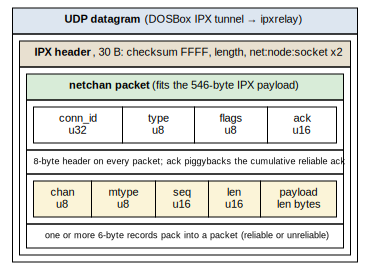
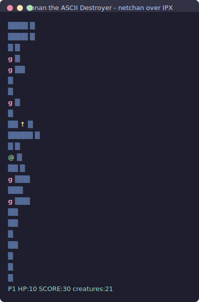

## Introduction

[Netchan](/netchan/) is a small reliable-channel layer over UDP for game networking: multiplexed channels, reliable and unreliable datagrams, a connection handshake, all in a few thousand lines of C. It's a modern POSIX library that calls `malloc` whenever it needs memory.

This project asks a different question. What would netchan look like if it had been written for the network it conceptually belongs to: IPX, on a 16-bit MS-DOS machine with 640 KB of RAM, where no single allocation should exceed 64 KB and the fewer large ones the better? The transport is reached through the real-mode IPX API, tunneled by DOSBox over UDP to a small relay. The compiler is Open Watcom, cross-compiling from Linux. The proof that it works is a four-player, server-authoritative game with a Caves-of-Thor text-mode look, played between DOSBox instances.

The interesting parts are the constraints, not the protocol: how you reach IPX from C without an interrupt to call, how you build a reliable transport that never touches the heap after startup, and the handful of real-mode and emulator bugs that each looked like something else entirely.

## Abstract

This is a wire-incompatible subset of netchan, a reliable + unreliable multiplexed channel library, rebuilt for 16-bit DOS and IPX. The core is transport-agnostic: it compiles over UDP on the host for fast iteration and tests, and over IPX on DOS for the real thing. IPX is reached through the `INT 2Fh AX=7A00h` far-call entry, with Event Control Blocks polled rather than serviced by an interrupt routine. All connection state, packet buffers, and ECBs are statically allocated; nothing is allocated during play, so the program cannot fragment the DOS arena or fail an allocation mid-game. The demo streams a generated cave map to each joining client over a reliable channel and broadcasts world state over an unreliable one at 8 Hz. Along the way the work surfaced a series of instructive bugs: an optimizer that cached a hardware clock, a socket that was opened under the wrong byte order, registers the IPX driver did not preserve, an unbounded receive loop, and an emulator that starves one of two instances unless its cycle count is pinned.

## The Target: DOS, IPX, and a 64 KB Ceiling

The rules of the environment shape every decision.

- **Memory.** A real-mode segment addresses at most 64 KB. The conventional-memory arena is about 640 KB total. Fragmentation is unforgiving: a long-running program that allocates and frees can fail a later allocation even with plenty of free bytes. The design goal is therefore not "fit in 640 KB" (trivially true) but "never allocate after startup."
- **IPX.** Internetwork Packet Exchange is connectionless, like UDP. Its media-independent payload guarantee is small: 576 bytes total, 546 after the 30-byte IPX header. That number is the MTU for the whole design.
- **DOSBox + ipxrelay.** DOSBox emulates the real-mode IPX driver and tunnels frames over UDP. An external relay (H. Peter Anvin's `ipxrelay`) is the meeting point; each DOSBox connects to it with `ipxnet connect`. So the path is: DOS program &#8594; real-mode IPX API &#8594; DOSBox &#8594; UDP &#8594; relay &#8594; the other DOSBox.
- **Watcom.** Open Watcom cross-compiles to a DOS executable from Linux (`wcc -bt=dos -0 -ml`, large model). The same source builds on the host with `gcc` over a UDP transport, which is where the core was developed and tested.

## Reaching IPX Through INT 2Fh

There is no interrupt that *is* IPX. Instead, `INT 2Fh` with `AX=7A00h` is the Novell-standard installation check: it returns `AL=FFh` if IPX is present and a far-call entry point in `ES:DI`. Every IPX operation is then a `call far` through that pointer, with the function number in `BX`: open socket, listen, send, get local address. This is the same API the DOS IPX games used, and DOSBox emulates it exactly; it isn't DOSBox-specific.

Calling it from Watcom C means writing thin `#pragma aux` thunks that do the indirect far call. Two rules emerged the hard way: hardcode the function number in the assembly body rather than passing it in a register, and bracket the call with `push bp` / `push ds`, declaring the full clobber set, because the IPX entry only promises to preserve `CS`, `DS`, and `SS`.

Receiving uses **Event Control Blocks**. An ECB points at a packet buffer and a socket; you hand it to "Listen For Packet" and the driver fills it when a matching datagram arrives. Rather than register an Event Service Routine (an interrupt-context callback, fiddly to write correctly in real mode), this implementation pre-posts a small pool of listen ECBs and polls them: each frame it checks each ECB's completion code, copies out any that completed, and re-posts them. At a few-hertz game tick, the latency cost is irrelevant and the code stays ordinary C.

The bytes on the wire nest cleanly. A netchan packet rides inside the IPX payload, which rides inside the UDP tunnel:



## Netchan Minus the Heap

The original netchan is a general-purpose library; it mallocs channels, per-message copies, fragment-reassembly buffers, and 64-slot reorder and outgoing queues. The DOS version keeps the same conceptual API (`nc_open`, `nc_chan_open`, `nc_write`, `nc_read`, feed/send-next packet I/O) but is a deliberate, wire-incompatible re-spin built for a fixed memory budget.

| Dimension | Original netchan | DOS/IPX subset |
|---|---|---|
| Allocation | `malloc` on demand | static / one calloc at open; none during play |
| Framing | variable 5/7 B header + 12 TLV frame types | fixed 8 B header + homogeneous records |
| Reliability | dedicated ACK frames + 64-slot reorder buffer | cumulative ack piggybacked, Go-Back-N |
| Fragmentation | yes (up to 32 fragments, 1200 B MTU) | none; max message is one packet (~532 B) |
| Flow control | credit-based byte windows | fixed message-count window |
| Channels | up to 256, with negotiated content type | a fixed small set, no negotiation |
| Channel types | reliable / unreliable / stream | reliable / unreliable |
| Endianness | big-endian | big-endian (kept) |

The headline difference is the trade in the first row. The original allocates whatever it needs; the DOS version pre-allocates a fixed worst case at init and never allocates again, accepting Go-Back-N and a one-packet message ceiling as the price. Dropping fragmentation follows from the memory model: reassembly buffers are exactly the kind of large, transient allocation this design avoids, and IPX only guarantees 546 bytes anyway.

The wire format follows from that. An 8-byte header sits on every packet (connection id, packet type, flags, and a 16-bit cumulative ack that piggybacks for free). Data packets carry one or more 6-byte records, so a tick's worth of small messages (a movement input and a chat line) coalesces into a single datagram. Reliable sequence numbers are connection-global, shared across reliable channels, so one ack field covers them all; delivery is still routed to the right channel by the record's channel id. Sequence wraparound uses RFC 1982 serial-number comparisons.

## A Memory Model With No Moving Parts

Everything that can be sized at compile time is. A connection's reliable send window, its unreliable ring, and its per-channel receive rings are arrays inside the connection struct; the only allocation is the connection itself, taken once at `nc_open`. For a four-player server that is roughly 50–60 KB total, with no individual object near the 64 KB segment limit. The IPX transport's ECBs and packet buffers are a static pool. The game's 96&#215;64 tile map is 6 KB, generated once on the server and streamed to clients.

That discipline is load-bearing. The first instinct for the IPX buffers was `_dos_allocmem` (the DOS "allocate a paragraph block" call). It hung the program. The reason is specific to the memory model: a Watcom large-model executable grabs every byte of conventional memory at startup for its own heap, so `_dos_allocmem` has nothing left to give and hands back an overlapping segment; the first write into it corrupts the program. The fix is the one the whole design points at: put the ECBs and buffers in static (BSS) storage, which lives in conventional RAM the loader already accounted for, and never ask DOS for memory at all.

## Discovery and the Handshake

A joining client doesn't know the host's IPX address. It finds it by sending its connection handshake's first packet (SYN) to the IPX broadcast node. The host replies with a SYN-ACK from its real node, and the client locks onto that unicast address for everything afterward. This is broadcast discovery and connection setup folded into one exchange. (The original netchan has a redirect event for exactly this kind of handoff; here the broadcast plays that role.)

Once connected, the reliable channel carries setup and the unreliable channel carries the realtime loop:


The relay enforces a few rules that the sender has to respect: the IPX checksum field must be `0xFFFF`, both source and destination network numbers must be zero (it is a single, router-less network), and the sender must already be registered. Broadcasts are forwarded to every other registered client; a node even receives its own broadcast back through DOSBox's local loopback, which the client simply ignores.

## The Demo: Caves of Thor Over IPX

The demo is a simplified Gauntlet, dressed in the text-mode look of Apogee's 1989 Caves of Thor: a larger-than-screen cave, a handful of creatures that step toward the nearest player, travelling projectiles, and up to four players, each scrolling its own 40&#215;25 viewport over the shared world.

It is server-authoritative. One instance hosts and also plays; the others join. The host generates the cave (a cellular-automata cave, kept to its largest connected region), simulates everything, and at 8 Hz broadcasts the full world state, which is small enough to fit one datagram with room to spare. Clients send only their input; on a missed input packet the next tick supersedes it, which is exactly what an unreliable channel is for. The map is streamed once to each client in MTU-sized chunks over the reliable channel as its send window allows. Chat rides the reliable channel too.



Movement is tile-stepped at the tick rate, which is authentic to the Kroz/Caves-of-Thor text-tile lineage and is the simplest thing that looks right. The first DOS build wrote each frame straight to the `0xB800` text buffer, and it flickered: the CRT beam kept catching the screen mid-rewrite. The fix uses the hardware the way the era intended. Text mode 01h (40&#215;25) keeps eight display pages in the 16 KB text buffer, so the renderer draws the next frame into a hidden page and, at vertical retrace, points the CRTC at it with `INT 10h AH=05h`. The visible page is never touched while it is on screen, so there is no tearing and no flicker, and the page flip costs nothing but a couple of register writes.

Input comes from a custom `INT 09h` keyboard handler that tracks the full key-state table, not the BIOS keystroke queue. That distinction is what makes the controls a twin-stick shooter: the arrow keys steer while **W A S D** fire north, west, south, and east independently, so you can run one way and shoot another, and the two key sets register at once. (`Z` or `Space` still fire along your facing, the direction you last moved, for one-handed play.) The BIOS queue, which reports one key at a time with typematic repeat, could never express "moving north-east while firing west." The same game compiles on the host with an ANSI/`termios` backend, which is how the screenshot above was produced.

## War Stories From Real Mode

The protocol and the game were the easy parts. These were not.

### The Optimizer Froze Time

Every timer in the system (retransmits, handshake retries, the tick clock) is driven by a millisecond counter read from the BIOS tick at `0040:006C`. Read through a plain far pointer, Watcom's optimizer correctly concluded the address does not change within the loop and cached it. `now` became a constant; nothing ever timed out; the connection never retried. The symptom looked like an intermittent freeze. The fix is one keyword, `volatile`, on the pointer, but the lesson is that a memory-mapped hardware counter is exactly the case `volatile` exists for, and a clever compiler will punish you for forgetting it.

### A Socket That Wasn't Open

Listens kept failing with completion code `0xFF`, which the code initially read as the "still pending" value. They were actually failing with a hardware-error code that happens to be `0xFF`. The cause was byte order: DOSBox's Open-Socket call byte-swaps the socket number in `DX`, while the ECB and packet socket fields are read big-endian. Passing `0x6000` opened socket `0x0060`, so the listens, which resolved to `0x6000`, matched no open socket. The fix is to hand Open-Socket the byte-swapped value. Confirming it meant reading DOSBox's own IPX source; the in-use flag, incidentally, is not the field to poll. The completion code is.

### Registers the Driver Kept

An early version of the IPX thunks corrupted memory in a way that *moved* when you added a `printf`. That is the classic signature of register corruption: the print forced the compiler to spill and reload values across the call, masking the damage. The real-mode IPX entry only guarantees `CS`, `DS`, and `SS`; the thunks were not declaring the rest of the register file as clobbered, and were not preserving `BP` and `DS` themselves. Spelling out the full clobber set and bracketing the call with `push bp` / `push ds` fixed it. Debugging it meant trusting the symptom less than the structure: a bug that a `printf` hides is almost never about the `printf`.

### A Flood You Have to Cap

The per-frame "drain everything the socket has" loop was written as `while (recv() > 0)`. A burst of packets, or a brief ack storm, turned that into a loop that never returned within a frame, and the game appeared to hang. Capping it at a fixed number of datagrams per frame each way fixed it. A receive loop with no bound is a denial-of-service waiting for its own traffic.

### One Buffer Smaller Than the Window

Reliable delivery would reach fourteen of twenty messages and stall. The receive ring held six slots; the send window held eight. A full window overran the ring by two records every time, and those two never got delivered. The host test's timing had hidden it; IPX's timing did not. The rule is simple once stated: the receive ring must hold at least a full window.

### The Emulator's Clock

With everything correct, two DOSBox instances on one host still behaved erratically: one would run smoothly while the other crawled at a few frames a second. `cycles=auto` and `cycles=max` were the cause; `max` in particular greedily oversubscribes the host CPU, and two greedy instances starve each other. A fixed cycle count makes DOSBox real-time-pace itself and share the host predictably. Under an emulator, "as fast as possible" is not a setting you want twice at once.

## Building and Running It

The demo cross-compiles on Linux with Open Watcom and runs in DOSBox. The host build (plain `gcc`) is for development and the unit tests.

```sh
cd demo
make            # host build: unit tests + the game over UDP
make check      # run the host unit tests
wmake           # DOS build: thor.exe (the game), ipxtest.exe, ncdemo.exe
```

To play over IPX, start a relay, then point two DOSBox instances at it and run `thor.exe s` (host) and `thor.exe` (join). DOSBox needs a fixed cycle count; the included harness scripts (`scripts/relay.sh`, `scripts/playtest.sh`) set this up and can run a headless two-instance match for testing. The full step-by-step is in the [demo README](demo/README.md) ([HTML](demo/README.html)).

## Conclusion

Netchan's design survives the move to IPX and 16-bit DOS without much trouble; reliable and unreliable multiplexed channels are a small, well-understood idea. What the move demands is discipline about memory, a static worst case allocated once and never touched again, and respect for the layer underneath: the far-call ABI, the driver's register promises, the emulator's clock. The reward is a reliable game transport that cannot fragment, cannot fail an allocation in the middle of a match, and fits comfortably in the machine it was written for. The bugs that cost the most were never in the protocol; they were in the seam between portable C and a real-mode world, which is precisely where this kind of project earns its keep.
