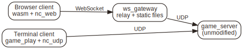

## Introduction

The [first netchan article](/netchan/) compared four reliable-UDP designs and
built one: a multiplexed channel protocol in about 1,500 lines of C, with
fragmentation, a 64-slot reorder buffer, credit-based flow control, and a fully
static memory model. It was a good desktop library and a self-contained
teaching example, but it made one assumption everywhere: that the network is a
POSIX UDP socket. `struct sockaddr` and `socklen_t` are stamped straight into
its public API.

That assumption is fine until you want to run the same protocol somewhere a
socket does not exist. A WebAssembly client in a browser cannot open a UDP
socket at all. It can, however, open a WebRTC data channel or a WebSocket, both
of which hand you a datagram-shaped pipe. The protocol logic above that pipe is
identical; only the plumbing below it differs.

The groundwork here is unglamorous: it replaces the baked-in socket address with
a single opaque type, and moves every line that knows what a socket is into one
small backend file. It is a short change. Once this seam exists, adding a browser
transport, or an encrypted one, stops being a rewrite and becomes a new file.

## Abstract

netchan-v2 introduces `nc_addr`, a transport-agnostic address the protocol core
copies and compares but never interprets, and `nc_udp`, a 98-line backend that
is the only code in the project aware of `sockaddr`. The core no longer includes
a single socket header. The change is behaviour-preserving: the existing ten
loopback tests still pass, and a new real-socket test exercises the UDP backend
directly, including IPv4/IPv6 address round-tripping and connection migration.
To show the core is now genuinely platform-independent, it also compiles to
WebAssembly and runs the same test suite under `node`. The first new backend
follows immediately: an encrypted UDP transport for the desktop, a
WireGuard/Noise-style decorator built on vendored public-domain crypto, added
without touching the core. To exercise all of this, the demo carries a small
multiplayer game, *Caves of Thor*, that runs server-authoritative over UDP,
compiles to a self-contained browser build, and, through a WebSocket backend
and a relay gateway, lets a browser player and a terminal player share one
unmodified server at the same time.

## The Assumption, Made Explicit

The old public API named the operating system's address type directly:

```c
int    netchan_connect  (struct netchan_conn *c,
                         const struct sockaddr *addr, socklen_t addrlen);
int    netchan_feed     (struct netchan_conn *c, const void *pkt, size_t len,
                         const struct sockaddr *from, socklen_t fromlen);
size_t netchan_send_next(struct netchan_conn *c, void *buf, size_t buflen,
                         struct sockaddr *to, socklen_t *tolen);
```

Three functions, and through them the whole library, depend on `<sys/socket.h>`.
The core also stored the peer as a `sockaddr_storage`, compared addresses with
`memcmp` over a `socklen_t`, and even built a `sockaddr_in` by hand when
decoding a redirect frame. None of that logic cares about IP addressing. It
needs an address only as an opaque token: something to store, to copy into an
outgoing packet's destination, and to compare for equality when a peer roams to
a new address. That is the entire contract.

## nc_addr: An Address the Core Cannot Read

`nc_addr` is that contract and nothing more:

```c
#define NC_ADDR_MAX 20

struct nc_addr {
    uint8_t len;              /* bytes used in a[]; 0 means "unset" */
    uint8_t a[NC_ADDR_MAX];
};
```

The core treats `a[]` as bytes. Each transport decides how to fill them. The UDP
backend packs a family tag, an IPv4 or IPv6 address, and a port. A future WebRTC
backend can pack a channel handle, an integer index into a table of data
channels the browser gave it, because in a browser there is no IP address to
speak of, only "which peer." The core cannot tell the difference between an IP
and a handle, which is exactly why it can run on both.

The three signatures collapse to their essence:

```c
int    netchan_connect  (struct netchan_conn *c, const struct nc_addr *addr);
int    netchan_feed     (struct netchan_conn *c, const void *pkt, size_t len,
                         const struct nc_addr *from);
size_t netchan_send_next(struct netchan_conn *c, void *buf, size_t buflen,
                         struct nc_addr *to);
```

Connection migration, the feature that lets a player survive a NAT rebinding or
a Wi-Fi-to-cellular handoff, was a `memcmp` over socket bytes. It stays a
`memcmp`, now over `nc_addr` bytes, and works unchanged for any transport whose
addresses can differ:

```c
if (from->len != c->peer_addr.len ||
    memcmp(from->a, c->peer_addr.a, from->len) != 0) {
    if (validate_migration(c, ...))
        c->peer_addr = *from;
}
```

A small piece of luck made the redirect path especially clean. netchan's
`CONNECT_REDIRECT` frame already carries a compact `[type][address][port]`
layout on the wire. That is precisely the packing `nc_udp` uses, so decoding a
redirect is now a `memcpy` into an `nc_addr`, and the core dropped its last
`sockaddr_in`, its last `htons`, and its `<arpa/inet.h>` include along with it.

## nc_udp: Where sockaddr Lives, and Only There

Everything the operating system knows about addresses now sits in one file pair,
`nc_udp.h` and `nc_udp.c`, together under 100 lines. Two functions bridge the OS
and the core:

```c
int       nc_udp_from_sockaddr(struct nc_addr *a,
                               const struct sockaddr *sa, socklen_t salen);
socklen_t nc_udp_to_sockaddr  (const struct nc_addr *a,
                               struct sockaddr_storage *ss);
```

The application calls `from_sockaddr` on the address `recvfrom` gives it, then
feeds the packet in; it calls `to_sockaddr` on the address `send_next` reports,
then `sendto`. The chat example changed only at those two syscall boundaries.
The protocol core, the reliability layer, the fragmentation logic, the flow
control: none of it recompiles against a socket header any more.

| | Before | After |
|---|---|---|
| Address type in public API | `struct sockaddr` + `socklen_t` | `struct nc_addr` |
| Socket headers in core | `<sys/socket.h>`, `<arpa/inet.h>` | none |
| Code that knows about IP | scattered through the core | `nc_udp` only, ~98 lines |
| Adding a new transport | edit the core | add a backend file |

## Validation

The refactor is meant to change nothing an existing user can observe, so the
bar is that the old behaviour is still exactly the old behaviour.

- The original ten loopback tests pass unchanged. They pack an `nc_addr` by hand
  as an opaque token, since the loopback harness never touches a real socket.
- A new real-socket test (`nc_udp_test`) drives the actual `nc_udp` backend over
  two live loopback UDP sockets: it round-trips both an IPv4 and an IPv6 address
  through `from_sockaddr`/`to_sockaddr` and checks every field survives, then
  runs a full session and migrates the client to a new socket mid-connection,
  confirming the server's reliable acks follow it to the new address.
- Everything above builds clean under `-Wall -Wextra -Werror` and runs clean
  under AddressSanitizer and UndefinedBehaviorSanitizer.

## Proof: The Same Core, Native and in wasm

A transport seam is only convincing if the core actually crosses it. Because
`netchan.c` no longer includes a socket header, it now compiles to WebAssembly
unchanged, and the socketless loopback test suite runs identically in both
places.

The demo builds with a small modular build driver that produces native and wasm
targets from one tree:

```sh
make                          # native: core, tests, and the UDP chat example
make CC=emcc CXX=em++         # wasm: core and tests, example dropped automatically
```

The chat example, the one piece that calls `bind` and `recvfrom`, is excluded
on the emscripten target by a single guard in the build descriptor. Nothing in
the protocol core is conditional. The same `nc_addr` seam that lets a new
transport slot in is what lets the socket transport slot *out* for a build that
has no sockets.

To give the eventual game something to say, the demo also carries a wire schema.
Game messages, player input, per-entity snapshot state, and a join handshake,
are described in a short `.idl` and compiled to zero-allocation C encoders by a
vendored IDL generator ([microser](/serialization-formats/)). A round-trip test
for the generated code runs alongside the protocol tests.

Both test binaries, compiled to wasm, pass under `node`:

```
netchan tests:
  handshake                     OK
  ...
  stats                         OK
10/10 tests passed

proto round-trip OK (player_input, entity_state, welcome)
```

The identical suite passes as a native binary. Same protocol core, two platforms,
and a wire schema already waiting for the browser client to speak it.

## The First New Backend: Encryption as a Decorator

With the seam cut, the first thing worth adding is an encrypted transport for
the desktop, and it lands without touching the core at all. It is a
*decorator*: `netchan_send_next` produces a plaintext datagram, the crypto
layer seals it before the socket `sendto`, and incoming datagrams are opened
before `netchan_feed`. netchan never knows.

The shape is WireGuard/Noise, deliberately not QUIC. There is no TLS state
machine, no certificate chain, no PKI, and no per-stream keying (netchan already
multiplexes):

- **Handshake**: one X25519 ephemeral exchange per connection. Both sides send a
  `HELLO` carrying their ephemeral public key; each derives the session from the
  shared secret. An optional pre-shared key can be mixed in for a closed LAN
  game. The keys are *directional*, one for each direction, hashed out of the
  shared secret with BLAKE2b, so both sides can start their packet counters at 1
  with no risk of nonce reuse.
- **Per packet**: XChaCha20-Poly1305 AEAD. The 24-byte nonce is a 64-bit counter;
  the counter travels in the packet so the receiver can reconstruct the nonce and
  run a sliding replay window over it. Overhead is 25 bytes per datagram.

The primitives come from [Monocypher](https://monocypher.org), a single-file
public-domain (CC0) library, vendored in. There is no external package to
install. The backend itself is 200 lines.

It is desktop-only by construction. WebRTC data channels mandate DTLS and `wss`
is TLS, so a browser transport already encrypts; the crypto backend is simply how
the desktop UDP path earns the same guarantee. It is excluded from the wasm build
by the same one-line guard that drops the socket example.

A loopback test runs a full reliable netchan session end to end through the
cipher and confirms the payload arrives byte-exact, then checks that a tampered
packet and a replayed packet are both rejected. All three pass under
AddressSanitizer and UndefinedBehaviorSanitizer:

```
nc_crypto tests:
  encrypted reliable session      OK
  tampered packet rejected        OK
  replayed packet rejected        OK
3/3 tests passed
```

## Why Not QUIC, and What It Costs

Calling the handshake "deliberately not QUIC" invites the obvious question: QUIC
is the modern, scrutinised transport, so what is being given up by not using it?
Two things it does that netchan's single X25519 exchange does not: 0-RTT
reconnection, and a handshake with machine-checked security proofs. Both are real,
and neither is worth what it costs *here*.

**0-RTT** is a latency optimisation. A normal TLS 1.3 or QUIC handshake is
*1-RTT*: the client sends its first flight, waits for the server's reply to
establish keys, and only then can send encrypted application data. One round trip
of setup before the first useful byte. 0-RTT — *zero* round-trip time — removes
even that on a *resumed* connection. When a client has talked to this server
before, it caches a resumption secret the server issued last time, and on the next
connection it encrypts application data with a key derived from that cached secret
and sends it in the very first packet, before any reply. The response can come
back in a single round trip. For the web, where a browser opens many short-lived
HTTPS connections to load one page, that saved round trip is a large slice of the
total, which is exactly why QUIC has it.

netchan's exchange is 1-RTT and has no resumption at all. Both sides send a
`HELLO` carrying an ephemeral public key, and neither can seal a `DATA` packet
until the peer's `HELLO` arrives, because the key is derived from the two
ephemerals together. `nc_crypto_seal` refuses until the session is ready. There
is no cached secret, so there is nothing to resume from and no 0-RTT path.

That is the right shape for a game and the wrong shape for the web, because the
economics are inverted. A browser pays the handshake cost on every page because it
reconnects constantly; a game pays it *once*, at join, and then holds the
connection open for the length of the match while thousands of snapshot and input
packets flow over it. The one round trip 0-RTT would save is amortised to nothing
across a session that long. And 0-RTT is not free: its early data is *replayable*
by design. An attacker who records the client's first flight can resend it, and
the server, holding no per-flight state, may act on it twice, so 0-RTT is
restricted to idempotent requests and needs its own anti-replay defence. A
server-authoritative game gains a round trip it does not need in exchange for a
replay hazard it would then have to reason about. Bad trade.

The **formal analysis** is the more honest concession. TLS 1.3's handshake was
designed alongside machine-checked proofs (Tamarin, ProVerif, miTLS in F\*), and
the Noise patterns netchan borrows its shape from have their own verified models.
netchan's handshake is not one of those proven instances. It *resembles* Noise's
`NN` pattern, an ephemeral-ephemeral exchange, with an optional pre-shared key
mixed into the KDF, but it is hand-written, and a hand-written construction earns
none of the assurance the analysed pattern carries. The sharper caveat is what
`NN` itself gives you: protection against a *passive* eavesdropper, but not an
active man-in-the-middle, who can substitute their own ephemeral key on each side
and sit in the cleartext between them. Nothing in the bare exchange authenticates
the peer. The pre-shared key closes exactly that gap, which is why it is the
recommended posture for a closed LAN game and not merely an option, and it is also
the one place netchan could do a 0-RTT-style first packet, since a static PSK is a
secret both sides already hold, though the backend does not.

Laid out directly:

| | netchan crypto backend | QUIC / TLS 1.3 |
|---|---|---|
| First encrypted byte, fresh | 1-RTT | 1-RTT |
| First encrypted byte, resumed | 1-RTT (no resumption) | 0-RTT |
| Peer authentication | only via pre-shared key | certificate + PKI |
| Handshake proofs | none (hand-rolled, Noise-`NN`-shaped) | machine-checked |
| Replay exposure on setup | none | 0-RTT early data replayable |
| Forward secrecy | yes (ephemeral X25519) | yes (0-RTT flight excepted) |
| Footprint | ~200 lines on vendored CC0 crypto | TLS stack, cert chain, PKI |

So the choice is not that QUIC is worse; it is that QUIC is priced for a different
job. Its 0-RTT and its proofs and its PKI all buy properties a match against a
trusted or LAN-local server does not need, and they arrive bundled with a TLS
state machine and a certificate chain the decorator exists specifically to avoid.
netchan takes the small, auditable, forward-secret exchange, tells the reader
plainly that it is unauthenticated without the PSK and unproven either way, and
spends the 200 lines that buys instead of the several thousand QUIC would.

## Caves of Thor: An Application for the Seam

The seam and its backends deserve a program that leans on all of them, so the
demo carries one: *Caves of Thor*, a four-player top-down shooter borrowed from
the earlier [netchan-ipx experiment](/netchan-ipx/) and rebuilt on netchan-v2.

The design is deliberately old-fashioned and server-authoritative. A native
`game_server` runs the simulation at 5 Hz. Each client opens two channels: a
reliable one that carries a one-time `Welcome` with the player's slot and the
map seed, and an unreliable one that streams packed entity snapshots. The map is
never sent. The client reproduces it deterministically from the seed, so a
snapshot is only the moving state, 220 bytes on the wire, and input is a single
byte per tick encoding a twin-stick move-and-fire pair.

Over the UDP backend this is just netchan doing its job. `game_server`
demultiplexes every client on one socket by connection id; `game_play` is the
interactive terminal client and `game_client` its headless twin for scripts and
tests. None of it is new to this article. It is the payoff of the wire schema
the previous section left "waiting for the browser client to speak it."

Then the browser. Because the core compiles to wasm, the whole client stack,
game logic, netchan, and a text-grid renderer drawn to a `<canvas>`, compiles
with it. The first browser build, `web_demo`, is self-contained: it runs the
server and the client in one module over an in-process loopback, with no network
at all. It proves the entire stack renders and plays in a browser before any
real transport exists. What it cannot do is share a world with anyone else.

## The Third Backend: A WebSocket to the Browser

To put that browser player on the real server, the browser has to send datagrams
to it, and a browser cannot open a UDP socket. It can open a WebSocket.



The browser transport is one file, `nc_web`, the exact mirror of `nc_udp`. Where
`nc_udp` is the only native code that knows `sockaddr`, `nc_web` is the only code
that knows the browser's `WebSocket` object. It carries no framing of its own,
because a WebSocket already delivers whole binary messages: one netchan datagram
is one message, and the datagram boundary survives for free. Sending is a call
into JavaScript; receiving is JavaScript calling back in. The game and the
protocol above it are byte-for-byte the native client.

The server still speaks UDP and should not have to learn otherwise, so the bridge
is a separate process, `ws_gateway`, and it is deliberately dumb. It terminates
the browser's WebSocket and relays each binary message, unchanged, as a UDP
datagram to the server, and each of the server's UDP replies back as a binary
message. It gives every browser its own UDP socket toward the server, so on the
server a browser is indistinguishable from any other UDP peer, one more
connection id in the same demux loop. A terminal player and a browser player land
on the same unmodified `game_server` at once, which is the sentence the whole
seam was built to make true.

The gateway needs a WebSocket implementation, and rather than pull in a library
it carries a small one, `nc_ws`: the RFC 6455 handshake with SHA-1 and base64
bundled in, plus the binary frame codec, about 430 lines with no external
dependency. That same binary also serves the demo page and the wasm over plain
HTTP, so the whole browser demo is one server process plus one gateway process.

Verifying a browser path without a browser is the awkward part, and `nc_ws` being
usable from both ends solves it. A native client, `ws_client`, speaks the same
handshake and framing a browser would, straight from C. The end-to-end test
launches the server and the gateway, then runs a WebSocket client and a native
UDP client against the server at the same time; both must join and receive
snapshots:

```
--- WebSocket client ---
ws_client: welcome, player 1, seed 4660
ws_client: state=2, player=1, snapshots=12
--- native UDP client ---
client: welcome, player 0, seed 4660
client: state=2, player=0, snapshots=12
ws_e2e_test: PASS (WebSocket + UDP clients shared one server)
```

Two players, two transports, one server, the same tick. The frame codec is
checked separately against the RFC 6455 known-answer vector, and the gateway and
both clients run clean under AddressSanitizer and UndefinedBehaviorSanitizer with
live traffic flowing through them. Full build and run steps, including the
browser-plus-terminal setup, are in the demo README
([Markdown](demo/README.md), [HTML](demo/README.html)).

A WebSocket runs over TCP, so beneath netchan's own reliability it is reliable
and ordered, redundant but correct, and fine on a LAN. The closer fit for a game
is a WebRTC data channel, unreliable and unordered like UDP. That is the fourth
backend, [`nc_rtc`](demo/nc_rtc/README.md): it terminates a browser's data
channel with a vendored DTLS/SCTP stack and relays it to the same unmodified
server, the same gateway shape as the WebSocket path. The browser swaps an
`RTCDataChannel` in where the `WebSocket` was, and the wasm client above it does
not change at all.

It earns one asterisk. A data channel is irreducibly ICE, DTLS, and SCTP, real
libraries where a WebSocket needed none, so `nc_rtc` is native-only and built on
its own, the single place the demo steps outside the compile-with-`cc` core. It
is verified the same headless way as the rest: a libpeer client stands in for
the browser, POSTs an offer, opens a data channel, and gets its datagram back
through the gateway from the server.

## Conclusion

The change at the center of this part stays small: one new type, `nc_addr`, and
the removal of every socket header from the core. Everything after it is
additive. An encrypted UDP decorator, a WebSocket gateway, and a WebRTC gateway
were each a file or two the core never saw. The proof is a browser player and a
terminal player in the same game on one unmodified server, reached through
transports the protocol logic above them cannot tell apart. Porting netchan to
the browser turned out to be the afternoon the seam promised, and the next
transport, whatever it is, is another file.
