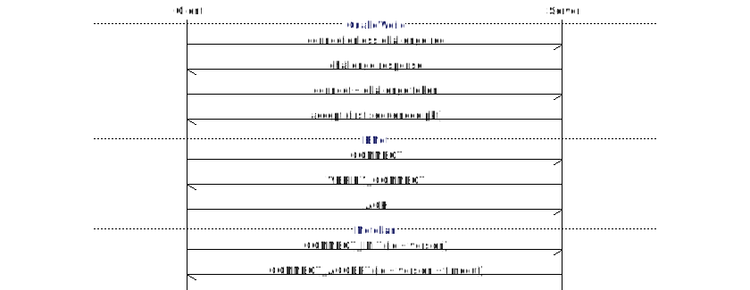
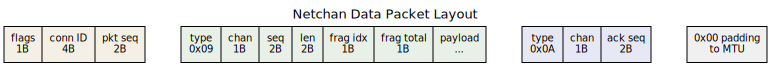

## Introduction

Every multiplayer game faces the same transport problem. TCP guarantees delivery but adds latency through head-of-line blocking: one lost packet stalls everything behind it, even packets for unrelated game state. UDP avoids this but provides no delivery guarantees at all. The game needs both: reliable delivery for chat messages, inventory changes, and map loads; unreliable delivery for position updates that expire in milliseconds.

The solution, reinvented across three decades of game development, is a reliability layer over UDP. The implementations range from a few hundred lines of C (QuakeWorld, 1996) to hundreds of thousands (QUIC, 2021). Four points on that spectrum:

- **QuakeWorld NetChannel** — the 1996 protocol that proved client-side prediction could make internet FPS playable over dial-up
- **ENet** — the de facto library for indie game networking since 2004, used by Sauerbraten, Godot Engine, and others
- **QUIC** — the IETF-standardized protocol (RFC 9000) that powers HTTP/3, with mandatory TLS 1.3 encryption
- **Netchan** — a near-minimal multiplexed channel protocol in 1,400 lines of C, designed as a practical baseline for small multiplayer games

## Abstract

We analyze the protocol design, packet overhead, reliability mechanisms, and implementation complexity of four UDP-based transport approaches. QuakeWorld's NetChannel introduced the reliable/unreliable split that became the industry template but limited itself to one reliable message in flight. ENet generalized this into a channel-based library with sliding windows and congestion control. QUIC brought stream multiplexing and mandatory encryption to the IETF standards track but at a complexity cost that dwarfs what most games need. Netchan demonstrates that a modern multiplexed channel protocol covering these requirements fits in a single C file with no external dependencies.

## The QuakeWorld NetChannel

QuakeWorld (1996) solved a problem that seemed impossible: making a fast-paced FPS playable over 200ms dial-up connections. The key insight was client-side prediction, but the networking protocol that enabled it was equally important.

### Packet Format

The QuakeWorld packet header is 10 bytes:

| Offset | Size | Field | Purpose |
|--------|------|-------|---------|
| 0 | 4 | Sequence | Outgoing packet counter; MSB = "reliable data" flag |
| 4 | 4 | ACK Sequence | Last received sequence from peer; MSB = reliable ACK |
| 8 | 2 | QPort | Random client ID to work around NAT port remapping |

Commands follow the header as variable-length messages. A single UDP packet mixes reliable and unreliable data freely.

### Reliability Model

QuakeWorld permits exactly **one reliable message in flight** at a time. The sender flags the reliable bit in the sequence number and waits for acknowledgment before queuing the next reliable message. ACKs piggyback on regular data packets, avoiding dedicated acknowledgment traffic during gameplay. If the ACK does not arrive, the reliable message is retransmitted with the next outgoing packet.

This is the simplest possible reliability scheme that works. At 20 server frames per second, a lost reliable message retransmits within 50ms. The single-message-in-flight constraint rarely matters because reliable traffic (map changes, connect/disconnect) is infrequent compared to unreliable traffic (player positions, inputs).

### What It Gets Right

- The unreliable/reliable split maps directly to game requirements
- Implicit ACKs eliminate dedicated acknowledgment packets
- Circular buffer indexed by bitwise AND avoids modulo operations
- The entire implementation fits in ~400 lines of C

### Limitations

- One reliable message in flight serializes all reliable operations
- No flow control or congestion detection
- No encryption
- No channel multiplexing; all data shares one stream
- No fragmentation support for large messages

The QuakeWorld model works because games produce a constant stream of small unreliable packets that carry the ACKs for free. Quake 2 and Quake 3 Arena inherited this design, adding delta compression and Huffman coding but keeping the single-reliable-message constraint.

## ENet

ENet, written by Lee Salzman for the Cube 2 engine (Sauerbraten), has been the go-to reliable UDP library for indie games since 2004. It generalizes the QuakeWorld model into a proper library with multiple peers, channels, and congestion control.

### Architecture

ENet manages a `host` that communicates with multiple `peers`, each supporting up to 255 independent channels. The application drives I/O through `enet_host_service()`, which returns events (connect, receive, disconnect) in a polling loop. The API surface is roughly 50 functions.

### Channel System

Each channel maintains independent sequence counters and supports three delivery modes:

| Mode | Ordered | Guaranteed | Use Case |
|------|---------|------------|----------|
| Reliable sequenced | Yes | Yes | Chat, inventory, RPC |
| Unreliable sequenced | Yes | No | Position updates |
| Unsequenced | No | No | Fire-and-forget effects |

Channels are independently buffered and drained in numerical order, giving lower-numbered channels implicit priority.

### Packet Format

ENet uses a 4-byte packet header (peer ID + send time) plus a 4-byte command header per command (type, channel ID, reliable sequence number). With UDP/IP overhead of 28 bytes, a minimal single-command packet is 36 bytes.

Multiple commands aggregate into a single UDP packet, amortizing the header cost. Messages exceeding the MTU (default 1,392 bytes, configurable 576–4,096) are fragmented transparently, with bitmap tracking for reassembly.

### Congestion Control

ENet tracks round-trip time per peer and implements a probabilistic throttle (0–32 scale) that adjusts based on RTT deviation. Static bandwidth limits (bytes/second) can be configured per host. This is more sophisticated than QuakeWorld's non-existent congestion handling but simpler than TCP's algorithms.

### Strengths

- Battle-tested in real games over two decades
- Clean event-driven API, no threading required
- Aggregation of multiple commands per packet reduces overhead
- Congestion control prevents overwhelming slow connections

### Limitations

- No IPv6 in the original library (the ENet6 fork adds dual-stack support)
- No encryption; application must layer DTLS or equivalent
- Community maintains several forks alongside the original
- No connection migration
- Fixed MTU assumption; no path MTU discovery
- Single-threaded; no built-in thread safety

## QUIC

QUIC (RFC 9000, 2021) is the most capable of the four protocols. It was designed by Google for HTTP/3 and standardized by the IETF, combining transport, encryption, and multiplexing into a single protocol.

### What QUIC Solves

QUIC eliminates TCP's head-of-line blocking through independent streams. A lost packet on stream A blocks only stream A; streams B and C continue unaffected. Connection establishment takes 1 RTT (versus 2–3 for TCP + TLS 1.3), and returning clients can send data immediately with 0-RTT resumption.

Connection migration allows sessions to survive network changes (Wi-Fi to cellular) by identifying connections with IDs rather than IP/port tuples.

### Packet Format

QUIC uses two header formats:

| Header | Use | Size |
|--------|-----|------|
| Long header | Handshake (Initial, Handshake, 0-RTT) | ~20 bytes |
| Short header | Established connection data | ~12 bytes |

Every packet carries a 16-byte AEAD authentication tag for mandatory encryption. Total per-packet overhead on IPv4 is approximately 64 bytes (20 IP + 8 UDP + 12 QUIC + 16 AEAD + frame headers).

### Why Games Avoid It

QUIC is feature-rich but mismatched to game networking requirements:

**Mandatory encryption.** Every packet is encrypted with TLS 1.3. This consumes CPU cycles that games would rather spend on simulation. The per-packet AEAD operations add measurable CPU overhead compared to unencrypted UDP protocols.

**Reliability by default.** QUIC streams are reliable. RFC 9221 adds an unreliable datagram extension, but it is not universally implemented. Games need unreliable delivery as the default, not an afterthought.

**Implementation complexity.** Production QUIC implementations measure in the tens to hundreds of thousands of lines of code:

| Implementation | Language | Approximate Scale |
|----------------|----------|-------------------|
| quiche (Cloudflare) | Rust | Large codebase |
| ngtcp2 | C | Large codebase |
| MsQuic (Microsoft) | C | Production-grade, ships in Windows |

Compare this with ENet (~5,000 LOC) or netchan (1,400 LOC).

**Latency tradeoffs.** On fast networks, measurements show UDP+QUIC+HTTP/3 suffering up to 45% data rate reduction versus TCP+TLS+HTTP/2. The per-packet crypto and loss detection overhead isn't free.

**What games do not need.** Mandatory TLS certificates, sophisticated congestion control tuned for web traffic, stream-level flow control with credit-based limits, and connection migration across network interfaces. These are valuable for web browsers; they are dead weight for a 16-player game server.

QUIC's unreliable datagram extension (RFC 9221) narrows the gap, but the fundamental mismatch remains: QUIC optimizes for reliable, encrypted byte streams, while games optimize for low-latency, lossy state snapshots.

## Netchan

Netchan is a multiplexed UDP channel protocol implemented in 1,437 lines of C (160-line header, 1,437-line implementation) with no external dependencies beyond POSIX sockets. The companion source (`netchan.h`, `netchan.c`, `netchan_test.c`) builds with a single `make` invocation and runs ten protocol-level tests. It doesn't require tens of thousands of lines of code to provide per-channel reliability, flow control, fragmentation, connection migration, and congestion detection statistics.

### Design Goals

1. **Multiplexed channels** over a single UDP connection, each with independent reliability
2. **Application-owned sockets** — the library never calls `sendto()` or `recvfrom()`
3. **No mandatory encryption** — the application can layer DTLS if needed
4. **Near-minimal implementation** — small enough to audit, embed, and modify

### Connection Lifecycle

Connections follow a five-state machine: NEW, CONNECTING, CONNECTED, CLOSING, CLOSED. The handshake is a two-frame exchange:

1. Client sends CONNECT_INIT (client ID + protocol version)
2. Server responds with CONNECT_ACCEPT (server ID + version + idle timeout)

Both sides generate random 32-bit connection IDs from `/dev/urandom`. The handshake retries up to 5 times at 500ms intervals. Keepalive PING/PONG frames maintain the connection and measure RTT at 5-second intervals, with a 30-second idle timeout.

The progression from QuakeWorld's 4-round challenge/response to netchan's 2-frame exchange reflects the shift from connectionless UDP (where the server cannot trust the source address without a challenge) to connection-ID-based protocols (where the random ID serves as a lightweight authentication token):



### Packet Format

Netchan uses two packet header formats:

| Header | Size | Fields |
|--------|------|--------|
| INIT | 5 bytes | flags (1) + connection ID (4) |
| Data | 7 bytes | flags (1) + remote connection ID (4) + packet sequence (2) |

Frames are packed sequentially after the header. Multiple frames share a single UDP packet, padded to the configured MTU (default 1,200 bytes). A typical data packet packs a DATA frame and an ACK frame into the same UDP datagram:



The frame types:

| Frame | ID | Size | Purpose |
|-------|-----|------|---------|
| PADDING | 0x00 | 1 | Null fill |
| CONNECT_INIT | 0x01 | 6 | Client handshake |
| CONNECT_ACCEPT | 0x02 | 10 | Server handshake |
| CONNECT_REDIRECT | 0x03 | 12–24 | Server redirect |
| DISCONNECT | 0x04 | 3 | Graceful close |
| PING | 0x05 | 5 | Keepalive probe |
| PONG | 0x06 | 5 | Keepalive response |
| CHANNEL_OPEN | 0x07 | 5+ | Open a channel |
| CHANNEL_CLOSE | 0x08 | 4 | Close a channel |
| DATA | 0x09 | 8+ | Channel payload |
| ACK | 0x0A | 4 | Delivery confirmation |
| WINDOW_UPDATE | 0x0B | 6 | Flow control credit |

### Channel Model

Channels are the core abstraction. Each connection supports up to 256 channels, opened dynamically with a type, direction, and optional content-type string. Server-allocated channels get even IDs; client-allocated channels get odd IDs, preventing collisions.

Each channel maintains its own sequence counters, reorder buffer, and receive queue. A lost packet affecting channel A doesn't block delivery on channel B, eliminating the head-of-line blocking problem that motivates the entire design. Multiple channels share a UDP packet (fate sharing on the wire), but once received, each channel delivers independently.

Two channel types are implemented:

**Unreliable channels** deliver best-effort datagrams with no sequencing. Fragments are reassembled on arrival, but a lost fragment means a lost message. This is the right mode for position updates, input snapshots, and other data that expires quickly.

**Reliable channels** guarantee ordered delivery through:
- Per-channel 16-bit sequence numbers
- Explicit ACK frames
- A 64-slot reorder buffer for out-of-order packets
- Exponential backoff retransmission (100ms initial, doubling to 1,000ms max, 5 attempts)
- Sliding window flow control with WINDOW_UPDATE frames

### Fragmentation

Messages exceeding the per-packet payload (MTU minus headers, approximately 1,185 bytes at default MTU) are split into up to 32 fragments. Each fragment carries a sequence number, fragment index, and fragment total. The receiver tracks reassembly with a 32-bit bitmask across 4 concurrent fragment slots per channel.

### Flow Control

Reliable channels implement credit-based flow control:
- The receiver advertises a window size (default 64 KB) via WINDOW_UPDATE frames
- The sender tracks bytes in flight and blocks with `NETCHAN_ERR_FLOW` when the window is exhausted
- The receiver sends window updates as buffered data is consumed

This prevents a fast sender from overwhelming a slow receiver without requiring global bandwidth limits.

### Connection Migration

When a packet arrives from a different address than expected, netchan validates the migration by checking for DATA or ACK frames targeting known channels. Spoofed packets without valid channel context are rejected. On successful validation, the peer address is updated transparently.

### API Design

The API separates concerns cleanly. The application owns the UDP socket and drives timing:

```c
/* connection lifecycle */
struct netchan_conn *netchan_open(int server);
int netchan_connect(conn, addr, addrlen);
int netchan_accept(conn);
void netchan_close(conn);

/* packet I/O — application owns the socket */
uint32_t netchan_peek_id(pkt, len);          /* demux without parsing */
int netchan_feed(conn, pkt, len, from, fromlen);
size_t netchan_send_next(conn, buf, buflen, to, tolen);
int netchan_service(conn, now_ms);           /* service timers */

/* channels */
struct netchan_chan *netchan_chan_open(conn, type, dir, content_type);
int netchan_chan_write(ch, data, len);
int netchan_chan_read(ch, buf, buflen);

/* events */
int netchan_poll(conn, &ev);

/* statistics — for congestion detection and diagnostics */
void netchan_conn_stats(conn, &stats);  /* RTT, packet counts */
void netchan_chan_stats(ch, &stats);     /* msgs sent/acked/recv, retransmissions */
```

The `netchan_peek_id()` function extracts the connection ID from a raw packet without full parsing, enabling the application to demultiplex packets across multiple connections using a single socket.

The library never allocates a socket, never calls `sendto()`, and never uses global state. The application calls `netchan_send_next()` in a loop to drain outgoing packets and `sendto()` them on its own socket. This makes netchan embeddable in any event loop.

### Test Coverage

Ten tests exercise the protocol end-to-end using loopback helpers that shuttle packets between two in-process connections:

| Test | Coverage |
|------|----------|
| Handshake | 3-way connection establishment |
| Unreliable datagram | Best-effort send/receive |
| Reliable datagram | ACK-confirmed delivery |
| Bidirectional channels | Simultaneous send/receive channels |
| Multiple messages | 10 reliable messages, ordered delivery |
| Connection migration | Address change mid-connection |
| Channel close | Graceful channel teardown |
| Peek ID | Packet demultiplexing utility |
| Graceful disconnect | Clean shutdown, no leaks |
| Stats | Connection and channel statistics counters |

## Comparison

### Protocol Features

| Feature | QuakeWorld | ENet | QUIC | Netchan |
|---------|-----------|------|------|---------|
| Year | 1996 | 2004 | 2021 | 2026 |
| Unreliable delivery | Yes | Yes | Extension (RFC 9221) | Yes |
| Reliable delivery | Yes (1 in flight) | Yes (sliding window) | Yes (per-stream) | Yes (per-channel) |
| Channels/streams | 1 | Up to 255 | Unlimited | Up to 256 |
| Fragmentation | No | Yes | Yes | Yes (32 frags) |
| Flow control | No | Throttle + bandwidth limit | Per-stream + connection | Per-channel window |
| Head-of-line blocking | Yes (single stream) | Per-channel (independent) | Per-stream (independent) | Per-channel (independent) |
| Congestion control | No | RTT-based throttle | Pluggable (NewReno/BBR) | No |
| Encryption | No | No | Mandatory TLS 1.3 | No (layer externally) |
| Connection migration | No | No | Yes | Yes |
| IPv6 | No | Fork only (ENet6) | Yes | Socket-agnostic |

### Packet Overhead

| Protocol | Min Header | Per-payload overhead | Crypto overhead |
|----------|-----------|---------------------|-----------------|
| QuakeWorld | 10 bytes | None | None |
| ENet | 8 bytes (4 pkt + 4 cmd) | 4 bytes per command | None |
| QUIC (short header) | ~12 bytes | Frame headers | 16-byte AEAD tag |
| Netchan | 7 bytes | Frame type + length | None |

All figures exclude the 28-byte UDP/IPv4 (or 48-byte UDP/IPv6) header that every protocol shares.

### Implementation Complexity

| Metric | QuakeWorld | ENet | QUIC (quiche) | Netchan |
|--------|-----------|------|---------------|---------|
| Implementation LOC | ~400 | ~5,000 | ~100,000+ | 1,437 |
| Header LOC | Inline | ~400 | Thousands | 160 |
| External dependencies | None | None | TLS library | None |
| API functions | ~5 | ~50 | ~100+ | 22 |
| Build complexity | Part of engine | autotools/CMake | Cargo + system TLS | Single `cc` invocation |

### Reliability Mechanisms

| Aspect | QuakeWorld | ENet | QUIC | Netchan |
|--------|-----------|------|------|---------|
| In-flight reliable messages | 1 | Window-based | Per-stream window | 64 per channel |
| ACK mechanism | Piggybacked on data | Aggregated ACK commands | Dedicated ACK frames | Per-channel ACK frames |
| Retransmission | Next outgoing packet | Exponential backoff | PTO + loss detection | Exponential backoff (100ms–1s) |
| Reorder handling | Drop | Per-channel buffer | Per-stream | 64-slot reorder buffer |
| Max retries | Continuous | Configurable | Continuous (PTO) | 5 attempts, then channel dies |

### Suitability by Game Type

| Game Type | QuakeWorld | ENet | QUIC | Netchan |
|-----------|-----------|------|------|---------|
| Twitch FPS (2–16 players) | Good | Good | Overkill | Good |
| Cooperative PvE (2–8 players) | Limited | Good | Overkill | Good |
| Turn-based/strategy | Poor | Good | Viable | Good |
| MMO (1,000+ connections) | N/A | Possible | Possible | Possible |
| Web-based game | N/A | N/A | Natural fit | N/A |

## Congestion Control Strategies

TCP's congestion control has evolved through four generations, and game protocols borrow selectively from that history.

### TCP's Evolution

**Reno** (1990) established the loss-based template still used today. The sender grows its congestion window (CWND) linearly until a packet is lost, then halves it. This additive-increase/multiplicative-decrease (AIMD) cycle produces a characteristic sawtooth pattern in throughput. Reno works, but it discovers the network's capacity by exceeding it: every growth phase ends with a lost packet.

**CUBIC** (2006, Linux default since 2.6.19) replaces Reno's linear growth with a cubic function that probes aggressively far from the last loss point and cautiously near it. CUBIC reaches full link utilization faster than Reno but causes more retransmissions in the process, and it dominates competing Reno flows unfairly by consuming buffer capacity that forces Reno to back off.

**Vegas** (1994) took a different approach: measure RTT continuously and slow down when round-trip times increase, before any packet is lost. Vegas produces far fewer retransmissions than loss-based algorithms. The tradeoff is fatal in practice: Vegas is too passive to compete for bandwidth against loss-based senders. A Reno or CUBIC flow sharing a bottleneck will fill the buffer, inflate the RTT, and starve Vegas into a fraction of its fair share.

**BBR** (2016, Google) models the bottleneck bandwidth and minimum RTT directly, pacing packets to match the measured capacity rather than probing until loss. BBR competes effectively against both CUBIC and Reno without relying on packet loss as a signal. It cycles through probing phases (startup, drain, steady-state bandwidth probing) to maintain high utilization without sustained buffer bloat. See Harsha Kapadia's [TCP version performance comparison](https://harshkapadia2.github.io/tcp-version-performance-comparison/) for measured throughput and fairness data across these algorithms.

### How Game Protocols Approach Congestion

Game traffic has a different shape than web or file transfer traffic. A game server sends 20-60 snapshots per second at a roughly constant rate, each snapshot small enough to fit in one or two UDP packets. There is no bulk transfer to ramp up, no slow start phase, and no flow that runs for minutes at full speed. The congestion control problem is less "how fast can I fill this pipe" and more "am I overwhelming this particular client's last-mile link."

**QuakeWorld** ignores congestion entirely. The server sends at a fixed tick rate regardless of network conditions. If the client's connection can't keep up, packets are lost and the client sees glitches. This works because Quake's traffic is small (a few hundred bytes per tick) and was designed for point-to-point play where the game server is the dominant sender.

**ENet** implements a throttle that adjusts per-peer send rates based on RTT variance. The throttle scale (0-32) ramps down when RTT becomes inconsistent, reducing the number of packets sent per interval. Static bandwidth limits (bytes/second) can also be configured per host. This is closer to Vegas than to Reno: it responds to delay rather than loss. ENet avoids the Vegas starvation problem by operating on a dedicated UDP port where it doesn't compete with TCP flows for buffer space.

**QUIC** supports pluggable congestion control. Most implementations ship with NewReno (a minor improvement over Reno that handles multiple losses within a single window better) and optionally BBR. The congestion controller operates per-connection, not per-stream. QUIC's loss detection is more sophisticated than TCP's, using packet number spaces and explicit ACK ranges rather than TCP's cumulative sequence numbers.

**Netchan** has no congestion control. It relies on per-channel flow control (WINDOW_UPDATE frames) to prevent a fast sender from overrunning a slow receiver, but it makes no attempt to detect or respond to network congestion. For a 16-player game server sending small snapshots at a fixed tick rate, this is usually acceptable: the traffic volume is low enough that congestion is rare on any link faster than dial-up.

### Adding Congestion Control to Netchan

Congestion manifests as five observable symptoms, roughly in order of onset: rising latency (packets queue longer at bottleneck routers), increasing jitter (delay becomes unpredictable), packet loss (router buffers overflow), retransmissions (reliable channels resend lost data, adding to the load), and falling throughput (useful data delivered per second drops). An application sitting on top of netchan can already observe the first two through PING/PONG RTT measurements and the last three through ACK gaps and retransmission counts.

Before choosing an algorithm, the goals need to be ranked. The five standard objectives are:

| Goal | Priority for Games |
|------|-------------------|
| Low delay (keep queues short) | Critical; 50ms of added latency is visible to players |
| Stability (avoid oscillations) | High; constant rate changes cause visible stutter |
| Fast recovery (bounce back after congestion) | High; a brief spike shouldn't ruin the next 5 seconds |
| Fair sharing (don't starve other flows) | Moderate; game traffic is usually small relative to the link |
| High throughput (use the link fully) | Low; games send kilobytes per second, not megabytes |

This priority ordering is almost the inverse of TCP's, where throughput comes first and latency is an afterthought. It explains why TCP congestion algorithms are a poor fit for game traffic even when the detection mechanisms are sound.

Congestion control algorithms fall into two broad categories. **Feedback (closed-loop)** algorithms detect and react to symptoms: packet loss (Reno, CUBIC), rising delay (Vegas), or a model of both (BBR). TCP's classic congestion-avoidance algorithm is closed-loop: the sender probes for capacity by increasing its send rate until loss occurs, then backs off. All four TCP algorithms described above are feedback-based. Some networks can also signal congestion directly through Explicit Congestion Notification (ECN), where routers mark packets rather than dropping them, giving the sender an earlier signal than loss. **Prevention (open-loop)** algorithms take structural steps that discourage congestion from forming: admission control (reject new connections when the server is full), traffic shaping (smooth bursty sends into a steady rate), and priority-based scheduling (send important data first when bandwidth is limited).

For netchan, a practical congestion response would combine elements from both categories:

**Detection.** Netchan measures RTT via PING/PONG at 5-second intervals. The `netchan_conn_stats()` function exposes the current `rtt_ms` and the smoothed minimum `rtt_min_ms`, letting the application detect congestion the same way Vegas does: when the current RTT exceeds the baseline minimum by more than a threshold, congestion is likely. The `netchan_chan_stats()` function reports per-channel `retransmissions` and `msgs_acked` counts, adding a loss-based signal for confirmation. Neither required protocol changes; both expose internal state through getter functions.

**Active queue management.** Netchan's send path already packs frames from multiple channels into each outgoing UDP packet. Because the application drives sends on a timer (typically once per tick), there is always a next packet scheduled. The sender can choose what goes into that packet based on channel priority: drop stale unreliable snapshots, defer low-priority reliable messages, and reserve space for critical channels. This is prevention-based congestion control at the application layer, and netchan's channel model supports it naturally. A channel priority field in `netchan_chan_open()` and a "drop oldest unsent" policy for unreliable channels would formalize what most game servers do ad hoc.

**Rate adjustment.** When RTT rises above the baseline, the application can reduce its tick rate for the affected connection (e.g., drop from 60 to 30 snapshots per second), increase delta compression to shrink each snapshot, or close optional channels entirely. This is coarser than TCP's window-based approach but better suited to game traffic, where the send rate is already discrete and the application knows which data matters.

**User-space limitations.** A kernel TCP stack can observe its own socket write queue drain rate and adjust pacing accordingly. User-space UDP has no equivalent: the kernel's socket send buffer is a simple FIFO that the application can fill but cannot introspect. Setting a very small `SO_SNDBUF` and using `poll()` write-ready events could expose back-pressure from the kernel, but this is inefficient in practice and not portable across operating systems. RTT measurement and loss detection at the application layer are more reliable signals than trying to infer kernel buffer state.

Netchan's stats API already covers the detection side: `netchan_conn_stats()` reports RTT and packet counts, `netchan_chan_stats()` reports per-channel message and retransmission counts. A recommended detection threshold (e.g., current RTT > 1.5x smoothed minimum triggers the application to reduce its send rate) and an optional channel priority field for send-path scheduling are natural next steps. The actual rate adjustment stays in the application, where the game server knows which data can be dropped, compressed, or deferred.

## When to Use What

**Use QuakeWorld-style netchan** if the game is a fast-paced shooter where nearly all data is unreliable position/input snapshots, reliable messages are rare (connect, disconnect, map change), and the server is authoritative. The simplicity is the feature.

**Use ENet** if the game needs a proven library with an active community, multiple peer management built in, and configurable congestion control. ENet handles the common case well and has been shipped in real games for over twenty years.

**Use QUIC** if the game runs in a browser (via WebTransport), requires encryption for compliance or anti-cheat, or connects through corporate firewalls that block non-HTTPS UDP traffic. Accept the complexity and CPU cost as the price of those requirements.

**Use netchan** (or something like it) if the game needs multiplexed channels with per-channel reliability, the codebase must remain small enough to audit and modify, no external dependencies are acceptable, and the application wants full control over socket I/O and event loops. Netchan is a protocol you understand, not a dependency you install.

## Conclusion

The spectrum from QuakeWorld's 400-line netchan to QUIC's six-figure codebase reflects a fundamental tension in protocol design: generality costs complexity. QuakeWorld proved that a reliable UDP layer can be trivially simple when the application's needs are narrow; QUIC proved it can replace TCP+TLS when they're broad. ENet and netchan occupy the practical middle ground where most games live.

Netchan fits the features described above into 1,400 lines of C. It's not the right choice for every game, but it establishes a useful lower bound: if the networking layer is more complex than this and the game's requirements are simpler than QUIC's, something may have gone wrong.

The full source (`netchan.h`, `netchan.c`, `netchan_test.c`, and `Makefile`) is available as a companion download. Build with `make` and run `./netchan_test` to exercise all nine protocol tests.
