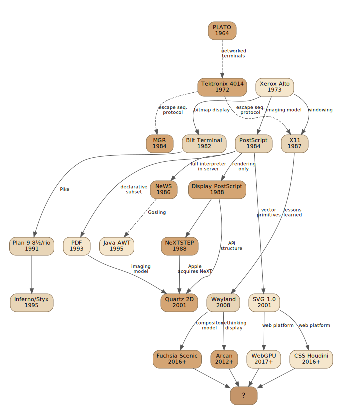
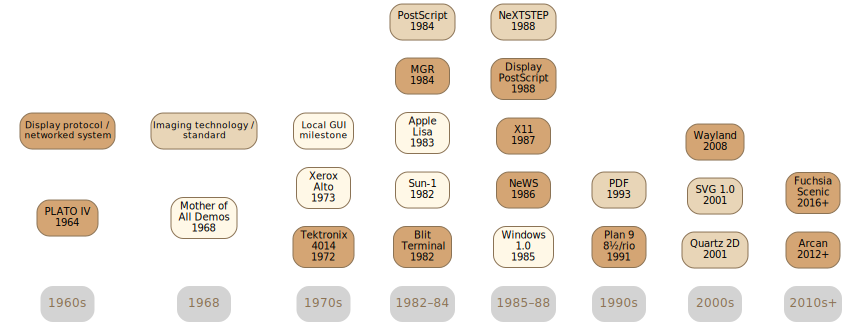
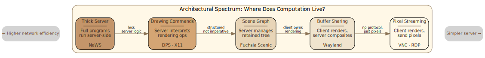
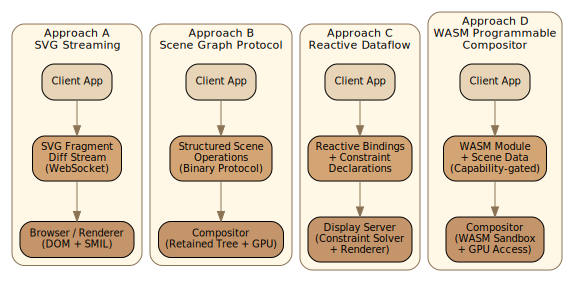

## Introduction

Beginning in 1984, James Gosling and a team at Sun Microsystems designed a window system around a radical idea: instead of sending drawing commands to a display server, send *programs*. The server would execute them — handling events, animating widgets, tracking mouse drags — all without a single network round-trip. That system was NeWS, publicly unveiled in 1986, and it lost the protocol wars to X11 despite being technically superior in almost every measurable dimension.

Nearly four decades later, we are still living with the consequences of that outcome. Modern display systems have largely converged on the thinnest possible server: Wayland composites pre-rendered buffers; web browsers execute JavaScript in a sandbox walled off from the rendering pipeline; VNC streams pixels. The "programmable display server" is a road not taken.

But the pressures that motivated NeWS haven't disappeared — they've intensified. Cloud rendering, edge computing, collaborative applications, and the growing gap between network latency and display refresh rates all point back to the same question Gosling was asking: *what if the display server could think?*

This research surveys the historical systems that explored programmable display protocols, distills the features a modern protocol would need, and evaluates four concrete architectural approaches — each making different trade-offs along the axes that have defined this design space since the 1980s.



## The Historical Landscape

The history of display protocols is a history of arguments about where computation should live. Every system ever built for putting graphics on a screen has had to answer the same question: how much intelligence belongs in the display server, and how much in the client?

The answer has shifted back and forth for sixty years. The earliest networked display systems were necessarily "thick" — terminals with their own processors, running programs downloaded from a host. As networks got faster and CPUs cheaper, the balance swung toward thin displays and rich clients. Understanding the arc requires starting earlier than the 1980s protocol wars.



### Before the Protocol Wars: Terminals That Could Think

#### PLATO: The First Programmable Display Protocol

**PLATO** (Programmed Logic for Automatic Teaching Operations) was perhaps the first system to demonstrate what a programmable display terminal could achieve at scale. Developed at the University of Illinois beginning in 1960, PLATO evolved through several generations before arriving at the system that matters for display protocol history.

PLATO I (1960) and II (1961) were single-user and dual-user systems with television displays. PLATO III (1963) scaled to twenty terminals on a CDC 1604 mainframe. The **TUTOR** programming language, conceived in 1967 by biology graduate student Paul Tenczar, would become central to the PLATO ecosystem. But it was **PLATO IV** (1972) that broke new ground with a custom display technology purpose-built for networked operation.

The breakthrough was the **plasma display panel**, invented by Donald Bitzer, H. Gene Slottow, and Robert Willson at UIUC in 1964. The AC plasma panel used small cells of noble gas between two glass plates; when ionized, the gas produced an orange glow. Critically, the cells were **bistable** — once a pixel was lit, it stayed lit without continuous refresh. This inherent memory meant no frame buffer was needed, and the host only had to send *changes* to the display, not redraw the entire screen. The 512×512 pixel plasma panel was its own memory. This property shaped the entire protocol design: the host sent high-level drawing commands at 1260 baud, and the terminal's hardwired logic (PLATO IV had no microprocessor) rendered text from built-in character ROM, drew vectors between coordinates, and filled rectangles — all without any host involvement once the command was received.

The protocol was a modal escape-sequence design: distinct modes for text rendering, pixel plotting, vector drawing, and filled rectangles, plus control modes for downloading custom character definitions into terminal memory. Four write modes — write, erase, rewrite, and inverse — controlled how new operations interacted with existing pixels on the bistable display. Beyond the plasma screen, PLATO IV terminals included a 16×16 infrared touch panel, random-access audio, and a voice synthesizer.

What made PLATO relevant to display protocol history was **TUTOR**, the programming language that ran on the host side. TUTOR controlled the terminal through structured commands — `at` for positioning, `write` for text, `draw` for vector lines, `circle` for arcs, `size` and `rotate` for text scaling and rotation. At default size and rotation, text rendered through the terminal's hardware character generator; at other values, the host sent line-segment descriptions (slow, bandwidth-limited). Four character sets of 63 characters each (8×16 pixels) were available, half fixed and half user-programmable. Interactive lessons with animated graphics, touch-driven responses, and real-time feedback ran over what was, by modern standards, a vanishingly thin network link.

PLATO demonstrated the core principle that NeWS would later articulate: if the terminal is smart enough, you can achieve rich interactivity over a slow connection by pushing behavior to the display side. By the late 1970s, **PLATO V** took this further with Intel 8080 microprocessors in the terminals, enabling **downloaded software modules** that executed locally — augmenting courseware with rich animation without host round-trips. This was the Blit's insight and NeWS's insight, arrived at independently.

Control Data Corporation commercialized PLATO, eventually investing over $600 million, with more than 100 systems deployed worldwide by the mid-1980s. Researchers from **Xerox PARC toured PLATO in 1972** and brought back ideas — the Charset Editor's pixel painting became "Doodle" at PARC; PLATO's picture application tools influenced the Xerox Star. PLATO also spawned applications that demonstrated a programmable display protocol could support real-time interaction far beyond its educational purpose: multiplayer games like Empire (1974) and Airfight (1974, which directly inspired Microsoft Flight Simulator), the first online message boards (PLATO Notes, 1973), and the first real-time chat system (Talkomatic, 1973).

PLATO survives today. The **cyber1.org** community runs the final release of CYBIS software on an emulated CDC Cyber mainframe, accessible through [Cyber1 PTERM](https://www.cyber1.org/pterm.asp) — a PLATO terminal emulator for Linux, Windows, and macOS. **IRATA.ONLINE** hosts a modern PLATO system accessible through the PLATOTerm family of clients — [platotermjs](https://github.com/tschak909/platotermjs) for web browsers, platoterm64 for Commodore 64, platotermst for Atari ST, and implementations for dozens of other platforms. These clients faithfully reproduce the original protocol's modal escape-sequence design — a display protocol conceived in the early 1970s, still functional and in active use.

#### Project MAC: From Time-Sharing to Display Protocols

At MIT, **Project MAC** (Machine-Aided Cognition / Multiple Access Computer, founded 1963) was pursuing a different angle on interactive graphics: bringing graphical displays to time-sharing systems. Ivan Sutherland's **Sketchpad** (1963) had demonstrated the potential of interactive computer graphics on the TX-2 at MIT Lincoln Laboratory, but Sketchpad was a single-user system on dedicated hardware. Project MAC's challenge was to make interactive graphics work in a time-shared environment where multiple users competed for a single mainframe.

The Electronic Systems Laboratory (ESL) at MIT built the first graphic display capable of operating on a time-sharing system in 1964: a CRT display driven directly from the IBM 7094 running CTSS. The critical architectural innovation came when a **PDP-7 was interposed as a buffer computer**, offloading display processing from the mainframe. This is an early instance of the pattern that recurs throughout display protocol history — a dedicated display processor mediating between host and screen, the same role that the Blit's 68000, X11's server process, and modern GPUs would later fill.

Project MAC's most significant contribution to the display protocol lineage was the **Advanced Remote Display Station (ARDS)**, designed by Richard Stotz and Tom Cheek at ESL beginning in 1965. The ARDS was built around a **Tektronix 600-series direct-view storage tube** — the same bistable phosphor technology that would later define the Tektronix 4014. Storage tube technology was chosen specifically because it enabled complex graphics over low-bandwidth telephone lines: images persisted on the screen without refresh, so the host only needed to send drawing commands, not maintain a frame buffer. Announced at the 1968 Spring Joint Computer Conference, the ARDS was the first purpose-built remote graphics terminal and one of the first commercial products to include a computer mouse as an optional peripheral.

The **Multics Graphics System (MGS)**, developed for Project MAC's Multics operating system, introduced another forward-looking concept: **device-independent graphics representation**. MGS maintained an internal scene representation and translated it at display time through pluggable **Graphic Interface Modules** — drivers for the ARDS, vector scopes, plotters, and character terminals. This is an early instance of the driver abstraction layer that later appears in GKS, PHIGS, and modern graphics stacks: separate "what to draw" from "how to draw it on this device."

The institutional lineage runs directly to X11. Project MAC was renamed the **MIT Laboratory for Computer Science** in 1975. In 1984, **Bob Scheifler** at LCS created the X Window System by forking Stanford's W window system, replacing its synchronous protocol with an asynchronous one. Jim Gettys at MIT's Project Athena co-developed X11. The laboratory that began with time-shared graphics terminals on CTSS produced, two decades later, the display protocol that won the Unix wars.

#### Tektronix: Storage Tubes as Display Protocol

The **Tektronix 4014** (1972) descended not from PLATO but from Tektronix's own heritage in **storage oscilloscopes**. Tektronix had been building direct-view storage tube instruments since the 1960s, and the **Tektronix 4002** (announced 1967) was their first graphics terminal — a storage-tube display with a keyboard and limited interactive capability, targeted at scientific computing. The 4014 refined this into a full-featured vector graphics terminal with higher resolution (4096×3120 addressable points in enhanced graphics mode), multiple character sizes, and a richer escape-sequence protocol.

The storage tube approach meant images persisted until explicitly erased — no refresh circuitry, no frame buffer. Drawing commands arrived as escape sequences over a serial connection: move-to, draw-to, point-plot, and various text modes. The lack of selective erase (you could only clear the entire screen) meant the 4014 was poorly suited for interactive manipulation, but it excelled at what it was designed for: displaying complex scientific and engineering graphics generated by remote programs.

The MIT ARDS (1965) and the Tektronix 4014 (1972) arrived at storage-tube graphics terminals independently — the ARDS from MIT's time-sharing display research, Tektronix from its oscilloscope business — but the 4014 won the market. It became the *de facto* standard graphics terminal on ARPANET. Its simple escape-sequence protocol meant that any program capable of writing to a serial port could generate vector graphics — no special libraries required. Plot libraries like DISSPLA, ISSCO TELLAGRAF, and later `gnuplot` all spoke Tektronix 4014 protocol. When bitmap displays arrived, terminal emulators (notably `xterm` with its Tektronix mode) kept the protocol alive. The 4014's legacy is instructive: a protocol simple enough that *any program can speak it* achieves a penetration that more capable but more complex protocols cannot.

#### The Common Thread

PLATO, Project MAC, and the Tektronix 4014 each explored the design space well before NeWS and X11 formalized the arguments. PLATO showed that programmable terminals with local intelligence could deliver rich interactivity over constrained networks — and that a display protocol designed around a bistable display's properties could support applications far beyond its original purpose. The ARDS and MGS at Project MAC showed that display processing could be offloaded to a dedicated processor and that graphics abstractions could be device-independent — ideas that would mature into X11 at the same institution two decades later. The 4014 showed that a minimal, universally-speakable protocol could become a dominant standard despite severe functional limitations. These are the same trade-offs that would animate the protocol wars of the 1980s — and the same trade-offs we face today.

### NeWS: The Maximalist Answer

NeWS was the most ambitious programmable display system ever deployed. Developed at Sun Microsystems beginning in 1984 by James Gosling, Owen Densmore, Jack Palevich, and others, NeWS had clients upload PostScript programs to the server, where they ran with direct access to the display, input events, and other server-side resources. A button's hover highlight, a scrollbar's drag tracking, a menu's cascade animation — all executed inside the server with zero network traffic.

The design exploited a deep insight about interactive graphics: most UI work is *local*. A slider doesn't need to consult the application on every mouse-move event — it needs to update its visual position, and only notify the application when the user releases it. By running the slider's logic server-side, NeWS reduced a stream of hundreds of mouse-motion events to a single "value changed" message. Sun's benchmarks showed NeWS using 100× less network bandwidth than X11 for equivalent interactive operations — a measurement that was plausible given that X11 required a round-trip for every event while NeWS processed events entirely server-side.

NeWS extended PostScript with lightweight processes, monitors for synchronization, a canvas hierarchy for windowing, and an event interest system where server-side procedures fired in response to input patterns. Clients registered *interests* — declarative descriptions of which events to handle — and the server dispatched accordingly, executing PostScript handlers without crossing the network.

The cost was formidable. PostScript is a stack-based language that most application developers found alien. Sun provided the **NeWS Toolkit (TNT)** and later the **XView** library to present C-level APIs, but the underlying complexity remained — any serious customization required writing PostScript. Debugging server-side PostScript was painful: errors in uploaded code could hang the display server or corrupt other clients' state. Security was essentially nonexistent — PostScript includes file I/O operators, and NeWS's extended PostScript had access to every canvas and event queue in the server. Any client could read other clients' windows, intercept their events, or crash the entire display. And Sun controlled the implementation, which made the rest of the Unix vendor ecosystem nervous.

Sun recognized the adoption problem early enough to ship **X11/NeWS**, a merged server that accepted both X11 and NeWS clients. OpenWindows, Sun's desktop environment through the mid-1990s, ran on this merged server. But the compromise satisfied neither camp: X11 developers had no reason to use NeWS features, and NeWS developers couldn't count on NeWS being available on non-Sun systems. X11's extensibility model — the ability to add capabilities through protocol extensions like RENDER, COMPOSITE, and GLX — allowed it to evolve incrementally in ways that NeWS's monolithic PostScript server could not easily match.

NeWS lost to X11 in what Richard Gabriel might call a textbook case of "worse is better." X11 was simpler, open, and good enough. The X Consortium provided neutral governance. Motif and later GTK/Qt gave developers C-level toolkits that were easier to work with than raw PostScript. By the mid-1990s, Sun conceded, shipping CDE on X11 and eventually discontinuing NeWS entirely.

### Display PostScript: The Pragmatic Middle

Adobe's Display PostScript took a less radical approach. Where NeWS made PostScript the programming language for the entire window system, DPS used it only for rendering. Applications communicated through *wraps* — C functions generated by Adobe's `pswrap` tool that, when called, sent pre-compiled PostScript fragments to the server for execution.

The DPS server maintained persistent execution contexts per client, each with its own graphics state — transformation matrices, clipping paths, colors, fonts. Incremental updates were natural: a client sent a small PostScript program to modify a specific region of its window, and the server applied it within the existing context. Binary object sequences reduced wire overhead by roughly 50% compared to ASCII PostScript.

NeXTSTEP was DPS's showcase. The entire window system was built on it, and the result was remarkable for its time: true WYSIWYG across screen and printer, resolution-independent rendering, and a unified imaging model that made Interface Builder's visual design tools possible. Steve Jobs chose DPS specifically because it collapsed the gap between screen and print — a selling point for NeXT's target market in desktop publishing and higher education.

DPS's limitations were practical rather than fundamental. Adobe charged significant licensing fees. The PostScript interpreter was entirely software-rendered, with no path to hardware acceleration. On NeXTSTEP's 25 MHz 68030 hardware, scrolling and window dragging were noticeably sluggish compared to contemporary X11 systems that could blit bitmaps directly.

When Apple acquired NeXT in 1997, DPS's legacy shaped what came next. Quartz 2D preserved the imaging model — paths, affine transforms, compositing, graphics state objects — while replacing PostScript with PDF as the underlying formalism. The `CGContext` API maps almost one-to-one onto PostScript operators (`CGContextMoveToPoint` ≈ `moveto`, `CGContextStrokePath` ≈ `stroke`), but executes as C function calls rather than interpreted code. Apple kept what worked (the imaging model) and discarded what didn't (the interpreter, the licensing, the Turing-completeness in the display server).

### The Blit and Plan 9: Programmability Through Composition

Rob Pike's work at Bell Labs took a different path entirely. The Blit terminal (1982) was a programmable bitmap display with its own 68000 processor. The host Unix system could download small C programs to the terminal, which would then execute locally — handling interactive graphics and text editing without host round-trips. This was NeWS's core insight, arrived at independently and four years earlier. Like PLATO's plasma terminals, the Blit demonstrated that pushing computation to the display side could transform a network-constrained connection into a responsive interactive experience.

Plan 9's window system, 8½ (and later rio), took the idea further by making it *compositional* rather than language-based. Each window appeared as a file system — `/dev/cons`, `/dev/mouse`, `/dev/draw` — and the window manager was an ordinary user process that multiplexed these file system interfaces. Any process could act as a window manager by mounting the appropriate interfaces. The display was programmable not because it ran a special language, but because it exposed standard interfaces that ordinary programs could interpose on.

The draw device (`/dev/draw`) provided a 2D imaging protocol based on Porter-Duff compositing operations. Applications communicated by writing fixed-format binary messages to the device file — each message began with a single-byte opcode followed by binary parameters. The `draw` command (`d`) performed a general compositing operation: source image, mask image, destination image, destination point, source point, mask point — a single operation expressive enough to implement fills, copies, transparency, and masked blits. Line drawing (`l`, `L`), ellipses (`e`), and string rendering (`s`) provided higher-level primitives. Images were allocated server-side (`b` to allocate, `f` to free) and referred to by integer IDs — the same retained-mode pattern that appears in every successful display protocol.

The elegance was in the uniformity. The entire graphics system reduced to compositing rectangles from one image onto another, with an optional mask — the twelve Porter-Duff operators (clear, SoverD, SatopD, SinD, etc.) as the compositing algebra. There were no special-case drawing modes, no modal state, no graphics context objects. A fill was a compositing operation from a solid-color source. A copy was a compositing operation with a full mask. Text rendering composited glyph images from a font cache. This minimalism made the protocol small enough to implement correctly (the draw device is roughly 2000 lines of C) and general enough to handle all 2D rendering needs.

Where X11 required the server to implement dozens of drawing operations (lines, arcs, polygons, fills, stipples, tiles, text in multiple encodings) across multiple visuals and color depths — each with modal graphics context state — Plan 9's draw device offered one operation that could express all of them. The contrast with X11 is instructive: X11's protocol has over 120 request types; Plan 9's draw device has roughly 20 message types, most of which are resource management (allocate image, load font, set clipping rectangle). The actual drawing vocabulary is tiny.

Plan 9's approach remains influential as a design philosophy: programmability emerges from composing simple, orthogonal mechanisms rather than from embedding a powerful language in a privileged server. The file system interface made network transparency a solved problem — `import` a remote machine's `/dev/draw` and you had a remote display, using the same protocol (`9P`) that moved files, with the same authentication and encryption. No separate display protocol was needed.

Bell Labs' **Inferno** operating system (1996) extended this philosophy with a higher-level widget layer. Inferno's Tk — a reimplementation of Tcl/Tk's widget set with Limbo replacing Tcl — provided structured widget commands (`label`, `button`, `pack`, `canvas`) over the same Styx/9P protocol that Plan 9 used for everything. All widget interaction passed through a single function: `tk->cmd(toplevel, cmdstring)`, where command strings created and configured widgets declaratively. Events flowed back to the application through Limbo's typed channels. This was a middle ground between Plan 9's raw draw device (too low-level for most applications) and NeWS's full PostScript (too complex and insecure): a structured widget vocabulary that kept all application logic in the client language while providing a higher-level protocol than raw pixel compositing.

### An Aside: The MGR Window System

Bellcore's MGR (1984) deserves mention as an overlooked middle path. Where NeWS required clients to write PostScript and Plan 9 exposed file system interfaces, MGR used *escape sequences* — the same mechanism that VT100 terminals used for cursor positioning and text attributes, extended to support bitmap graphics, windows, and menus.

An MGR client was any program that could write to a terminal. Drawing a line meant printing an escape sequence; creating a menu meant printing another. The entire protocol ran over pseudo-terminals, which meant standard Unix tools — `cat`, pipes, `ssh` — worked as transport without modification. A shell script could create windows and draw graphics. The barrier to entry was essentially zero.

MGR ran on Sun workstations with as little as 1 MB of RAM, serving multiple concurrent clients with bitmap graphics, stacking windows, and mouse input. It supported network transparency through the simple expedient of running over TCP — no special protocol needed, because the protocol *was* the terminal data stream.

The lesson from MGR is that protocol simplicity and ecosystem integration can matter more than expressive power. MGR could never match NeWS's rendering sophistication, but it could be adopted incrementally by any program that could print to stdout. This principle — that the protocol should meet developers where they are — informs the design of the proof-of-concept that follows.

### The Modern Landscape

Today's display systems have largely migrated to the opposite end of the spectrum from NeWS.

#### Wayland: The Triumph of Buffer Passing

Wayland represents the logical endpoint of a trend that began with X11's DRI (Direct Rendering Infrastructure) and Xgl: if clients are already rendering everything themselves using OpenGL or Vulkan, why maintain a server-side drawing protocol at all? Kristian Høgsberg's answer, when he started Wayland in 2008, was that you shouldn't. The Wayland protocol is deliberately minimal: clients render into buffers (shared memory, GBM, or DMA-BUF backed), attach them to a `wl_surface`, report which regions changed (`damage`), and `commit`. The compositor takes the buffer, composites it with other clients' buffers, and presents the result. There is no `DrawLine`, no `FillRectangle`, no `RenderString` — no drawing protocol whatsoever.

The argument for this model is compelling in the local case. Modern GUI toolkits — GTK, Qt, Flutter, Chromium — already perform all rendering client-side using GPU-accelerated pipelines. X11's server-side drawing operations had become vestigial; the Xrender extension and Cairo's client-side rendering made them unnecessary for everything except legacy applications. By eliminating the drawing protocol entirely, Wayland removes an entire class of server complexity, reduces the attack surface, and lets clients use whatever rendering technology they choose. The compositor's job shrinks to what a compositor actually needs to do: combine surfaces, manage input focus, and apply whole-surface transforms.

But the buffer-passing model makes an implicit trade-off that becomes explicit in several scenarios:

**Network transparency.** Wayland has none. The protocol assumes shared memory or DMA-BUF — mechanisms that require the client and compositor to share a physical address space or GPU. Remote display over Wayland requires external solutions (RDP, VNC, PipeWire screen capture) that stream pixels, losing all structural information. This is a deliberate design choice, not an oversight — the Wayland developers argue that network transparency is better handled at a higher layer — but it means Wayland cannot serve the use case that motivated X11, NeWS, and the Tektronix 4014: a remote application displaying on a local screen.

**Resolution independence.** When a client renders to a buffer, it commits to a specific pixel resolution. Wayland's `wp_fractional_scale` and `wp_viewport` protocols mitigate this by letting the compositor scale buffers and by informing clients of the desired scale factor, but the fundamental issue remains: the compositor receives pixels, not geometry. It cannot re-render a client's output at a different resolution without the client's cooperation. A vector-based protocol — even a simple one — would let the display server re-render at any resolution without client involvement.

**Accessibility.** An opaque buffer reveals nothing about its contents. Screen readers cannot inspect a Wayland surface to discover that it contains a button, a menu, or a text field — they must rely on a separate accessibility protocol (AT-SPI over D-Bus) that the client maintains independently. This is a defensible architectural choice — pushing accessibility to the toolkit layer (GTK, Qt) where semantic information originates — but it creates a parallel data path: the visual representation goes through Wayland as pixels, while the semantic representation goes through AT-SPI as structured data. A display protocol that transmits structured scene descriptions would unify these paths, making the scene graph and the accessibility tree aspects of the same data.

**Bandwidth.** In the local case, shared-memory buffer passing is efficient — damage tracking ensures only changed regions are composited, and DMA-BUF avoids copies entirely. But this efficiency depends on a shared address space. For any remote display scenario, the buffer-passing model degenerates: even a modestly interactive application (text editor, spreadsheet) may damage a significant fraction of its surface on each keystroke as it re-renders text, updates scrollbars, and repaints selection highlights. A structured protocol that says "change this text node's content to X" transmits bytes, not megapixels.

The contrast with a vector-based display protocol is not as stark as it initially appears, however. Both models must ultimately produce pixels on a display; the question is where the rasterization happens and what crosses the interface boundary. Wayland says: rasterize client-side, pass pixels. A vector protocol says: pass geometry, rasterize server-side. The web platform shows that these aren't mutually exclusive — HTML Canvas and WebGL are buffer-passing within a system that also supports structured SVG and DOM. A modern display protocol might similarly support both: structured scene graph operations for UI, with an escape hatch to buffer-passing for content that doesn't fit the vector model (video, 3D viewports, custom rendering).

#### Remote Display Protocols: SPICE, Citrix, and RDP

While the Unix world debated X11 versus NeWS, the enterprise virtualization and remote desktop markets were building their own answers to the display protocol question — and arriving at a consistent architectural pattern: **adaptive, content-aware encoding** that treats different regions of the screen differently based on what they contain.

**SPICE** (Simple Protocol for Independent Computing Environments) was developed by Qumranet for KVM virtual machines, open-sourced by Red Hat in 2009. SPICE is structured, not pixel-based: a paravirtual **QXL** GPU driver inside the guest intercepts OS rendering calls, translates them into draw commands (fills, copies, blits), and pushes them through a command ring. The SPICE server builds a graphics command tree and sends structured rendering commands to the client, which renders them locally using its own hardware. Multiple independent channels carry display, input, cursor, audio, USB, and smartcard data, each with independent compression and prioritization. The display channel selects compression per-content: lossless LZ for synthetic UI, QUIC for photographic content, and M-JPEG for video regions. This is the same insight that every successful remote display protocol has converged on: UI chrome is structured data, media content is a pixel stream, and the protocol should handle each appropriately.

**Citrix ICA** (Independent Computing Architecture), developed in the early 1990s, took this further with up to 32 **virtual channels** — independent data streams for display, audio, printing, clipboard, USB, and more, each with its own compression and priority. Citrix's **ThinWire** display channel detects regions of rapid change (video, 3D animation) and encodes them with H.264/H.265, while static regions (text, UI elements) use bitmap caching and lossless compression. ICA was designed for extreme low-bandwidth operation — usable at modem speeds — by aggressively caching bitmaps client-side and transmitting only drawing commands for UI elements. The **EDT** (Enlightened Data Transport) protocol adds UDP-based transport for high-latency links.

**Microsoft's RDP** follows a similar hybrid model: GDI drawing commands for UI elements, bitmap caching for repeated content, and RemoteFX video codec for media regions. RDP is not the pixel streamer it is sometimes characterized as — it transmits structured drawing operations when possible and falls back to bitmap encoding only for content that resists structural representation.

The convergence is striking. SPICE, Citrix ICA, and RDP all independently arrived at the same architecture: a channel-multiplexed protocol that carries structured commands for UI and compressed pixels for media, with adaptive per-region encoding. This validates the hybrid model — structured scene data where possible, pixel streaming where necessary — that a modern display protocol should formalize.

#### Compositors: The Web, Scenic, SurfaceFlinger, and Arcan

The web platform occupies a fascinating middle position. The browser is, in effect, a display server that interprets a rich declarative language (HTML/CSS/SVG) and executes uploaded programs (JavaScript). CSS Houdini's paint worklets are strikingly close to NeWS's model: executable code uploaded to the rendering engine, running in a restricted context with direct access to drawing primitives. (As an aside, the Vello project has shown that GPU compute shaders compiled to WASM can render complex vector scenes at rates far beyond what SVG's DOM pipeline achieves — decoupling protocol design from rendering technology.)

Google's Fuchsia operating system introduced **Scenic**, a scene-graph-based compositor where clients submit structured scene graph fragments rather than rendered buffers or drawing commands. Clients interact through FIDL (Fuchsia Interface Definition Language) — a typed IPC protocol with operations like `CreateResource`, `SetTranslation`, `SetShape`, `SetMaterial`, and `AddChild`. The compositor retains a tree of nodes — shapes, transforms, materials, clips — and performs rendering itself using Escher, a Vulkan-based renderer. This is neither NeWS's "upload programs" model nor Wayland's "upload pixels" model, but a middle ground: upload *structured data* that the server renders. Scenic evolved from a full 3D scene graph (GFX) to a simplified 2D-focused API (Flatland), suggesting that even purpose-built scene graph protocols benefit from simplification under real-world pressure.

Android's **SurfaceFlinger** (2008) provides a production-scale data point for the retained-surface compositor model. Each application renders into a Surface backed by a BufferQueue; SurfaceFlinger composites all surfaces according to retained metadata — Z-order, position, crop, transform, alpha — updated through atomic transactions. The Hardware Composer HAL offloads layer compositing to display hardware, deciding per-frame which layers go through GPU compositing versus hardware overlay planes. SurfaceFlinger shares Wayland's buffer-passing philosophy but demonstrates it at the scale of billions of deployed devices, with a retained layer model that gives the compositor meaningful structural knowledge about the scene.

**Arcan** is perhaps the most ambitious modern attempt at a programmable display server, directly invoking the spirit of NeWS. Its compositor logic is written entirely in Lua — window management policies, visual effects, input routing, and custom UI elements are all scripts running inside the display server. Arcan's A12 network protocol provides built-in network transparency with adaptive encoding: structured commands for UI elements, video codec for media content, with per-frame compression selection based on content type. Combined with its shmif client protocol (which supports structured content types, bidirectional communication, and state serialization), Arcan demonstrates that a modern programmable display server is technically viable — the question is whether it can achieve the ecosystem breadth that NeWS could not.

(Figma's multiplayer architecture is also worth noting as an existence proof: it synchronizes a structured scene graph across clients via WebSocket using operational transforms, demonstrating that scene graph synchronization can work at scale with high interactivity — the core mechanism a display protocol would need.)



## Design Requirements

Drawing from the historical record, we can identify a set of capabilities that a modern programmable display protocol should provide. These are not features to be implemented all at once, but rather a minimum viable set that addresses the failure modes of past systems while preserving their strengths.

**Resolution-independent vector imaging.** The PostScript/PDF/SVG imaging model — paths, bezier curves, affine transforms, gradient fills, compositing — has proven durable across four decades. Any modern protocol should speak this language natively. Bitmap-only protocols (VNC) and buffer-only protocols (Wayland) discard semantic information that the server could exploit for caching, scaling, and bandwidth optimization.

**Incremental, streaming updates.** DPS's strongest feature was its ability to send small PostScript fragments that modified an existing graphics state. A modern protocol must support fine-grained mutations — inserting a node, changing an attribute, removing a subtree — without retransmitting the entire scene. This is what makes the protocol viable over constrained networks.

**Server-side state retention.** The display server must maintain a persistent representation of the scene between updates. This enables the server to re-render at different resolutions, apply compositor effects (shadows, transparency, animations), and avoid redundant data transfer. Plan 9's draw device, Fuchsia's Scenic, and every browser's DOM all demonstrate the value of retained-mode graphics.

**Declarative animation and transition.** NeWS showed that interactive behaviors can execute server-side to eliminate round-trips. But uploading Turing-complete programs raises security and complexity concerns. A modern protocol should support *declarative* animations and transitions — descriptions of motion that the server executes autonomously. SVG's SMIL animations and CSS transitions are existence proofs that this works.

**Sandboxed server-side computation.** This is the NeWS feature that no successor has satisfactorily replaced. Some class of computation *must* run server-side for latency-critical interactions — hit testing, constraint resolution, scroll physics, gesture recognition. The key is sandboxing: the uploaded code must be memory-safe, time-bounded, and incapable of accessing other clients' state. WebAssembly provides the execution model; capability-based security provides the access model.

**Structured event flow.** NeWS's event interest system was elegant: clients declared patterns describing which events to receive, and the server dispatched accordingly. A modern protocol should support event filtering, coalescing, and server-side preprocessing — reducing raw input streams to semantic events before they cross the wire.

**Accessibility as a first-class concern.** No historical display protocol addressed accessibility adequately. A modern protocol that transmits structured scene descriptions (rather than pixels) has a natural advantage: the scene graph *is* the accessibility tree, or can be mapped to one without screen-scraping heuristics.

## Candidate Architectures

With these requirements established, we can evaluate concrete architectures. Each approach makes different trade-offs along the fundamental axes: server complexity vs. network efficiency, security vs. programmability, and adoption feasibility vs. architectural purity.



### Approach A: SVG Streaming Protocol

The most conservative approach builds directly on SVG, the web's existing vector graphics standard. An SVG streaming protocol would define a wire format for incremental mutations to an SVG document — insert element, set attribute, remove element, reorder children — transmitted over a persistent connection.

The client maintains the authoritative application state and generates SVG mutations. The server (a browser, a dedicated renderer, or a compositor) maintains a retained SVG DOM and applies mutations as they arrive. SMIL animations handle declarative motion server-side. CSS custom properties provide a thin parameterization channel — the client can update a handful of numeric values and let CSS rules propagate the visual consequences.

**Strengths.** Adoption is the overwhelming advantage. SVG is a W3C standard implemented in every browser. The tooling ecosystem — editors, debuggers, accessibility tools — already exists. The gap between "SVG streaming protocol" and "what browsers already do" is small enough that a polyfill could demonstrate the concept. Accessibility comes nearly for free: SVG elements carry ARIA roles and the DOM is already exposed to screen readers.

**Weaknesses.** SVG's DOM is not designed for high-frequency updates. Each mutation triggers style recalculation, layout, and repaint through the browser's rendering pipeline — a pipeline optimized for document rendering, not interactive graphics. At thousands of mutations per second, this becomes a bottleneck. SVG also lacks a mechanism for server-side computation: there is no way to upload a hit-testing function or a scroll-physics routine. The protocol would be purely declarative, with all logic remaining client-side.

The wire format presents a design choice. XML-based diffs are human-readable but verbose. A binary encoding (similar to DPS's binary object sequences) would be more efficient but would sacrifice SVG's inspectability. A hybrid approach — binary transport with XML-equivalent semantics — is possible but adds complexity.

**Best suited for:** applications where visual fidelity and accessibility matter more than interactive performance — dashboards, data visualizations, document rendering, collaborative whiteboards with moderate update rates.

### Approach B: Scene Graph Protocol

This approach defines a custom binary protocol for submitting and mutating a retained scene graph on the compositor. The scene graph consists of typed nodes — shapes, groups, transforms, clips, materials, text runs — organized in a tree. Clients submit subtrees and subsequent mutations; the compositor retains the tree and renders it.

This is closest to what Fuchsia's Scenic does. The protocol is structured: each operation targets a node by ID and specifies a typed mutation (set transform, change fill color, append child). The compositor owns the rendering pipeline and can optimize aggressively — batching draw calls, caching rasterized subtrees, applying resolution-appropriate level-of-detail.

**Strengths.** A purpose-built binary protocol can be extremely bandwidth-efficient. Node-level granularity allows the compositor to cache and invalidate precisely. The typed node model enables the compositor to understand the *structure* of the scene, not just its pixel output — enabling semantic zoom, compositor-driven animation, and principled accessibility tree generation. GPU acceleration is straightforward because the compositor controls the rendering pipeline end-to-end.

**Weaknesses.** A new protocol means a new ecosystem — renderers, debuggers, profilers, accessibility bridges — all must be built from scratch. This is the cost that killed Fresco/Berlin in the 1990s and has slowed Scenic's adoption outside Fuchsia. The protocol must be versioned carefully; adding new node types or mutation operations is a compatibility event. And like Approach A, there is no mechanism for server-side computation beyond what the compositor natively supports.

Interoperability with the web is a challenge. A scene graph protocol could be bridged to SVG or Canvas, but the impedance mismatch would lose much of the performance advantage. Applications targeting this protocol would need dedicated client libraries rather than leveraging existing web APIs.

**Best suited for:** operating system-level display servers where the protocol can be mandated (as in Fuchsia), embedded systems with constrained bandwidth, and remote display scenarios where structured scene data dramatically outperforms pixel streaming.

### Approach C: Reactive Dataflow Protocol

Rather than sending imperative mutations, this approach has the client declare *relationships* — reactive bindings and constraints that the server maintains autonomously. A slider's thumb position is bound to a numeric value; the value is constrained to a range; the track fill width is derived from the value. The client sends the constraint graph; the server solves it continuously.

This draws inspiration from constraint-based systems like TeX's box-and-glue model, Apple's Auto Layout (based on the Cassowary constraint solver), and reactive programming frameworks. The protocol transmits a dataflow graph: nodes are values, edges are derivation functions. The display server evaluates the graph, renders the visual result, and re-evaluates when inputs change — whether from client updates or from user input processed server-side.

**Strengths.** Reactive dataflow naturally handles the interactions that are most painful over a network: dragging, scrolling, resizing, animation. The server maintains the constraint graph and can resolve user input locally without round-trips. The declarative nature makes the protocol inspectable and debuggable — the constraint graph is a meaningful artifact, not an opaque stream of mutations. Animations are implicit: changing a constraint's input triggers re-evaluation, and the server can interpolate between states.

**Weaknesses.** Constraint solving is computationally expensive. General constraint systems can have exponential worst-case behavior; even Cassowary (linear arithmetic constraints) adds meaningful overhead per constraint. A display server running constraint solvers for hundreds of clients must either limit expressiveness or accept variable frame rates. The protocol is also unfamiliar — there is no large developer community experienced with constraint-based UI beyond Auto Layout, and even Auto Layout is widely regarded as difficult to debug.

The expressive boundary is the critical design challenge. Which constraints can the server solve? Linear arithmetic? Affine transforms? Arbitrary functions? Each extension makes the server more powerful but harder to implement, harder to sandbox, and harder to reason about. A reactive dataflow protocol risks becoming either too limited to be useful or too complex to be tractable.

It should be noted that no display system has ever been built on a reactive dataflow model — the precedents cited (Auto Layout, TeX) are layout engines within larger systems, not display protocols. Approach C is more speculative than the other three, which all have direct historical implementations.

**Best suited for:** form-heavy applications with structured layouts, responsive design across heterogeneous displays, and scenarios where the server must adapt the UI to local conditions (screen size, accessibility settings, user preferences) without client involvement.

### Approach D: WASM Programmable Compositor

This is the direct descendant of NeWS: clients upload executable code to the display server, where it runs with access to drawing primitives and input events. The critical difference from NeWS is the execution environment. Where NeWS used PostScript (Turing-complete, no memory safety, no isolation), this approach uses WebAssembly — a sandboxed, memory-safe, time-boundable bytecode format designed for exactly this kind of untrusted-code execution.

A client submits a WASM module along with a capability manifest declaring what resources it needs: a drawing surface of specified dimensions, input events of specified types, a timer, access to specific shared state. The compositor validates the manifest against security policy, instantiates the module in a sandbox, and begins dispatching events to it. The module renders into its allocated surface using a drawing API exposed through WASM imports. The compositor composites all clients' surfaces into the final display.

**Strengths.** This is the only approach that fully addresses server-side computation. Hit testing, scroll physics, gesture recognition, text input handling, and custom animation curves can all execute server-side at native speed. WASM's sandbox provides memory safety and can be time-bounded (fuel metering) to prevent runaway modules from starving other clients. The capability model provides principled security — a module can only access resources explicitly granted by its manifest. And WASM is language-agnostic: clients can write their rendering code in Rust, C, Go, or any language with a WASM target.

**Weaknesses.** Complexity is the dominant concern. The compositor becomes a WASM runtime, a capability manager, a resource allocator, and a rendering engine — a substantial surface area for bugs and security vulnerabilities. The WASM module itself is opaque to the compositor: unlike a scene graph or SVG DOM, the compositor cannot inspect the module's visual output for accessibility, cannot apply compositor-level effects (shadows, transparency) to sub-elements, and cannot rerender at a different resolution without the module's cooperation.

Debugging is harder than in any other approach. When a visual glitch appears, is it in the client's application logic, the WASM module's rendering code, the compositor's surface management, or the WASM runtime itself? Each layer has its own tooling and failure modes.

The "opaque surface" problem deserves emphasis. NeWS's great advantage over X11 was that the server *understood* what was being drawn — it could apply server-side logic to the scene's structure. A WASM module that renders to a bitmap surface loses this advantage. The mitigation is a hybrid model: the module submits structured scene graph data *and* receives a drawing API for custom rendering within specific nodes. This is essentially how browsers work today (DOM for structure, Canvas for custom rendering), but formalized as a protocol.

**Best suited for:** latency-critical interactive applications (games, creative tools, collaborative editors), scenarios where server-side computation provides a measurable UX improvement, and systems where the compositor's trust boundary is well-defined.

## Trade-off Analysis

The four approaches occupy different positions in the design space, and no single approach dominates across all dimensions.

| | SVG Streaming | Scene Graph | Reactive Dataflow | WASM Compositor |
|---|---|---|---|---|
| **Network efficiency** | Moderate (XML overhead) | High (binary, structured) | High (only changed inputs) | Variable (depends on module) |
| **Server-side computation** | None | Limited (built-in only) | Constraint solving | Full (sandboxed WASM) |
| **Accessibility** | Excellent (DOM-native) | Good (structured tree) | Good (constraint graph) | Poor (opaque surfaces) |
| **Security model** | Trivial (no code exec) | Trivial (no code exec) | Moderate (constraint scope) | Complex (WASM sandbox + capabilities) |
| **Adoption path** | Easy (extend existing web) | Hard (new ecosystem) | Medium (novel but declarative) | Hard (new runtime) |
| **Interactive latency** | Medium (declarative anim.) | Medium (declarative anim.) | Low (server-side solving) | Lowest (server-side code) |
| **Debugging** | Easy (browser DevTools) | Moderate (new tooling) | Hard (constraint debugging) | Hardest (multi-layer) |
| **GPU acceleration** | Limited (browser pipeline) | Natural (compositor-owned) | Possible (solver output) | Natural (module or compositor) |

The most revealing axis is the tension between **interactive latency** and **accessibility**. Approaches that move computation server-side (C, D) reduce latency but make the display server's output harder to inspect semantically. Approaches that keep the display server purely declarative (A, B) are inherently inspectable but cannot eliminate client round-trips for interactive behaviors.

This tension echoes the original NeWS vs. X11 trade-off, but modern technology offers partial resolutions that weren't available in the 1980s. WASM sandboxing addresses NeWS's security problems. Capability-based access control addresses its isolation problems. And a hybrid approach — structured scene graph *plus* sandboxed computation within designated nodes — could address the accessibility gap by ensuring that the overall scene structure remains inspectable even when individual elements are rendered by opaque code.

## A Pragmatic Synthesis

The historical record suggests that architectural purity is less important than ecosystem fit. NeWS was technically superior to X11 but lost because X11 was simpler, open, and had more vendors behind it. DPS was elegant but lost to bitmap-based rendering because hardware got fast enough to make brute force viable. Plan 9's compositional approach was the most principled of all but never reached critical mass outside Bell Labs.

A modern programmable display protocol that aims for adoption should probably be a **layered architecture** rather than a monolithic one:

**Layer 1 — Structured scene graph.** A retained tree of typed nodes (shapes, text, groups, clips, transforms) with a binary wire protocol for incremental mutations. This provides the baseline: resolution-independent rendering, compositor-level effects, accessibility, and efficient bandwidth usage. This layer can function standalone as a display protocol — equivalent to Approach B.

**Layer 2 — Declarative behaviors.** Animations, transitions, constraints, and event filters that execute server-side without uploaded code. This layer reduces round-trips for common interactive patterns (scrolling, resizing, hover effects, layout reflow) while remaining inspectable and safe. Built atop the scene graph as annotations on nodes.

**Layer 3 — Sandboxed computation.** WASM modules that execute within designated scene graph nodes, receiving drawing APIs and input events through capabilities. This layer is optional — clients that don't need server-side computation never touch it. Clients that do get NeWS-class latency reduction within a modern security model.

This layering has a direct historical parallel. It's how the web platform evolved: HTML provides the scene graph (Layer 1), CSS provides declarative behaviors (Layer 2), and JavaScript provides programmable computation (Layer 3). The web's success suggests that this layered approach — where each layer is independently useful and adoption is incremental — is more viable than any monolithic design.

The key difference from the web platform would be that all three layers are designed as a *protocol* from the start, rather than evolving organically from a document format. The scene graph is binary and structured, not XML. The declarative behaviors are defined in terms of scene graph operations, not text styling. And the sandboxed computation layer is integrated with the compositor's rendering pipeline, not walled off in a separate VM.

## Proof of Concept: Quaoar

To ground the preceding analysis, we built **Quaoar** — a minimal SVG-based thin client that tests whether behavior offloading works in practice. Quaoar is not a production system or a comprehensive implementation of the layered architecture described above. It is a deliberately biased experiment: the author's attempt to translate the article's conclusions into working code, choosing the simplest viable approach (Approach A, SVG streaming with declarative behavior offloading) over more ambitious alternatives. Other valid implementations — a binary scene graph protocol (Approach B), a WASM-based compositor (Approach D), or hybrid approaches like Arcan's A12 — would test different aspects of the design space.

An even more minimal proof-of-concept was available: one application per browser tab, with no multiplexing or window management in the client. This would have reduced the implementation to little more than a WebSocket-to-SVG pipe, testing the core behavior-offloading thesis with less code. The trade-off is a WebSocket connection per application rather than per user session — a potential scaling concern, but arguably the right starting point for a minimal experiment. Quaoar's choice to multiplex multiple applications through a single connection reflects the author's preference for the X11-style `DISPLAY` model rather than a strict minimality criterion.

### Architecture

The architecture mirrors X11's `DISPLAY` model with modern materials. A browser tab acts as the **display server**, maintaining a retained SVG DOM. Remote applications connect through a Unix socket to a lightweight C server (~300 lines) that bridges to the browser via WebSocket. A C client library (~385 lines) provides a widget API:

```c
qu_ctx *ctx = qu_connect(NULL); /* reads QUAOAR_DISPLAY env */

int win = qu_window(ctx, "Notepad", 80, 60, 480, 340);
int btn = qu_button(ctx, win, "Save", 10, 10, 70, 28);
int ta  = qu_textarea(ctx, win, 10, 48, 460, 272);

qu_on_event(ctx, btn, on_save, NULL);
qu_on_event(ctx, ta,  on_text, NULL);

struct pollfd pfd = { .fd = qu_fd(ctx), .events = POLLIN };
while (poll(&pfd, 1, -1) >= 0)
    if (qu_process(ctx) < 0) break;
```

The key mechanism is **behavior offloading**: when the widget library creates a button, it sends a self-contained SVG declaration including SMIL animations for hover, press, and focus states. The browser-side display server inserts the SVG and wires up event listeners — button hover effects, press animations, and scrollbar drag behavior all execute through the browser's native SVG/SMIL engine with zero network round-trips. Only semantic events ("button clicked", "text changed") are sent back:

```
svg 2 1
<g transform="translate(10,10)" style="cursor:pointer">
  <rect width="70" height="28" rx="4" fill="#5a5a62">
    <set attributeName="fill" to="#6a6a72"
         begin="mouseover" end="mouseout"/>
    <set attributeName="fill" to="#4a4a52"
         begin="mousedown" end="mouseup"/>
  </rect>
  <text x="35" y="18" fill="#eee" font-size="12"
        text-anchor="middle">Save</text>
</g>
```

The display client doesn't know what a "button" is; it just inserts SVG and wires up event listeners as instructed. The button's hover highlight and press depression are SMIL `<set>` animations — they execute in the browser's SVG engine with no JavaScript and no network traffic.

### What Quaoar Demonstrates

The prototype tests three claims from the analysis:

**Behavior offloading works.** Interactive widget behaviors — hover effects, press animations, text cursor blinking — execute locally in the browser with zero round-trips. The user sees immediate feedback for interactions; only semantic results cross the network. This validates the core NeWS insight using declarative mechanisms rather than uploaded code.

**Structured protocols are bandwidth-efficient.** A button widget is approximately 200 bytes of protocol data. A complete notepad application (window, two buttons, text area) requires roughly 2 KB for initial scene setup. Subsequent updates — changing a label, updating text content — are single set-attribute operations of tens of bytes. By contrast, a compressed framebuffer of the same UI at 2× DPI would be hundreds of KB.

**Implementation cost is low.** The entire system — server, client library, browser display client, and a sample application — totals approximately 1,000 lines of C and 320 lines of JavaScript with no external dependencies. This suggests that a structured display protocol need not be a massive engineering undertaking to be useful.

### What Quaoar Does Not Demonstrate

Several important questions remain untested:

**Scalability under load.** SVG DOM performance in browsers tops out at roughly 5,000–10,000 elements before style recalculation and layout become bottlenecks. Whether techniques like viewport-aware culling and element recycling can extend this to complex applications (large spreadsheets, densely populated IDEs) is an open question. Measuring DOM element count at the point of perceptible lag, and mutation throughput in elements per second, would quantify the ceiling.

**Latency at distance.** The prototype has been tested only on localhost and local networks. Measuring behavior offloading latency versus X11 forwarding and VNC over simulated WAN conditions (50–200ms RTT, varying bandwidth) would quantify the practical advantage. The expected result — that offloaded behaviors remain responsive while forwarded protocols degrade — is plausible but unproven.

**Arbitrary rendering.** Applications that need pixel-level control — image editors, 3D viewports, video players — cannot be served purely through SVG. A production protocol would need an escape hatch: an out-of-band render buffer target, similar to how Wayland clients render into shared-memory or DMA-BUF surfaces. On localhost, the application could render into a buffer and pass the handle through to the display client for direct compositing. Over the network, the buffer would be compressed and transmitted through a side-channel (a parallel WebSocket or HTTP stream), following the hybrid model that SPICE and Citrix ICA have validated — structured SVG commands for UI chrome, compressed pixel data for media regions.

**Ecosystem adoption.** Like every display protocol before it, Quaoar requires applications to be written against its widget library. The practical path to adoption would be a GTK or Qt backend that outputs protocol messages rather than rendering locally — the same approach GTK's Broadway backend takes for Canvas-based remote display.

The full source, build instructions, and deployment documentation are in the [`demo/`](https://github.com/OrangeTide/the-mechanical-researcher/tree/gh-pages/programmable-display-protocols/demo) directory and [README](demo/README.md).

## Conclusion

The question was never really "should the display server be programmable?" — every successful display system has been programmable to some degree. PLATO's terminals executed drawing commands from built-in logic. The Blit downloaded C programs. NeWS ran PostScript. Even Wayland's "thin" compositor retains surfaces and applies transforms. The question is *how much* programmability, *what kind*, and *with what safety guarantees*.

The historical record suggests a consistent answer: **layered programmability with incremental adoption**. The web platform evolved from HTML (structured scene graph) through CSS (declarative behaviors) to JavaScript (sandboxed computation), with each layer independently useful. PLATO's protocol grew from hardwired character rendering to downloadable software modules. The systems that tried to start at maximum programmability — NeWS with full PostScript, Fresco/Berlin with comprehensive object models — failed to achieve adoption. The systems that started simple and grew — X11 with its extension mechanism, the web with its layered standards — succeeded.

A modern programmable display protocol would follow this pattern: structured scene data for inspectability and accessibility, declarative behaviors for common interactions, sandboxed computation for everything else. The pieces exist — SVG/PDF imaging models, scene graph structures from Scenic, CSS-style declarative behaviors, WASM sandboxing — but have not been assembled into a coherent protocol. Meanwhile, the enterprise remote display market (SPICE, Citrix ICA, RDP) has independently converged on adaptive content-aware encoding, validating the hybrid model of structured commands for UI and pixel streaming for media.

The Quaoar prototype tests one narrow slice of this design space: SVG streaming with declarative behavior offloading. It demonstrates that the core NeWS insight — pushing interactive behavior to the display side — can be achieved with declarative mechanisms rather than uploaded code, at minimal implementation cost. But Quaoar is one possible response among several. A binary scene graph protocol in the style of Scenic would trade SVG's ecosystem advantages for performance. A WASM-based compositor would trade simplicity for full server-side programmability. Arcan's Lua-scriptable A12 protocol is already exploring the programmable compositor model in production. Each makes different trade-offs along the same axes the field has navigated since the 1960s.

Whether any of these approaches achieves broad adoption depends less on technical merit than on the same forces that have always shaped protocol wars: openness, governance, ecosystem breadth, and the willingness of enough implementors to commit to a shared standard. The components for a modern programmable display protocol are available. What remains is assembly — and the political will to attempt it.

---

*Revised March 18, 2026: Expanded coverage of PLATO's protocol architecture and modern communities (cyber1.org, IRATA.ONLINE). Added MIT Project MAC, the ARDS terminal, and Multics Graphics System. Corrected Tektronix 4014 lineage (from storage oscilloscopes via the 4002, not from PLATO). Added SPICE, Citrix ICA, and Android SurfaceFlinger to the modern landscape. Expanded NeWS section. Added Inferno/Tk. Corrected factual errors in NeWS attribution, Tektronix 4014 resolution, and RDP characterization. Restructured Quaoar section to focus on what the prototype demonstrates and its limitations.*
