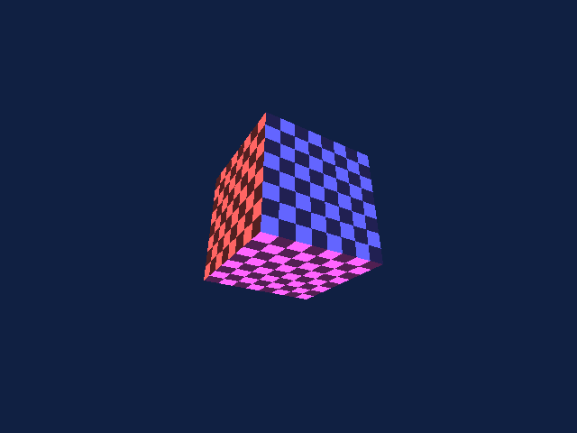
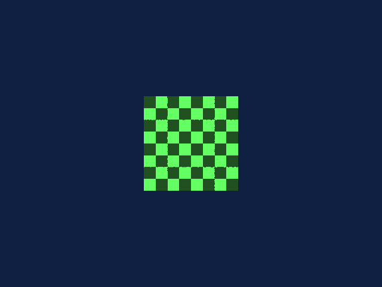
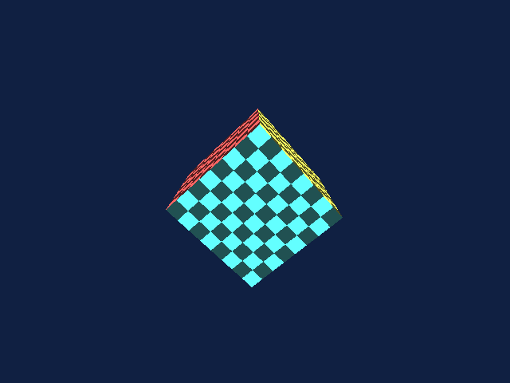
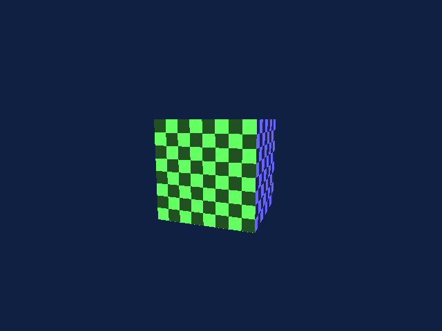

## Introduction

[Part 1](../coldfire-emulator/) built a ColdFire V4e CPU emulator in 2,221 lines of C. [Part 2](../triton-system-emulator/) wrapped it in a system emulator — memory-mapped peripherals, a monitor ROM, UART output, SDL3 display — and booted guest programs that draw colored rectangles to VRAM. The CPU can run code. The system can boot. But the GPU is a stub: a 64 KB register file that returns "idle" and "vblank" to anything that polls it.

The Triton's Banshee-derived GPU has a specific programming interface: 3Dfx's Glide 3.0 API, the same API that powered Quake, Unreal, and half the PC games of 1997–1999. Glide is not an abstraction over hardware the way OpenGL or Direct3D are — it *is* the hardware. Every Glide function maps directly to a register write or a FIFO command. `grDrawTriangle` does not ask a driver to please consider drawing a triangle sometime; it writes three vertices into the command FIFO and the rasterizer starts filling pixels before the function returns.

This directness is what made Glide fast and what makes it a natural fit for a console. There is no driver layer. There is no shader compiler. There are no state validation checks. A Glide call is a hardware command, and on the Triton, a Glide call is a hypercall — a single LINE_A instruction that traps from guest code into the host rasterizer with zero overhead.

This article implements that rasterizer. We take the ~45 Tier 1 functions from the Glide 3.0 API specification and implement them as a software pixel pipeline: triangle setup with edge functions, perspective-correct texture mapping, a configurable color combine unit, depth testing, alpha blending, and fog. The rasterizer is 1,541 lines of host-side C. The guest-side Glide header — inline assembly wrappers for every function — is another 598 lines. A spinning textured cube demo exercises the full pipeline in 381 lines of freestanding ColdFire C.



## Abstract

We present a software rasterizer implementing a practical subset of the 3Dfx Glide 3.0 API for the Triton fantasy game console. The rasterizer handles 45+ Tier 1 API functions covering the complete pixel pipeline: triangle rasterization via half-space edge functions with 4-bit subpixel precision, perspective-correct texture mapping, a configurable color combine unit matching the Glide combine equation, per-fragment depth testing, alpha blending, fog, and backface culling. Guest programs invoke the rasterizer through LINE_A hypercalls — each Glide function compiles to a single instruction that traps directly into the host rasterizer with arguments passed in CPU registers. The guest-side API is a C header of inline assembly wrappers requiring no runtime library. A textured spinning cube demo validates the full pipeline: 12 triangles per frame, 300 frames, 3.4 million emulated ColdFire instructions, zero memory leaks.

## The Glide API

Glide 3.0 shipped alongside the Voodoo Banshee in June 1998. In the open-source Glide codebase, Banshee and Voodoo3 share the same `h3` driver — they are the same architecture, Voodoo3 just re-adds the second TMU. The full Glide 3.x export table is approximately 98 functions. We organize them into three tiers:

**Tier 1 — Implement (~45 functions).** The core rendering pipeline. Every function here does real work in the rasterizer: lifecycle management, buffer operations, triangle/line/point drawing, vertex format configuration, color and alpha combining, depth and alpha testing, texture upload and sampling, fog, culling, chroma-key, linear framebuffer access, and state queries.

**Tier 2 — Stub (~20 functions).** Safe to return success or no-op. These include `grSplash` (the 3Dfx logo screen), `grLoadGammaTable`, stipple modes, texture detail control, NCC tables, and state save/restore. Games either check for NULL via `grGetProcAddress`, use these as hints, or call them in non-critical paths.

**Tier 3 — Not implemented.** Voodoo4/5 extensions (stencil, extended combine, texture buffers), multi-TMU state (Banshee has one TMU — `grGet(GR_NUM_TMU)` returns 1), multi-context, SLI, and host-side file I/O utilities. Games that need multi-texture use multi-pass rendering.

### The Pixel Pipeline

The Banshee pipeline processes each fragment through a fixed sequence of stages:

```
vertex → triangle setup → rasterizer → texel lookup →
  color combine → fog → alpha test → depth test →
    alpha blend → write to framebuffer
```

Every stage after triangle setup operates per-pixel. A 640×480 framebuffer is 307,200 pixels; a scene with 500 triangles averaging 200 pixels each generates 100,000 fragment operations per frame. At 60 fps, that is six million fragment operations per second — each one running through the full pipeline. The pipeline's job is to make each of those operations as cheap as possible.

### Calling Convention

On real Voodoo hardware, Glide writes to memory-mapped registers and a command FIFO. On the Triton, Glide calls are LINE_A hypercalls — single-instruction traps from guest to host. The encoding uses the 12-bit function ID in the low bits of the LINE_A opword:

```
  1010  NNNN NNNN NNNN     (bits 8-6 ≠ 101)
  group  function ID
```

Arguments pass through CPU registers directly: integer arguments in D0–D7, pointer arguments in A0–A6, return values in D0. The calling convention is hardcoded — no stack frames, no marshaling, no serialization. When guest code calls `grDrawTriangle(&va, &vb, &vc)`, the compiler loads three vertex pointers into A0, A1, A2 and emits a single `.short 0xA020`. The host rasterizer receives the CPU state, reads three guest-memory addresses from A0–A2, and starts rasterizing.

The function ID space is grouped with gaps for future expansion:

| Range | Category | Examples |
|---|---|---|
| 0x001–0x005 | Lifecycle | `grGlideInit`, `grSstWinOpen` |
| 0x010–0x014 | Buffers | `grBufferClear`, `grBufferSwap` |
| 0x020–0x024 | Drawing | `grDrawTriangle`, `grDrawLine` |
| 0x030–0x031 | Vertex format | `grVertexLayout`, `grCoordinateSpace` |
| 0x040–0x043 | Color combine | `grColorCombine`, `grConstantColorValue` |
| 0x050–0x053 | Alpha | `grAlphaCombine`, `grAlphaBlendFunction` |
| 0x060–0x063 | Depth | `grDepthBufferMode`, `grDepthBufferFunction` |
| 0x070–0x072 | Fog | `grFogMode`, `grFogTable` |
| 0x080–0x08A | Texture | `grTexSource`, `grTexDownloadMipMapLevel` |
| 0x090 | Culling | `grCullMode` |
| 0x0A0–0x0A1 | Chroma-key | `grChromakeyMode`, `grChromakeyValue` |
| 0x0B0–0x0B2 | LFB | `grLfbLock`, `grLfbWriteRegion` |
| 0x0C0–0x0C1 | Query | `grGet`, `grGetString` |
| 0x100–0x1FF | Tier 2 stubs | Silent no-ops |

## VRAM Layout

The Triton has 8 MB of dedicated VRAM shared between framebuffers, depth buffer, and texture memory. The layout is fixed at boot:

| Offset | Size | Purpose |
|---|---|---|
| 0x000000 | 614,400 | Front buffer (640×480 RGB565) |
| 0x096000 | 614,400 | Back buffer (640×480 RGB565) |
| 0x12C000 | 614,400 | Z-buffer (640×480 uint16) |
| 0x1C2000 | ~6.1 MB | Texture memory |

Buffer swap is pointer exchange, not copy. The rasterizer maintains `front_offset` and `back_offset` — `grBufferSwap` toggles them. The host display reads from `vram + front_offset`, and `grRenderBuffer` selects which offset `draw_offset` points to. A double-buffered frame swap is two integer assignments and zero bytes copied.

All pixel data is 16-bit RGB565 stored big-endian (ColdFire byte order). Depth values are 16-bit unsigned integers, also big-endian. The texture region starts at offset 0x1C2000 and extends to the 8 MB VRAM boundary, giving approximately 6.1 MB for texture data — enough for dozens of 256×256 mipmapped textures.

## The Guest-Side Header

Guest programs see a standard C header — `glide3x.h` — that looks like a normal Glide API. Each function is a `static inline` wrapper using GCC's register-variable extension to place arguments in specific CPU registers before emitting the LINE_A trap:

```c
static inline void
grDrawTriangle(const GrVertex *a, const GrVertex *b, const GrVertex *c)
{
    register const GrVertex *_a0 __asm__("a0") = a;
    register const GrVertex *_a1 __asm__("a1") = b;
    register const GrVertex *_a2 __asm__("a2") = c;
    __asm__ volatile(".short 0xA020"
        : : "a"(_a0), "a"(_a1), "a"(_a2) : "memory");
}
```

The vertex struct matches the Glide 3.0 specification:

```c
typedef struct {
    float x, y;         /*  0: screen position */
    float ooz;          /*  8: 1/z (depth, 0-65535 range) */
    float oow;          /* 12: 1/w (perspective correction) */
    float r, g, b, a;   /* 16: vertex color (0.0-255.0) */
    float sow, tow;     /* 32: s/w, t/w texture coordinates */
} GrVertex;
```

Glide vertices carry screen-space coordinates — the game performs its own projection and perspective divide. This is not a limitation; it is the design. By the time a vertex reaches Glide, all the expensive math (model-view transform, clipping, perspective divide) is done. The hardware (or in our case, the software rasterizer) handles only the per-pixel work: interpolation, texturing, depth testing, and blending.

The `oow` field (1/w, the reciprocal of the homogeneous W coordinate) enables perspective-correct texture mapping. Without it, textures on angled surfaces swim and warp — the notorious "affine texture" artifacts of the original PlayStation. With it, the rasterizer can interpolate texture coordinates correctly in screen space by dividing s/w and t/w by the interpolated 1/w at each pixel.

Functions that take integer arguments use data registers instead of address registers:

```c
static inline void
grBufferClear(GrColor_t color, GrAlpha_t alpha, FxU32 depth)
{
    register unsigned long _d0 __asm__("d0") = color;
    register unsigned long _d1 __asm__("d1") = alpha;
    register unsigned long _d2 __asm__("d2") = depth;
    __asm__ volatile(".short 0xA010"
        : : "d"(_d0), "d"(_d1), "d"(_d2) : "memory");
}
```

Functions with return values use output operands:

```c
static inline FxU32
grGet(FxU32 pname)
{
    register unsigned long _d0 __asm__("d0") = pname;
    __asm__ volatile(".short 0xA0C0" : "+d"(_d0) : : "memory");
    return _d0;
}
```

The entire header compiles to zero overhead — every function inlines to register loads and a two-byte trap instruction. No function call, no stack frame, no parameter marshaling. The `.short` directive encodes the LINE_A opword directly; the assembler does not need to understand hypercalls.

## Byte-Swapping the Guest–Host Boundary

The ColdFire is big-endian. The host (x86-64) is little-endian. Every time the rasterizer reads data from guest memory, it must byte-swap.

For vertex data, the rasterizer reads big-endian IEEE-754 floats from the guest's RAM array:

```c
static float
read_guest_float(const uint8_t *mem, uint32_t addr)
{
    uint32_t raw = ((uint32_t)mem[addr] << 24) |
                   ((uint32_t)mem[addr + 1] << 16) |
                   ((uint32_t)mem[addr + 2] << 8) |
                   ((uint32_t)mem[addr + 3]);
    float f;
    memcpy(&f, &raw, sizeof(f));
    return f;
}
```

The `memcpy` is the correct way to type-pun between integer and float in C — it avoids undefined behavior from pointer aliasing (`*(float *)&raw`) and any optimizer will compile it to a single register move. Every vertex read calls this function ten times (x, y, ooz, oow, r, g, b, a, sow, tow), making it one of the hottest paths in the rasterizer.

VRAM is also big-endian. Pixel writes and depth buffer reads go through matching helpers:

```c
static void
write_vram_u16(uint8_t *vram, uint32_t off, uint16_t val)
{
    vram[off]     = (uint8_t)(val >> 8);
    vram[off + 1] = (uint8_t)(val);
}
```

The SDL3 display reads raw VRAM bytes and uploads them as an `SDL_PIXELFORMAT_RGB565` texture. On a big-endian host this would be zero-copy. On little-endian x86-64, SDL3 handles the pixel format conversion internally via its texture upload path — the rasterizer does not need to worry about display byte order, only VRAM byte order.

## Triangle Rasterization

The core of any software rasterizer is the triangle filler. Ours uses the half-space (edge function) method — the same algorithm used by hardware rasterizers from the Voodoo1 through modern GPUs.

### Edge Functions

A triangle divides the 2D plane into regions. Each edge defines a half-space — points on one side are "inside" that edge, points on the other side are "outside." A point is inside the triangle if and only if it is inside all three half-spaces simultaneously.

The edge function for edge (v0, v1) evaluated at point (px, py) is:

```
E(px, py) = (v0.y - v1.y) * px + (v1.x - v0.x) * py + (v0.x * v1.y - v1.x * v0.y)
```

If E > 0, the point is on the left side of the edge (inside for counter-clockwise winding). If E < 0, it is outside. If E = 0, it is exactly on the edge.

The key property that makes this algorithm practical is *linearity*: the edge function is an affine function of (px, py). Moving one pixel to the right adds a constant (`v0.y - v1.y`). Moving one pixel down adds a different constant (`v1.x - v0.x`). This means the inner loop needs only integer additions — no multiplies, no divides:

```c
for (int py = miny; py <= maxy; py++) {
    int w0 = w0_row;
    int w1 = w1_row;
    int w2 = w2_row;

    for (int px = minx; px <= maxx; px++) {
        if ((w0 + bias0) >= 0 && (w1 + bias1) >= 0 && (w2 + bias2) >= 0) {
            /* pixel is inside triangle — process fragment */
        }
        w0 += a12_step;  /* constant increment per pixel */
        w1 += a20_step;
        w2 += a01_step;
    }
    w0_row += b12_step;  /* constant increment per scanline */
    w1_row += b20_step;
    w2_row += b01_step;
}
```

Three additions per pixel, three additions per scanline. The bounding box is clipped to the scissor rectangle before the loop starts, so pixels outside the screen are never tested.

### Subpixel Precision

Vertex positions are converted to fixed-point with 4 fractional bits (16 subpixel positions per pixel). Without subpixel precision, vertices snap to integer pixel positions and triangles visibly jitter as they move — the classic "wobbling polygon" artifact of early 3D hardware. Four bits of subpixel precision eliminates visible jitter at the cost of a fixed-point shift in the setup code:

```c
int x0 = (int)(v0->x * 16.0f + 0.5f);
int y0 = (int)(v0->y * 16.0f + 0.5f);
```

The bounding box conversion rounds the minimum outward (toward smaller values) and the maximum inward:

```c
minx = (minx + 15) >> 4;   /* round up to next whole pixel */
maxx = maxx >> 4;           /* round down */
```

### Top-Left Fill Rule

When two triangles share an edge, exactly one triangle must own the pixels on that edge. Otherwise, shared edges either double-draw (bright seams) or skip (dark seams). The top-left fill rule assigns edge ownership: a pixel on an edge belongs to the triangle if the edge is a "top" edge (horizontal, going right) or a "left" edge (going up). The implementation adds a -1 bias to edges that are not top-left:

```c
int bias0 = (a12 > 0 || (a12 == 0 && b12 > 0)) ? 0 : -1;
```

### Barycentric Interpolation

The three edge function values at a pixel are proportional to the barycentric coordinates of that pixel within the triangle. Dividing each edge value by the total signed area gives weights that sum to 1.0:

```c
float bary0 = (float)w0 * inv_area;
float bary1 = (float)w1 * inv_area;
float bary2 = 1.0f - bary0 - bary1;
```

These weights interpolate every per-vertex attribute: color, depth, 1/w, and texture coordinates. The division by area is computed once per triangle (`inv_area = 1.0f / area`), not per pixel.

## Perspective-Correct Texture Mapping

Interpolating texture coordinates linearly in screen space produces incorrect results for surfaces that are not parallel to the screen. The textures appear to swim and warp as the camera moves — the characteristic visual defect of the original PlayStation, which lacked perspective correction.

The fix is to interpolate s/w and t/w (texture coordinates divided by W) linearly, and also interpolate 1/w linearly, then recover the actual texture coordinates at each pixel by dividing:

```c
float sow = v0->s * inv_w0 * bary0 +
            v1->s * inv_w1 * bary1 +
            v2->s * inv_w2 * bary2;
float tow = v0->t * inv_w0 * bary0 +
            v1->t * inv_w1 * bary1 +
            v2->t * inv_w2 * bary2;
float oow = inv_w0 * bary0 +
            inv_w1 * bary1 +
            inv_w2 * bary2;

if (oow > 0.0f) {
    sow /= oow;
    tow /= oow;
}
```

This works because 1/w is linear in screen space (a mathematical consequence of the perspective projection), so any quantity divided by w is also linear in screen space. The Glide vertex format stores `oow` (1/w) and `sow`, `tow` (s/w, t/w) precisely for this reason — the game computes them during projection, and the rasterizer interpolates them directly.

The per-pixel divide (`sow / oow`, `tow / oow`) is the most expensive operation in the inner loop. Real Voodoo hardware had a dedicated reciprocal unit to accelerate this. Our software rasterizer accepts the cost — floating-point division is fast on modern x86, and the alternative (affine approximation with periodic correction) adds complexity without improving visual quality at 640×480.

## The Color Combine Unit

The Glide color combine unit is the rasterizer's most configurable stage. It computes the final fragment color from three sources — the iterated vertex color, the texture sample, and a constant color — using a programmable equation:

```
output = function(factor, local, other)
```

Where:
- **local** is one of: iterated vertex color, constant color, or depth
- **other** is one of: iterated vertex color, texture color, or constant color
- **factor** is a scaling value selected from: local alpha, texture alpha, other alpha, zero, one, or their complements

The `function` field selects from twelve operations:

| Function | Equation |
|---|---|
| ZERO | 0 |
| LOCAL | local |
| SCALE_OTHER | other × factor |
| BLEND_OTHER | other × factor + local × (1 − factor) |
| SCALE_OTHER_ADD_LOCAL | other × factor + local |
| SCALE_OTHER_MINUS_LOCAL | (other − local) × factor |
| ... | (six more variants) |

The implementation evaluates the combine equation per-channel:

```c
static float
combine_channel(float local, float other, float factor,
                int function, float local_alpha)
{
    switch (function) {
    case GR_COMBINE_FUNCTION_ZERO:
        return 0.0f;
    case GR_COMBINE_FUNCTION_LOCAL:
        return local;
    case GR_COMBINE_FUNCTION_SCALE_OTHER:
        return other * factor;
    case GR_COMBINE_FUNCTION_BLEND_OTHER:
        return other * factor + local * (1.0f - factor);
    case GR_COMBINE_FUNCTION_SCALE_OTHER_ADD_LOCAL:
        return other * factor + local;
    /* ... */
    }
}
```

The two most common configurations cover the vast majority of Glide programs:

**Flat vertex color** (`FUNCTION_LOCAL`, `LOCAL_ITERATED`): Output equals the interpolated vertex color. Used for wireframes, debug visualization, and Gouraud-shaded geometry without textures.

**Textured with modulation** (`FUNCTION_SCALE_OTHER`, `FACTOR_LOCAL`, `LOCAL_ITERATED`, `OTHER_TEXTURE`): Output equals the texture sample multiplied by the vertex color. This is the workhorse mode — vertex colors tint the texture, enabling a single texture to appear different on different faces. The cube demo uses this mode: a white-and-gray checkerboard texture is modulated by per-face colors (red, green, blue, yellow, magenta, cyan) to produce six distinctly colored faces from one texture upload.

Alpha has its own independent combine unit with the same equation structure, driven by `grAlphaCombine`. The two combine results feed into the alpha test and alpha blend stages.

## Texture Sampling

Textures live in VRAM starting at offset 0x1C2000. Guest programs upload texture data via `grTexDownloadMipMapLevel`, which copies pixel data from guest RAM to the texture region of VRAM. The rasterizer supports multiple texture formats matching the Banshee specification:

| Format | Bits/pixel | Description |
|---|---|---|
| RGB_565 | 16 | Color, no alpha |
| ARGB_1555 | 16 | Color + 1-bit alpha |
| ARGB_4444 | 16 | Color + 4-bit alpha |
| INTENSITY_8 | 8 | Grayscale |
| ALPHA_8 | 8 | Alpha channel only |

Texture coordinates arrive as integer texel positions after the perspective divide. The sampler applies clamp or wrap addressing:

```c
if (gs->tex_clamp_s == GR_TEXCLAMP_CLAMP) {
    if (s < 0) s = 0;
    if (s >= tw) s = tw - 1;
} else {
    s = s % tw;
    if (s < 0) s += tw;
}
```

The implementation supports point sampling (nearest texel) — the default and most common mode for Glide programs targeting Banshee hardware. Bilinear filtering is defined in the Glide API but not implemented in the rasterizer; point sampling is visually sufficient at 640×480 with the texture resolutions typical of late-1990s games (64×64 to 256×256).

## Depth Testing

The 16-bit depth buffer occupies 614,400 bytes of VRAM starting at offset 0x12C000. Depth values range from 0 to 65535, with the convention that larger values are closer to the camera (matching the Glide 3.0 specification's 1/z depth model).

The depth test is configurable via `grDepthBufferFunction`:

```c
static int
depth_compare(int func, uint16_t incoming, uint16_t stored)
{
    switch (func) {
    case GR_CMP_NEVER:    return 0;
    case GR_CMP_LESS:     return incoming < stored;
    case GR_CMP_LEQUAL:   return incoming <= stored;
    case GR_CMP_GREATER:  return incoming > stored;
    case GR_CMP_ALWAYS:   return 1;
    /* ... all eight comparison functions ... */
    }
}
```

The same comparison function handles alpha testing — both use the `GR_CMP_*` constants. `grDepthMask` controls whether passing fragments write to the depth buffer (useful for transparent geometry that should be depth-tested but not depth-written).

`grBufferClear` fills the depth buffer to a specified value along with the color buffer. The clear is a straight `memset`-style fill of the back buffer and z-buffer regions in VRAM — no per-pixel pipeline, just bulk writes.

## Alpha Blending

Blending combines the incoming fragment color with the pixel already in the framebuffer. The equation is:

```
final = src_color × src_factor + dst_color × dst_factor
```

Where `src_factor` and `dst_factor` are selected from:

| Factor | Value |
|---|---|
| ZERO | 0 |
| ONE | 1 |
| SRC_ALPHA | fragment alpha / 255 |
| ONE_MINUS_SRC_ALPHA | 1 − fragment alpha / 255 |
| DST_ALPHA | framebuffer alpha / 255 |
| ONE_MINUS_DST_ALPHA | 1 − framebuffer alpha / 255 |

The default blend mode is (ONE, ZERO) — replace, no blending. Transparent rendering uses (SRC_ALPHA, ONE_MINUS_SRC_ALPHA), the standard alpha blend. Additive blending for particle effects uses (SRC_ALPHA, ONE).

Blending requires reading the existing pixel from the framebuffer, so it is more expensive than opaque rendering. The rasterizer skips the read when the blend function is (ONE, ZERO):

```c
if (gs->ab_rgb_src != GR_BLEND_ONE ||
    gs->ab_rgb_dst != GR_BLEND_ZERO) {
    /* read framebuffer, compute blended result */
}
```

This fast path covers all opaque geometry, which is typically the majority of a scene.

## Fog

The fog unit blends fragment colors toward a fog color based on depth. The fog density is specified by a 64-entry lookup table indexed by W (distance from camera):

```c
static void
apply_fog(glide_state *gs, float w, float *r, float *g, float *b)
{
    if (gs->fog_mode == GR_FOG_DISABLE)
        return;

    float wf = (w > 0.0f) ? 1.0f / w : 1.0f;
    int idx = (int)(wf * 63.0f);
    /* clamp to [0, 63] */

    float fog = (float)gs->fog_table[idx] / 255.0f;
    float fog_r = (float)((gs->fog_color >> 16) & 0xFF);
    /* ... g, b similarly ... */

    *r = *r * (1.0f - fog) + fog_r * fog;
    /* ... g, b similarly ... */
}
```

The table-based approach matches the Voodoo hardware — games fill the fog table with `guFogGenerateExp`, `guFogGenerateExp2`, or `guFogGenerateLinear`, then pass it to `grFogTable`. The rasterizer does not need to know the fog equation; it just samples the table.

## Integration

Wiring the rasterizer into the system emulator takes six additions to `triton.c`:

```c
#include "glide_raster.h"

static glide_state gpu_state;

static int
glide_hypercall(cf_cpu *cpu, uint16_t opword, void *ctx)
{
    triton_sys *sys = ctx;
    return glide_dispatch(sys->gpu, cpu, opword);
}
```

In `main()`:

```c
sys.gpu = &gpu_state;
glide_init(sys.gpu, sys.vram, sys.ram);
cf_set_hypercall(&sys.cpu, glide_hypercall, &sys);
```

And the display update reads from the front buffer:

```c
display_update(&disp, sys.vram + sys.gpu->front_offset);
```

The rasterizer is decoupled from the system emulator — it knows about VRAM and RAM as byte arrays, not about the CPU's memory bus, the UART, or SDL3. The only connection points are the hypercall dispatch (called from the LINE_A handler) and the `front_offset` field (read by the display update). This separation means the rasterizer works identically in headless mode and SDL3 mode — it writes pixels to VRAM regardless of whether anything is showing them.

## The Cube Demo

The demo program validates the full rasterizer pipeline: vertex setup, texture upload, color combine, depth testing, and backface culling. It renders a spinning textured cube — 8 vertices, 12 triangles, 6 colored faces — for 300 frames.

### Freestanding Math

The demo runs freestanding on the ColdFire — no libc, no `<math.h>`, no `malloc`. Trigonometry uses a 256-entry sine lookup table in Q15 fixed-point:

```c
static const short sin_table[256] = {
         0,    804,   1608, /* ... */ -1608,   -804,
};

static int fp_sin(int angle) { return sin_table[angle & 0xFF]; }
static int fp_cos(int angle) { return sin_table[(angle + 64) & 0xFF]; }
```

Fixed-point multiply avoids 64-bit integer arithmetic (which requires `__muldi3` from libgcc, unavailable in freestanding mode) by splitting into 16-bit halves:

```c
static int
fp_mul(int a, int b)
{
    /* Split into high/low 16-bit halves to avoid __muldi3 */
    unsigned int ah = ua >> 16, al = ua & 0xFFFF;
    unsigned int bh = ub >> 16, bl = ub & 0xFFFF;

    result = (ah * bh) << 17;
    result += (ah * bl + al * bh) << 1;
    result += (al * bl) >> 15;
    /* ... sign handling ... */
}
```

### Projection

Each vertex is rotated around X and Y axes using the fixed-point sine table, translated away from the camera, then projected to screen coordinates with an integer perspective divide:

```c
int sx = SCREEN_CX + (x2 * PROJ_D / zt);
int sy = SCREEN_CY - (y2 * PROJ_D / zt);
float oow = 1.0f / ((float)zt / (float)FP_ONE);
```

The `oow` (1/w) value is computed from the transformed Z depth — this is the value the rasterizer uses for perspective-correct texture mapping. The separation of concerns is clean: the guest handles 3D math and projection in fixed-point, then hands screen-space vertices to the rasterizer via `grDrawTriangle`.

### Texture

A 64×64 checkerboard pattern is generated procedurally and uploaded as RGB565:

```c
static void
generate_checkerboard(void)
{
    unsigned short c0 = rgb565(255, 255, 255);  /* white */
    unsigned short c1 = rgb565(80, 80, 80);     /* dark gray */
    for (y = 0; y < 64; y++)
        for (x = 0; x < 64; x++)
            tex_data[y * 64 + x] = ((x >> 3) ^ (y >> 3)) & 1 ? c1 : c0;
}
```

The color combine mode is `SCALE_OTHER` with `FACTOR_LOCAL` — texture color multiplied by vertex color. Each face of the cube has a distinct vertex color (red, green, blue, yellow, magenta, cyan), so the same checkerboard texture appears in six different colors without uploading six separate textures.

### Results

```
$ ./triton-headless examples/cube.elf
triton: loaded 11532 bytes from examples/cube.elf at 0x00001000
triton: CPU reset, PC=0x01200400 SP=0x00800000
cube: starting Glide demo
[glide] grGlideInit
[glide] grSstWinOpen: 640x480 RGB565
cube: 300 frames rendered
[glide] grSstWinClose
[glide] grGlideShutdown
triton: halted after 3372349 instructions
```

300 frames, 3.4 million ColdFire instructions, zero memory leaks (verified with valgrind). The monitor ROM boots, loads the ELF, jumps to the entry point. The demo initializes Glide, configures the pipeline, uploads the texture, renders 300 frames of a spinning cube, then shuts down and halts.

Four frames from the rotation sequence — the checkerboard texture is perspective-correct (lines converge toward vanishing points), and each face is tinted by its vertex color:

 

 

## Conclusion

The Glide 3.0 software rasterizer adds 1,541 lines of host-side C to the Triton system emulator. The guest-side header adds 598 lines. Together with the 381-line cube demo, Part 3 contributes 2,520 new lines of code — comparable in scope to the 2,221-line CPU emulator from Part 1.

What the rasterizer implements: the full Glide pixel pipeline from triangle setup through framebuffer write. Forty-five Tier 1 functions that do real work — drawing, texturing, combining, testing, blending. Twenty Tier 2 stubs that return success silently. A configurable color combine unit that matches the Glide combine equation. Perspective-correct texture mapping with five texture formats. Double-buffered rendering with pointer-swap buffer exchange.

What it intentionally omits: bilinear texture filtering (point sampling is visually sufficient at 640×480), the 2D engine (BitBLT, rect fill, color expand — games use `grLfbWriteRegion` for 2D work), and the stereo 3D support that Vertex Technologies was so convinced would be transformative.

The design trades performance for simplicity. A real Voodoo Banshee fills 50 million pixels per second. The software rasterizer fills as many as the host CPU permits — which, for a 300-frame spinning cube demo, is fast enough that the bottleneck is the ColdFire instruction interpreter, not the pixel pipeline. For more complex scenes (thousands of textured triangles per frame), the inner loop's per-pixel divide for perspective correction becomes the dominant cost. An optimized rasterizer would use incremental approximation (the Voodoo hardware's approach); ours accepts the divide because the code is clearer and the correctness is easier to verify.

The hypercall mechanism from Part 1 proves its value here. Each Glide call is a single LINE_A instruction — two bytes of machine code, no exception frame, no vector table lookup, no RTE. The guest-side header compiles every function to register loads and a trap. The host-side dispatch is a switch statement. The boundary between guest and host is a function call, not a protocol. This is the payoff of choosing a real ISA over a custom bytecode: GCC's register-variable extension does the marshaling work for free.

### Sources

- *Glide 3.0 Reference Manual*, 3Dfx Interactive, June 1998
- *Glide 3.0 Programming Guide*, 3Dfx Interactive, June 1998
- 3Dfx Glide 3.10 source code (open-sourced under 3Dfx Glide General Public License)
- Juan Piñeda, "A Parallel Algorithm for Polygon Rasterization," *ACM SIGGRAPH Computer Graphics*, Vol. 22, No. 4, August 1988
- Rodrigo Copetti, [Console architecture analyses](https://www.copetti.org/writings/consoles/)
- Michael Abrash, *Rasterization on Larrabee*, 2009 (half-space rasterization overview)
